# 🎯 Complete User Flow - AI Learning Platform

## 📋 Tổng quan

Tài liệu này mô tả chi tiết luồng hoạt động của người dùng trong hệ thống AI Learning Platform, bao gồm tất cả các chức năng chính và enrollment system mới được tích hợp.

---

## 👥 Các vai trò người dùng

### 🎓 Student (Học viên)
- Đăng ký và học các khóa học
- Tạo khóa học cá nhân
- Sử dụng AI chat và quiz
- Theo dõi tiến độ học tập

### 👨‍🏫 Instructor (Giảng viên)
- Tất cả quyền của Student
- Tạo và quản lý khóa học công khai
- Xem danh sách học viên đã đăng ký
- Phân tích dữ liệu khóa học

### 👑 Admin (Quản trị viên)
- Tất cả quyền của Instructor
- Quản lý người dùng
- Quản lý toàn bộ khóa học trong hệ thống
- Xem thống kê hệ thống

---

## 🔄 Luồng hoạt động chi tiết

### 1. 🌐 Public Area (Khu vực công khai)

#### 1.1 Landing Page
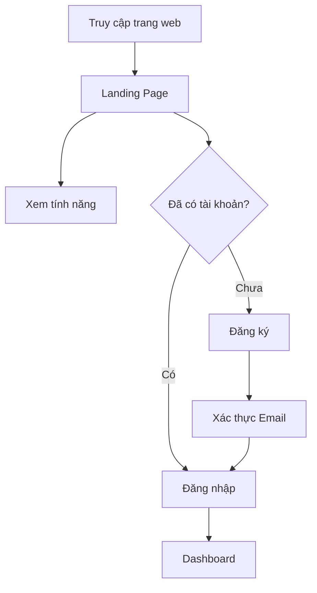

**Các thành phần:**
- Hero section với CTA buttons
- Feature showcase (Upload, Chat AI, Quiz)
- Giới thiệu về nền tảng
- Footer với links

**Routes:**
- `/` - Landing Page

---

#### 1.2 Authentication Flow

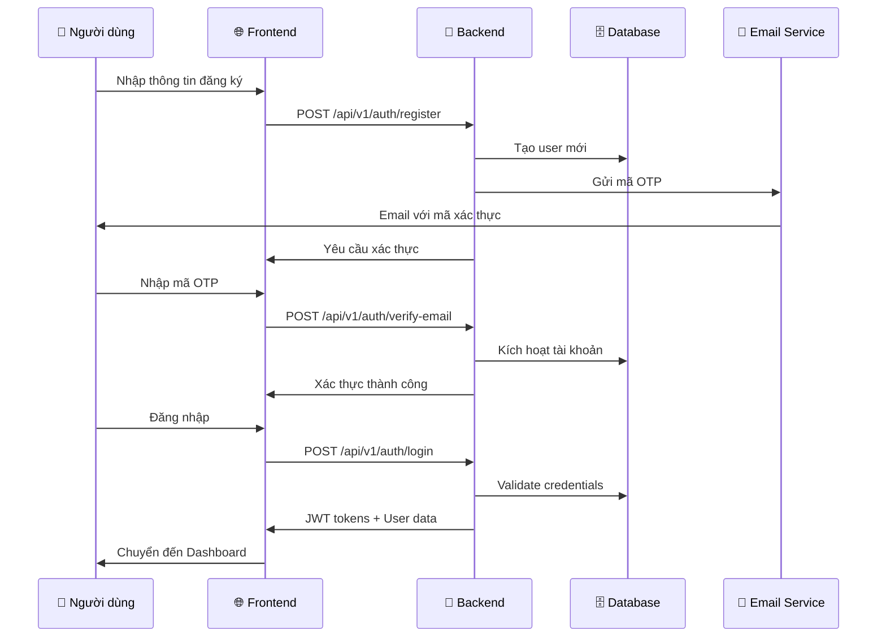

**Pages:**
- `/login` - Trang đăng nhập
- `/register` - Trang đăng ký
- `/auth/verify-email` - Xác thực email
- `/auth/forgot-password` - Quên mật khẩu
- `/auth/reset-password` - Đặt lại mật khẩu

**Chức năng:**
- ✅ Email/Password authentication
- ✅ Email verification với OTP
- ✅ Forgot password flow
- ✅ JWT token với auto-refresh
- ⚠️ Google OAuth (planned)

---

### 2. 🔒 Protected Area (Khu vực bảo mật)

#### 2.1 Dashboard (Trang chủ)

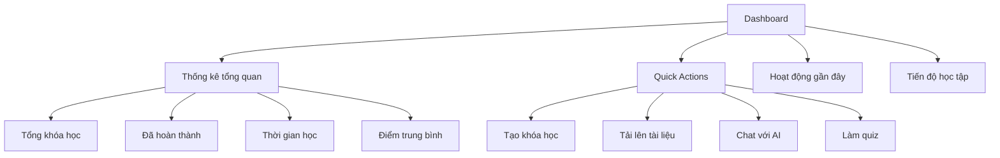

**Route:** `/dashboard`

**Components:**
- Statistics cards (4 metrics)
- Quick action buttons
- Recent activity list
- Progress chart
- Continue learning section

---

#### 2.2 Course Management (Quản lý khóa học)

##### 2.2.1 Courses Page

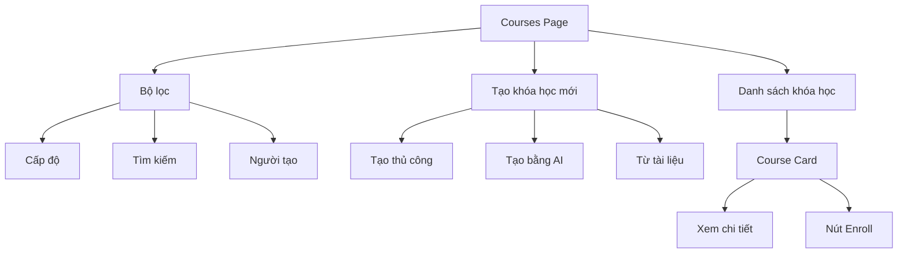

**Route:** `/courses`

**Chức năng:**
- ✅ Hiển thị tất cả khóa học (public + owned)
- ✅ Search by title/description
- ✅ Filter by level (beginner/intermediate/advanced)
- ✅ Create course manually
- ✅ AI-generated course from prompt
- ✅ Create from uploaded files
- ✅ Enroll button (for students)

**Course Creation Methods:**
1. **Manual Creation**
   - Nhập title, description, level, tags
   - Thêm chapters thủ công
   
2. **AI Generation**
   - Nhập topic và level
   - AI tạo outline và nội dung
   - Có thể edit sau khi tạo
   
3. **From Upload**
   - Upload PDF/DOCX file
   - AI extract và tạo course structure

---

##### 2.2.2 Course Detail Page

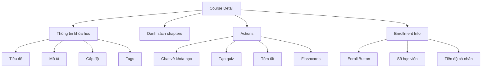

**Route:** `/courses/:courseId`

**Chức năng cho Student:**
- ✅ View course information
- ✅ **Enroll/Unenroll button** 🆕
- ✅ View enrollment status
- ✅ Access chapters (if enrolled)
- ✅ Chat with AI about course
- ✅ Generate quiz from course
- ✅ View personal progress

**Chức năng cho Instructor/Admin:**
- ✅ Edit course
- ✅ Add/edit/delete chapters
- ✅ View enrolled students 🆕
- ✅ Course analytics 🆕
- ✅ Set visibility (PUBLIC/PRIVATE/DRAFT) 🆕

---

#### 2.3 🆕 Enrollment System (Hệ thống đăng ký học)

##### 2.3.1 Student Enrollment Flow

```mermaid
graph TB
    START[Browse Courses] --> CHECK{Check Visibility}
    CHECK -->|PUBLIC| SHOW_ENROLL[Show Enroll Button]
    CHECK -->|PRIVATE| HIDE[Hide Course]
    CHECK -->|DRAFT| DISABLE[Disable Enroll]
    
    SHOW_ENROLL --> CLICK[Click Enroll]
    CLICK --> API[POST /student/courses/{id}/enroll]
    API --> CREATE_ENROLLMENT[Create Enrollment Record]
    CREATE_ENROLLMENT --> UPDATE_COUNT[Update enrollment_count]
    UPDATE_COUNT --> SUCCESS[Show Success Toast]
    SUCCESS --> ENROLLED[Status: ACTIVE]
    
    ENROLLED --> LEARN[Access Course Content]
    ENROLLED --> TRACK[Track Progress]
    ENROLLED --> UNENROLL_BTN[Unenroll Button]
    
    UNENROLL_BTN --> CONFIRM{Confirm?}
    CONFIRM -->|Yes| UNENROLL_API[DELETE /student/courses/{id}/enroll]
    UNENROLL_API --> DROPPED[Status: DROPPED]
    DROPPED --> RE_ENROLL[Can Re-enroll]
```

**Student Routes:**
- `/my-learning` - Student enrollment dashboard 🆕
- `/my-courses` - My enrolled courses list 🆕

**Student Features:**
- ✅ Browse public courses
- ✅ One-click enrollment
- ✅ View enrolled courses with filters (active/completed/dropped)
- ✅ Track progress per course
- ✅ Unenroll from courses
- ✅ Re-enrollment support
- ✅ Student dashboard with statistics

**Student Dashboard Metrics:**
- Total enrolled courses
- Completed courses
- In-progress courses
- Average progress (%)
- Total time spent
- Recent courses with progress bars

---

##### 2.3.2 Instructor Course Management

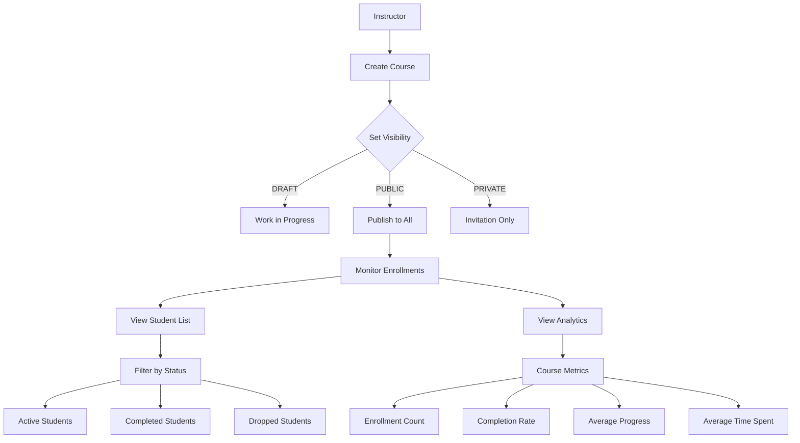

**Instructor Routes:**
- `/instructor/dashboard` - Instructor analytics dashboard 🆕
- `/courses/:courseId` - Enhanced with enrollment info 🆕

**Instructor Features:**
- ✅ Create courses with visibility control
- ✅ View enrolled students per course
- ✅ Filter students by status
- ✅ Course analytics dashboard
- ✅ Instructor overview dashboard
- ✅ Track student progress
- ✅ View enrollment trends

**Instructor Dashboard Metrics:**
- Total courses created
- Total students (unique)
- Total enrollments
- Average course rating
- Recent course analytics (top 5)
- Per-course metrics:
  - Enrollment count
  - Active students
  - Completed students
  - Average progress
  - Completion rate
  - Average time spent

---

##### 2.3.3 Course Visibility & Access Control

| Visibility | Student Can See | Student Can Enroll | Who Can Edit |
|------------|----------------|-------------------|--------------|
| **PUBLIC** | ✅ Yes | ✅ Yes | Owner + Admin |
| **PRIVATE** | ❌ No | ❌ No | Owner + Admin |
| **DRAFT** | ❌ No | ❌ No | Owner + Admin |

**Enrollment Status Flow:**
```
NOT_ENROLLED → [Enroll] → ACTIVE → [Complete] → COMPLETED
                              ↓
                         [Unenroll]
                              ↓
                           DROPPED → [Re-enroll] → ACTIVE
```

---

#### 2.4 AI Chat System

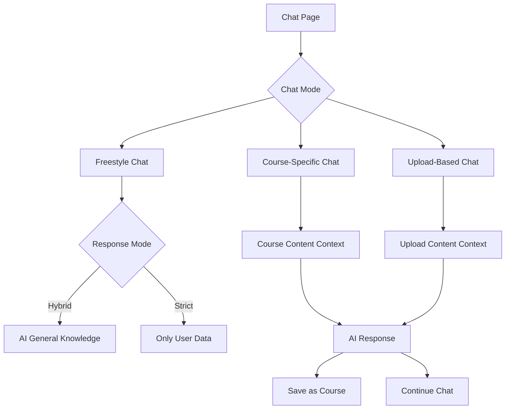

**Route:** `/chat`

**Chức năng:**
- ✅ Freestyle chat with AI tutor
- ✅ Course-specific Q&A
- ✅ Upload-based Q&A
- ✅ Chat history
- ✅ Session management
- ✅ Save chat as course
- ✅ Strict vs Hybrid mode

**Chat Modes:**
- **Freestyle**: General AI conversation
- **Course-specific**: AI uses course content as context
- **Upload-based**: AI uses uploaded file as context

**Response Modes:**
- **Strict**: Only answers from provided context
- **Hybrid**: Combines context with general AI knowledge

---

#### 2.5 File Upload System

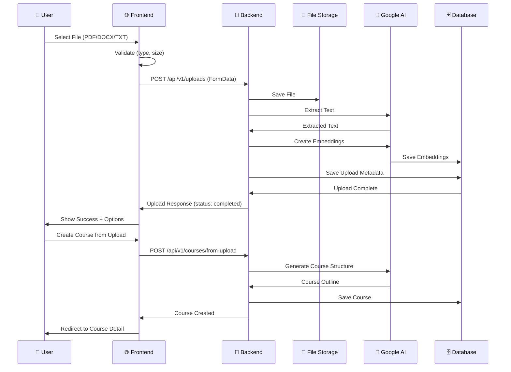

**Route:** `/uploads`

**Chức năng:**
- ✅ Drag & drop file upload
- ✅ File type validation (PDF, DOCX, TXT)
- ✅ File size limit (10MB)
- ✅ Upload progress tracking
- ✅ Upload status (pending/processing/completed/failed)
- ✅ Create course from upload
- ✅ Chat with upload content
- ✅ Delete uploads

**Supported Files:**
- ✅ PDF documents
- ✅ DOCX documents
- ✅ TXT files
- ⚠️ Video files (planned)

---

#### 2.6 Quiz System

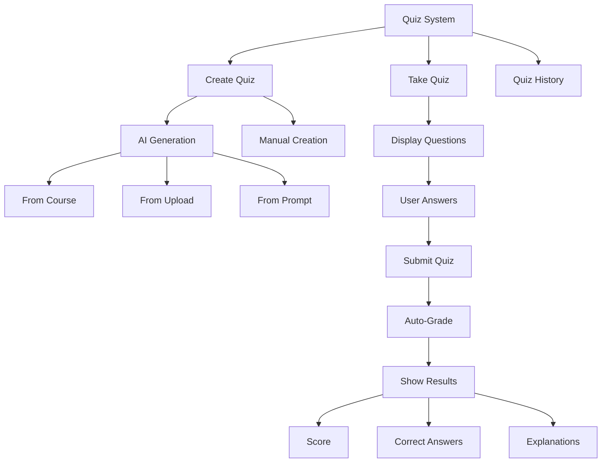

**Routes:**
- `/quiz` - Quiz list page
- `/quiz/:quizId` - Take/view quiz

**Chức năng:**
- ✅ AI-generated quizzes
- ✅ Manual quiz creation
- ✅ Multiple choice questions
- ✅ Auto-grading
- ✅ Detailed results with explanations
- ✅ Quiz history
- ✅ Retake quizzes
- ⚠️ Timer functionality (basic)
- ❌ Resume on disconnect (planned)

---

#### 2.7 Progress Tracking

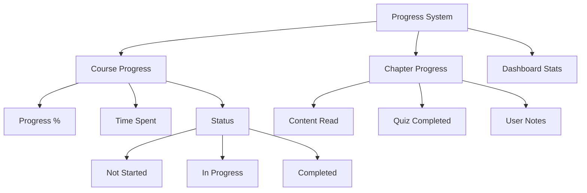

**Route:** `/progress`

**Chức năng:**
- ✅ Track time spent per course
- ✅ Calculate completion percentage
- ✅ Chapter-level tracking
- ✅ Progress visualization
- ✅ Learning streak (basic)
- ❌ Daily streak tracking (planned)
- ❌ Achievements/badges (planned)

---

#### 2.8 Profile & Settings

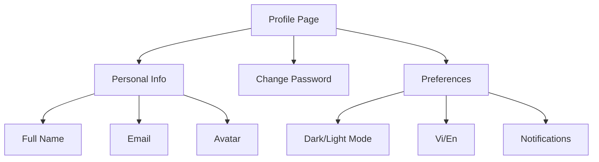

**Route:** `/profile`

**Chức năng:**
- ✅ Update profile information
- ✅ Change password
- ✅ Theme toggle (dark/light)
- ✅ Language switcher (Vi/En)
- ✅ View activity history
- ❌ Notification settings (planned)

---

#### 2.9 Admin Panel

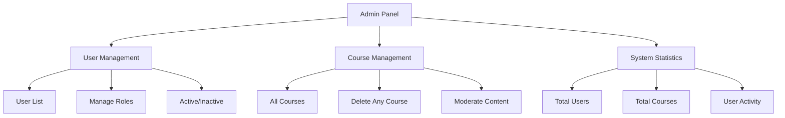

**Route:** `/admin/*`

**Chức năng (Admin only):**
- ✅ View all users
- ✅ Change user roles (student/instructor/admin)
- ✅ Activate/deactivate users
- ✅ View all courses (including private)
- ✅ Delete any course
- ✅ System statistics
- ❌ Content moderation (planned)

---

## 📊 Enrollment System Integration

### Enrollment Data Flow

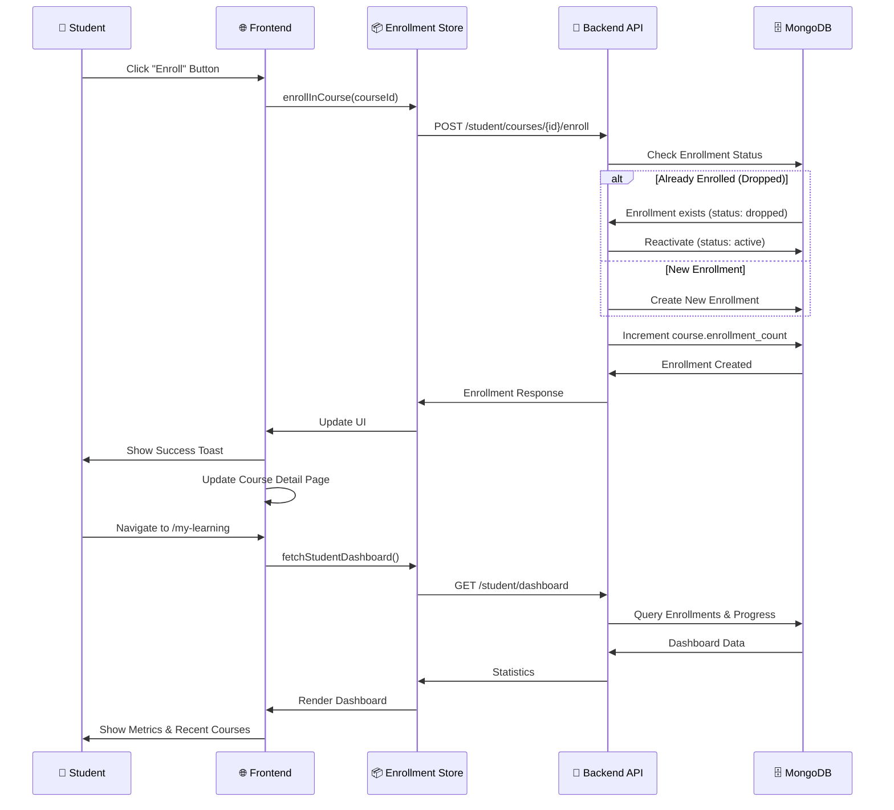

### Database Schema Updates

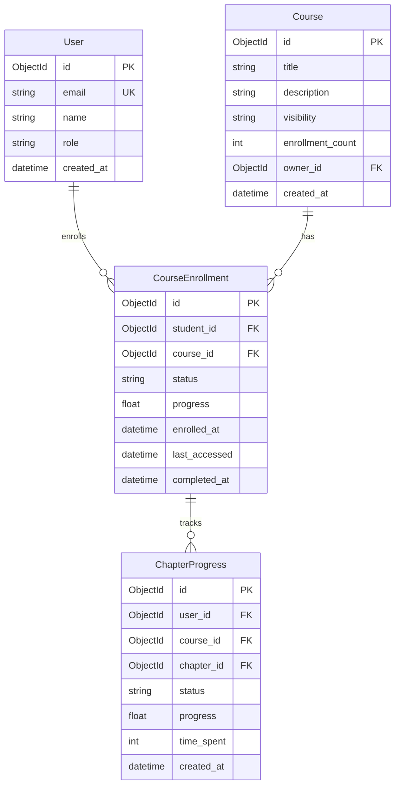

---

## 🔑 Key Navigation Paths

### Student Journey
```
/ (Landing) 
  → /register → /auth/verify-email → /login 
  → /dashboard (Overview)
  → /courses (Browse)
  → /courses/:id (View & Enroll) 🆕
  → /my-courses (My Enrollments) 🆕
  → /courses/:id/chapters/:chapterId (Learn)
  → /my-learning (Dashboard) 🆕
  → /quiz/:id (Practice)
  → /progress (Track)
```

### Instructor Journey
```
/ (Landing)
  → /login
  → /dashboard
  → /courses (Create PUBLIC course) 🆕
  → /courses/:id (Manage & Edit)
  → /courses/:id (View Enrolled Students) 🆕
  → /instructor/dashboard (Analytics) 🆕
  → /courses/:id/analytics (Course Metrics) 🆕
```

### Admin Journey
```
/ (Landing)
  → /login
  → /dashboard
  → /admin (User Management)
  → /admin/courses (All Courses)
  → /admin/stats (System Overview)
  → /instructor/dashboard (All Analytics) 🆕
```

---

## 📱 Responsive Design Breakpoints

- **Mobile**: < 640px (sm)
- **Tablet**: 640px - 1024px (md/lg)
- **Desktop**: > 1024px (xl/2xl)

All pages are fully responsive with:
- Mobile-first approach
- Touch-friendly interactions
- Adaptive layouts
- Collapsible navigation

---

## 🎨 UI/UX Patterns

### Common Components
- **Navigation**: Sidebar + Top bar
- **Cards**: Glass morphism design
- **Buttons**: Primary/Secondary/Outline variants
- **Forms**: Validation với error messages
- **Modals**: Overlay dialogs
- **Toast**: Success/Error notifications
- **Loading**: Spinners và skeletons
- **Empty States**: Friendly messages với CTAs

### Animations
- Page transitions (Framer Motion)
- Card hover effects
- Button interactions
- Smooth scrolling
- Progress animations

### Theme Support
- Light mode (default)
- Dark mode (toggle)
- System preference detection
- Smooth theme transitions

---

## 🔐 Security & Permissions

### Route Protection
```typescript
// Public routes
/ /login /register /auth/*

// Protected routes (authenticated users)
/dashboard /courses /chat /quiz /uploads /progress /profile

// Role-specific routes
/my-learning (student) 🆕
/my-courses (student) 🆕
/instructor/dashboard (instructor/admin) 🆕

// Admin-only routes
/admin/*
```

### API Authorization
- JWT token trong Authorization header
- Token auto-refresh on 401
- Role-based endpoint access
- Owner-based resource access

---

## 🚀 Performance Optimizations

- Code splitting per route
- Lazy loading components
- Image optimization
- API response caching
- Debounced search inputs
- Virtualized long lists
- Optimistic UI updates

---

## 📈 Analytics & Tracking

### User Actions Tracked
- Page views
- Course enrollments 🆕
- Quiz completions
- File uploads
- Chat interactions
- Time spent per course
- Learning streaks

### Metrics Collected
- User engagement
- Course popularity
- Completion rates 🆕
- Average progress 🆕
- Drop-off points
- Feature usage

---

## 🎯 Success Metrics

### Student Success
- ✅ Enrollment completion rate
- ✅ Average course progress
- ✅ Time to completion
- ✅ Quiz scores
- ✅ Re-enrollment rate 🆕

### Instructor Success
- ✅ Student enrollment count 🆕
- ✅ Course completion rate 🆕
- ✅ Student engagement 🆕
- ✅ Course ratings

### Platform Success
- ✅ Total active users
- ✅ Total courses created
- ✅ Total enrollments 🆕
- ✅ Daily active users
- ✅ User retention rate

---

## 🔄 Next Steps & Roadmap

### Phase 1: Core Enrollment (✅ COMPLETED)
- ✅ Backend enrollment system (9 endpoints)
- ✅ Frontend types & services
- ✅ EnrollButton component
- ✅ Student & Instructor dashboards
- ✅ My Courses page
- ✅ Documentation updates

### Phase 2: UI/UX Polish (⏳ IN PROGRESS)
- ⏳ Add enrollment routes to App.tsx
- ⏳ Update navigation menu
- ⏳ Add loading skeletons
- ⏳ Improve error handling
- ⏳ Mobile responsiveness testing

### Phase 3: Advanced Features (📋 PLANNED)
- 📋 Course prerequisites
- 📋 Certificates on completion
- 📋 Course reviews & ratings
- 📋 Discussion forums
- 📋 Live sessions (video)

### Phase 4: Gamification (📋 PLANNED)
- 📋 Achievement badges
- 📋 Leaderboards
- 📋 Points system
- 📋 Streak tracking
- 📋 Social features

---

## 📚 Related Documentation

- [SYSTEM_OVERVIEW.md](./SYSTEM_OVERVIEW.md) - Technical architecture
- [USER_FLOW_CHECKLIST.md](./USER_FLOW_CHECKLIST.md) - Feature checklist
- [UPDATED_USER_FLOW_CHECKLIST.md](./UPDATED_USER_FLOW_CHECKLIST.md) - Achievement summary
- [API_DOCUMENTATION.md](./BEDB/API_DOCUMENTATION.md) - API reference
- [BACKEND_ARCHITECTURE.md](./BEDB/BACKEND_ARCHITECTURE.md) - Backend details
- [ARCHITECTURE.md](./learning-app-fe/ARCHITECTURE.md) - Frontend architecture

---

**Last Updated**: October 3, 2025
**Version**: 2.0.0 (with Enrollment System)
**Status**: 🎉 90% Complete - Ready for Testing
