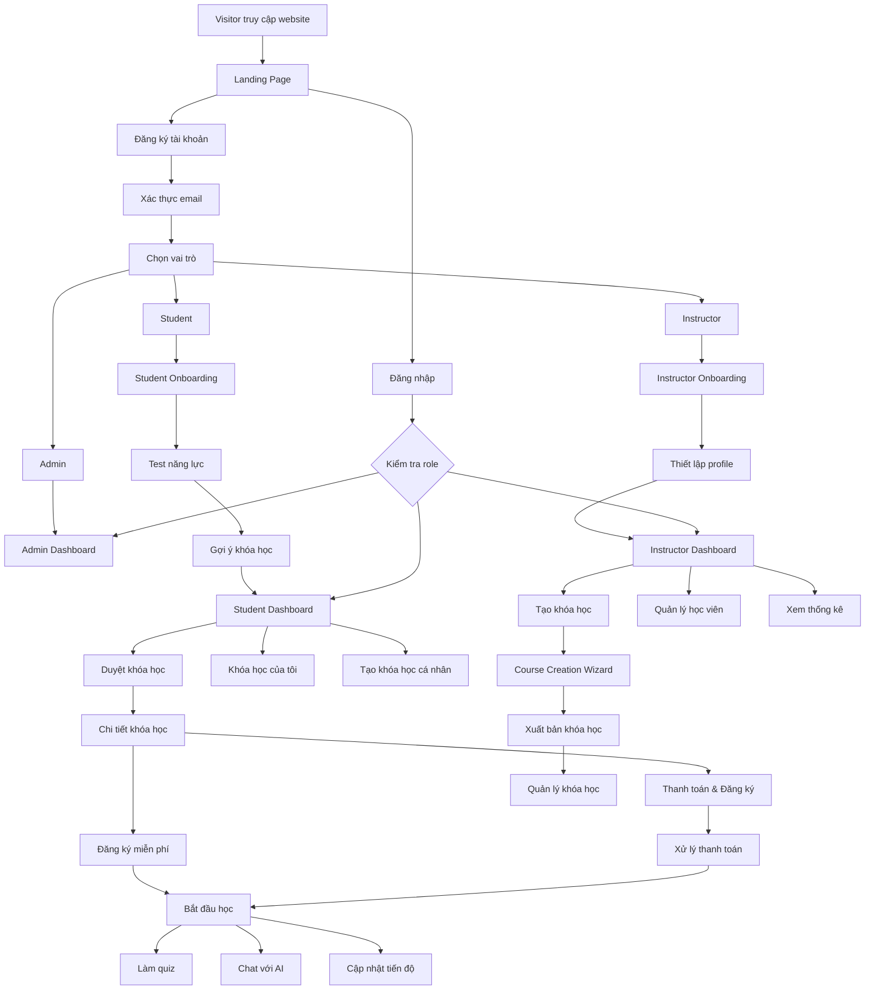
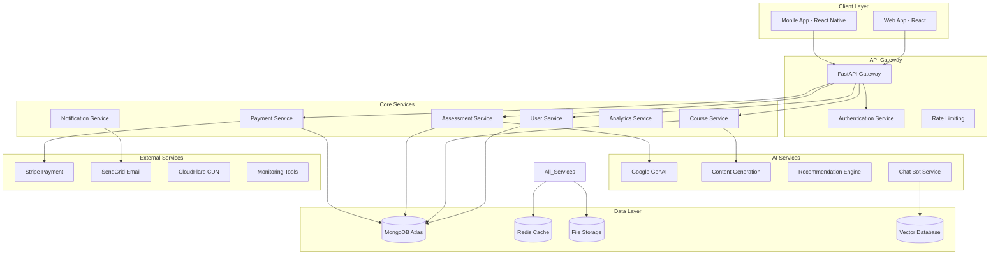
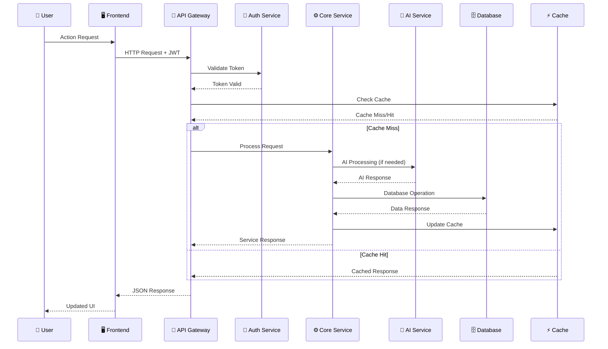
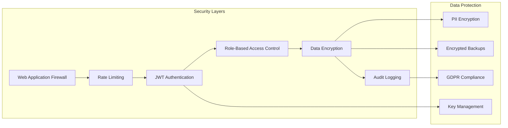

# HỆ THỐNG NỀN TẢNG HỌC TẬP AI - TÀI LIỆU KỸ THUẬT TỔNG QUAN
> người tạo: NGUYỄN NGỌC TUẤN ANH
> Tài liệu kỹ thuật hoàn chỉnh cho Backend và Frontend teams  
> Ngày cập nhật: 04/10/2025

## MỤC LỤC

1. [TỔNG QUAN HỆ THỐNG](#1-tổng-quan-hệ-thống)
2. [USER FLOW TỔNG THỂ](#2-user-flow-tổng-thể)
3. [SYSTEM FLOW & KIẾN TRÚC](#3-system-flow--kiến-trúc)
4. [YÊU CẦU DEVELOPMENT](#4-yêu-cầu-development)
5. [LUỒNG NGƯỜI DÙNG CHI TIẾT](#5-luồng-người-dùng-chi-tiết)
6. [KIẾN TRÚC DATABASE](#6-kiến-trúc-database)
7. [API ENDPOINTS](#7-api-endpoints)
8. [CÔNG NGHỆ SỬ DỤNG](#8-công-nghệ-sử-dụng)
9. [GIAO DIỆN NGƯỜI DÙNG](#9-giao-diện-người-dùng)
10. [BẢNG CHỨC NĂNG THEO VAI TRÒ](#10-bảng-chức-năng-theo-vai-trò)

---

## 1. TỔNG QUAN HỆ THỐNG

### 1.1 Mô tả hệ thống
AI Learning Platform là hệ thống học tập thông minh với 3 vai trò chính:
- **Student**: Học viên có thể đăng ký khóa học, tạo khóa học cá nhân, làm test năng lực
- **Instructor**: Giảng viên tạo và quản lý khóa học, theo dõi học viên, thu phí
- **Admin**: Quản trị viên quản lý toàn bộ hệ thống, người dùng, nội dung

### 1.2 Các chức năng chính được mở rộng
- **Test năng lực đầu vào**: Đánh giá trình độ học viên và gợi ý khóa học phù hợp
- **Hệ thống thanh toán**: Tích hợp cổng thanh toán cho khóa học trả phí
- **Khóa học cá nhân**: Học viên tự tạo khóa học riêng với AI hỗ trợ
- **Analytics nâng cao**: Theo dõi chi tiết tiến độ và hiệu suất học tập
- **AI Chatbot**: Hỗ trợ học tập cá nhân hóa theo từng ngữ cảnh

### 1.3 Kiến trúc tổng thể

```
┌─────────────────┐    ┌─────────────────┐    ┌─────────────────┐
│   FRONTEND      │    │    BACKEND      │    │    DATABASE     │
│   React 18      │◄──►│   FastAPI       │◄──►│   MongoDB       │
│   TypeScript    │    │   Python 3.11   │    │   Atlas         │
└─────────────────┘    └─────────────────┘    └─────────────────┘
         │                       │                       │
         │                       │                       │
         ▼                       ▼                       ▼
┌─────────────────┐    ┌─────────────────┐    ┌─────────────────┐
│  STATE MGMT     │    │   AI SERVICES   │    │  VECTOR STORE   │
│  Zustand        │    │  Google GenAI   │    │  Embeddings     │
│  React Query    │    │  Gemini API     │    │  Collections    │
└─────────────────┘    └─────────────────┘    └─────────────────┘
```

---

## 2. USER FLOW TỔNG THỂ

### 2.1 Tổng quan User Journey

```
VISITOR → REGISTRATION → ROLE SELECTION → ONBOARDING → MAIN PLATFORM → LEARNING/TEACHING → GROWTH
```

### 2.2 User Flow Diagram Tổng Thể



### 2.3 Chi tiết các User Journey chính

#### 2.3.1 Student Journey
```
1. Trang chủ → Đăng ký → Xác thực email → Chọn vai trò: Học viên  
2. Thiết lập hồ sơ → Kiểm tra năng lực → Phân tích bởi AI → Gợi ý khóa học  
3. Duyệt danh sách khóa học → Xem chi tiết → Đăng ký (Miễn phí / Trả phí) → Thanh toán (nếu có)  
4. Bảng điều khiển học tập → Chọn khóa học → Duyệt chương → Học nội dung  
5. Học tương tác → Làm quiz → Trò chuyện với AI → Theo dõi tiến độ → Hoàn thành khóa học  
6. Tự tạo khóa học cá nhân → Hỗ trợ AI → Sinh lộ trình học tập riêng  
7. Hệ thống thành tích → Huy hiệu → Chứng chỉ → Bảng xếp hạng
 
```
#### 2.3.2 Instructor Journey
```
1. Landing → Register → Email Verify → Role: Instructor
2. Profile Setup → Teaching Experience → Subject Expertise → Portfolio
3. Instructor Dashboard → Course Creation → Content Development → AI Assistance
4. Course Setup → Pricing → Visibility → Publishing → Student Management
5. Analytics Dashboard → Student Progress → Revenue Tracking → Course Optimization
6. Student Communication → Q&A → Feedback → Course Updates
7. Payout Management → Revenue Reports → Tax Documents
```

#### 2.3.3 Admin Journey
```
1. Truy cập hệ thống → Bảng điều khiển Admin → Tổng quan hệ thống → Theo dõi tình trạng  
2. Quản lý người dùng → Gán vai trò → Kiểm duyệt tài khoản → Theo dõi hoạt động  
3. Kiểm duyệt nội dung → Duyệt khóa học (có thể bỏ) 
4. Phân tích & Báo cáo → Chỉ số nền tảng → Phân tích doanh thu → Thống kê người dùng  
5. Cấu hình hệ thống → Quản lý tính năng → Cài đặt thanh toán → Tham số AI  (có thể bỏ)
6. Hỗ trợ người dùng → Xử lý khiếu nại → Liên hệ hỗ trợ → Chuyển cấp xử lý (có thể bỏ


```

---

## 3. SYSTEM FLOW & KIẾN TRÚC

### 3.1 System Architecture Overview



### 3.2 Data Flow Architecture



### 3.3 Microservices Architecture (kiến trúc)

| Dịch vụ (Service) | Chức năng chính (Responsibility) | Cơ sở dữ liệu (Database) | Tích hợp AI (AI Integration) |
|--------------------|----------------------------------|---------------------------|-------------------------------|
| **User Service** | Xác thực người dùng, quản lý hồ sơ cá nhân và phân quyền (học viên, giảng viên, quản trị viên). | MongoDB | Tối ưu hồ sơ người dùng (đề xuất cải thiện thông tin cá nhân hoặc hồ sơ chuyên môn). |
| **Assessment Service** | Tổ chức và đánh giá bài kiểm tra năng lực, quiz hoặc bài thi tự động. | MongoDB | Tạo câu hỏi tự động và phân tích kết quả đánh giá. |
| **Course Service** | Quản lý nội dung khóa học, bao gồm các thao tác tạo, đọc, cập nhật và xóa (CRUD). | MongoDB | Sinh nội dung khóa học và dịch tự động sang nhiều ngôn ngữ. |
| **Enrollment Service** | Quản lý đăng ký khóa học và theo dõi tiến độ học tập của học viên. | MongoDB | Tối ưu lộ trình học tập cá nhân dựa trên kết quả và hành vi học. |
| **Payment Service** | Xử lý giao dịch thanh toán và quản lý hóa đơn, gói học. | MongoDB | Phát hiện và ngăn chặn gian lận trong thanh toán. |
| **Chat Service** | Cung cấp tính năng trò chuyện với AI và quản lý ngữ cảnh hội thoại. | MongoDB + Vector | Hỗ trợ hội thoại thông minh, trợ lý học tập dựa trên AI. |
| **Analytics Service** | Thu thập, tổng hợp và báo cáo dữ liệu thống kê về người dùng, khóa học và hệ thống. | MongoDB | Phân tích dữ liệu và tạo ra các báo cáo, thông tin chi tiết (insights). |
| **Notification Service** | Gửi email, thông báo đẩy và nhắc nhở tự động cho người dùng. | Redis | Dự đoán thời điểm gửi thông báo tối ưu nhằm tăng khả năng tương tác. |




---

## 4. YÊU CẦU DEVELOPMENT

### 4.1 Environment Setup Requirements

#### 4.1.1 Development Environment
```yaml
Backend Requirements:
  - Python 3.11+
  - MongoDB Atlas cluster
  - Redis instance
  - Google Cloud AI API key
  - Stripe test keys
  - SendGrid API key
  - AWS S3 bucket (optional)

Frontend Requirements:
  - Node.js 18+
  - npm/yarn package manager
  - Modern browser (Chrome 90+)
  - VS Code + extensions

Development Tools:
  - Docker & Docker Compose
  - Git version control
  - Postman/Insomnia (API testing)
  - MongoDB Compass (database GUI)
```

#### 4.1.2 Project Structure Setup
```
LEARNING-AI/
├── BEDB/                           # Backend FastAPI
│   ├── app/
│   │   ├── main.py                # FastAPI entry point
│   │   ├── config.py              # Environment configuration
│   │   ├── models/                # Database models (Beanie ODM)
│   │   ├── routers/               # API endpoints
│   │   ├── schemas/               # Pydantic schemas
│   │   ├── services/              # Business logic
│   │   └── utils/                 # Helper functions
│   ├── requirements.txt           # Python dependencies
│   ├── Dockerfile                 # Container configuration
│   └── .env.example              # Environment variables template
├── learning-app-fe/               # Frontend React
│   ├── src/
│   │   ├── components/           # Reusable UI components
│   │   ├── pages/               # Route components
│   │   ├── stores/              # Zustand state management
│   │   ├── services/            # API integration
│   │   ├── hooks/               # Custom React hooks
│   │   ├── utils/               # Helper functions
│   │   └── types/               # TypeScript definitions
│   ├── package.json             # Dependencies
│   ├── tailwind.config.js       # Styling configuration
│   └── vite.config.ts           # Build configuration
└── docs/                          # Documentation
    ├── API_DOCS.md               # API documentation
    ├── DEPLOYMENT.md             # Deployment guide
    └── DEVELOPMENT.md            # Development guide
```

### 4.2 Development Workflow

#### 4.2.1 Backend Development Process
```
1. Setup & Configuration
   - Install Python dependencies: pip install -r requirements.txt
   - Configure environment variables from .env.example
   - Setup MongoDB Atlas connection
   - Initialize database with sample data

2. API Development
   - Create Pydantic models in schemas/
   - Create database models in models/ (Beanie ODM)
   - Implement business logic in services/
   - Create API endpoints in routers/
   - Add authentication & authorization
   - Write unit tests

3. AI Integration
   - Setup Google GenAI API
   - Implement content generation services
   - Create assessment logic
   - Build recommendation engine
   - Integrate chat functionality

4. Testing & Documentation
   - Unit tests with pytest
   - API documentation with FastAPI auto-docs
   - Integration testing
   - Performance testing
```

#### 4.2.2 Frontend Development Process
```
1. Setup & Configuration
   - Install Node.js dependencies: npm install
   - Configure environment variables
   - Setup development server: npm run dev
   - Configure Tailwind CSS & theme

2. Component Development
   - Create reusable UI components
   - Implement responsive design
   - Add dark mode support
   - Build accessibility features

3. State Management
   - Setup Zustand stores for each feature
   - Implement API integration with React Query
   - Handle loading states & error handling
   - Create form management with React Hook Form

4. Feature Implementation
   - Build authentication flow
   - Create dashboard interfaces
   - Implement course management
   - Add assessment system
   - Build payment integration
   - Create chat interface

5. Testing & Optimization
   - Component testing with Vitest
   - E2E testing with Playwright
   - Performance optimization
   - Bundle size optimization
```

### 4.3 Database Setup & Migration

#### 4.3.1 MongoDB Collections Setup
```javascript
// Collections to create
collections = [
  'users',
  'courses', 
  'assessments',
  'enrollments',
  'payments',
  'quizzes',
  'chat_sessions',
  'chat_messages',
  'uploads',
  'notifications',
  'analytics'
]

// Sample data structure
sampleData = {
  adminUser: {
    email: "admin@example.com",
    role: "admin",
    name: "System Admin"
  },
  sampleCourses: [
    {
      title: "JavaScript Fundamentals",
      category: "programming",
      level: "beginner",
      visibility: "public",
      type: "free"
    }
  ]
}
```

#### 4.3.2 Database Indexes & Optimization
```javascript
// Essential indexes for performance
db.users.createIndex({ "email": 1 }, { unique: true })
db.users.createIndex({ "role": 1, "status": 1 })
db.courses.createIndex({ "instructor_id": 1, "visibility": 1 })
db.courses.createIndex({ "category": 1, "level": 1 })
db.enrollments.createIndex({ "student_id": 1, "status": 1 })
db.enrollments.createIndex({ "course_id": 1, "status": 1 })
db.assessments.createIndex({ "user_id": 1, "assessment_type": 1 })
db.payments.createIndex({ "user_id": 1, "status": 1 })
db.chat_messages.createIndex({ "session_id": 1, "created_at": -1 })

// Vector search index for AI features
db.embeddings.createIndex({
  "embedding": "vector",
  "text": "text"
})
```

### 4.4 API Development Standards

#### 4.4.1 API Naming Conventions
```
Resource naming: /api/v1/{resource}
Actions: POST (create), GET (read), PUT (update), DELETE (delete)
Nested resources: /api/v1/courses/{course_id}/chapters
Query parameters: ?skip=0&limit=10&category=programming
```

#### 4.4.2 Response Standards
```javascript
// Success response
{
  "success": true,
  "data": {
    // response data
  },
  "message": "Operation completed successfully",
  "timestamp": "2025-10-05T10:30:00Z"
}

// Error response
{
  "success": false,
  "error": {
    "code": "VALIDATION_ERROR",
    "message": "Invalid input data",
    "details": {
      "field": "email",
      "issue": "Invalid email format"
    }
  },
  "timestamp": "2025-10-05T10:30:00Z"
}
```

### 4.5 Testing Strategy

#### 4.5.1 Backend Testing
```python
# Unit tests for services
def test_create_user():
    user_data = {"email": "test@example.com", "name": "Test User"}
    user = create_user(user_data)
    assert user.email == "test@example.com"

# Integration tests for APIs
def test_register_endpoint():
    response = client.post("/api/v1/auth/register", json=user_data)
    assert response.status_code == 201
    assert "access_token" in response.json()

# AI service tests
def test_course_generation():
    prompt = "Create a Python course for beginners"
    course = generate_course_from_prompt(prompt)
    assert course.title is not None
    assert len(course.chapters) > 0
```

#### 4.5.2 Frontend Testing
```typescript
// Component tests
test('renders login form', () => {
  render(<LoginForm />);
  expect(screen.getByLabelText(/email/i)).toBeInTheDocument();
  expect(screen.getByLabelText(/password/i)).toBeInTheDocument();
});

// Integration tests
test('user can register and login', async () => {
  // Test registration flow
  const user = userEvent.setup();
  render(<RegistrationFlow />);
  
  await user.type(screen.getByLabelText(/email/i), 'test@example.com');
  await user.type(screen.getByLabelText(/password/i), 'password123');
  await user.click(screen.getByRole('button', { name: /register/i }));
  
  expect(await screen.findByText(/registration successful/i)).toBeInTheDocument();
});
```

### 4.6 Production Deployment Requirements

#### 4.6.1 Infrastructure Requirements
```yaml
Backend Deployment:
  - VPS/Cloud instance (2+ CPU cores, 4GB+ RAM)
  - MongoDB Atlas cluster (M10+ for production)
  - Redis instance (256MB+ memory)
  - SSL certificate (Let's Encrypt or commercial)
  - Domain name with DNS configuration
  - Load balancer (for scaling)

Frontend Deployment:
  - CDN service (CloudFlare, AWS CloudFront)
  - Static hosting (Vercel, Netlify, AWS S3)
  - SSL certificate (auto-configured)
  - Custom domain configuration

Monitoring & Logging:
  - Application monitoring (Sentry, DataDog)
  - Server monitoring (New Relic, Grafana)
  - Log aggregation (ELK stack, Splunk)
  - Uptime monitoring (Pingdom, StatusPage)
```

#### 4.6.2 Security Configuration
```yaml
Production Security:
  - Environment variables in secure vault
  - Database encryption at rest
  - API rate limiting (100 requests/minute/user)
  - CORS configuration for production domains
  - Security headers (HSTS, CSP, X-Frame-Options)
  - Regular security audits
  - Automated backups with encryption
  - DDoS protection
```

#### 4.6.3 Performance Optimization
```yaml
Backend Optimization:
  - Database query optimization
  - Redis caching strategy
  - API response compression
  - Image optimization and CDN
  - Background job processing
  - Connection pooling

Frontend Optimization:
  - Code splitting and lazy loading
  - Bundle size optimization
  - Image lazy loading
  - Service worker for caching
  - Performance monitoring
  - Core Web Vitals optimization
```

---

## 5. LUỒNG NGƯỜI DÙNG CHI TIẾT

### 5.1 STUDENT WORKFLOW (Học viên)

#### 5.1.1 Onboarding và Test Năng lực

```
Đăng ký → Xác thực email → Điền thông tin cơ bản → Test năng lực → Gợi ý khóa học → Dashboard
```

**Chi tiết test năng lực:**
1. **Bước 1**: Chọn lĩnh vực quan tâm (Programming, Design, Business, etc.)
2. **Bước 2**: Trả lời câu hỏi về mục tiêu học tập
3. **Bước 3**: Làm quiz đánh giá trình độ (10-15 câu hỏi)
4. **Bước 4**: AI phân tích kết quả và đưa ra:
   - Mức độ hiện tại (Beginner/Intermediate/Advanced)
   - Điểm mạnh/yếu cần cải thiện
   - Gợi ý 5-10 khóa học phù hợp
   - Lộ trình học tập cá nhân hóa

#### 5.1.2 Dashboard Student

**Các section chính:**
- **Tổng quan**: Tiến độ tổng thể, thời gian học, điểm số
- **Khóa học đã đăng ký**: Danh sách với tiến độ từng khóa
- **Khóa học cá nhân**: Khóa học tự tạo
- **Gợi ý học tập**: Dựa trên AI và lịch sử học tập
- **Thành tích**: Badges, certificates, leaderboard
- **Lịch học**: Calendar view của các bài học

#### 5.1.3 Quản lý khóa học

**Đăng ký khóa học:**
- Duyệt khóa học công khai
- Tìm kiếm theo categories, tags, level
- Preview nội dung khóa học
- Đăng ký miễn phí hoặc thanh toán cho khóa trả phí
- Nhận invitation cho khóa học private

**Tạo khóa học cá nhân:**
- Nhập topic và mục tiêu
- AI tạo outline tự động
- Chỉnh sửa và tùy chỉnh nội dung
- Thêm materials, quizzes
- Theo dõi tiến độ cá nhân

### 5.2 INSTRUCTOR WORKFLOW (Giảng viên)

#### 5.2.1 Dashboard Instructor

**Metrics chính:**
- Tổng số khóa học đã tạo
- Tổng số học viên
- Doanh thu từ khóa học trả phí
- Rating trung bình
- Engagement metrics

**Các section:**
- **Course Management**: Tạo, chỉnh sửa, xóa khóa học
- **Student Analytics**: Theo dõi tiến độ học viên
- **Revenue Tracking**: Thống kê doanh thu, payouts
- **Content Creation**: AI-assisted content generation
- **Communication**: Tin nhắn với học viên

#### 5.2.2 Tạo và quản lý khóa học

**Tạo khóa học:**
- Nhập thông tin cơ bản (title, description, category)
- Chọn loại khóa học: Public/Private/Paid
- Tạo nội dung: Manual hoặc AI-generated
- Thiết lập pricing (cho khóa trả phí)
- Upload materials, videos
- Tạo quizzes và assignments

**Quản lý học viên:**
- Xem danh sách enrolled students
- Theo dõi progress từng học viên
- Gửi thông báo, announcements
- Quản lý discussions/Q&A

### 5.3 ADMIN WORKFLOW (Quản trị viên)

#### 5.3.1 Dashboard Admin

**System Overview:**
- Tổng số users (Students/Instructors)
- Tổng số khóa học và enrollment
- Revenue tổng thể
- System performance metrics
- Content moderation queue

**Quản lý người dùng:**
- User list với filters và search
- Assign/change roles
- Suspend/activate accounts
- View user activity logs

**Quản lý nội dung:**
- Review và approve courses
- Content moderation
- System announcements
- Platform policies management

---

## 6. KIẾN TRÚC DATABASE

### 6.1 Collections chính

#### 6.1.1 Users Collection
```javascript
{
  _id: ObjectId,
  email: String,
  password_hash: String,
  name: String,
  avatar: String,
  role: String, // "student", "instructor", "admin"
  status: String, // "active", "suspended", "pending"
  profile: {
    bio: String,
    location: String,
    education: String,
    interests: [String],
    social_links: Object
  },
  preferences: {
    language: String,
    timezone: String,
    notifications: Object
  },
  created_at: Date,
  updated_at: Date,
  last_login: Date
}
```

#### 6.1.2 Assessment Collection 
```javascript
{
  _id: ObjectId,
  user_id: ObjectId,
  assessment_type: String, // "skill_assessment", "placement_test"
  category: String, // "programming", "design", "business"
  questions: [{
    question_id: ObjectId,
    question_text: String,
    options: [String],
    correct_answer: Number,
    user_answer: Number,
    is_correct: Boolean
  }],
  result: {
    score: Number, // 0-100
    level: String, // "beginner", "intermediate", "advanced"
    strengths: [String],
    weaknesses: [String],
    recommendations: [ObjectId] // course_ids
  },
  completed_at: Date,
  created_at: Date
}
```

#### 6.1.3 Courses Collection 
```javascript
{
  _id: ObjectId,
  title: String,
  description: String,
  instructor_id: ObjectId,
  category: String,
  tags: [String],
  level: String, // "beginner", "intermediate", "advanced"
  visibility: String, // "public", "private", "draft"
  type: String, // "free", "paid", "personal"
  pricing: {
    price: Number,
    currency: String,
    payment_type: String // "one_time", "subscription"
  },
  content: {
    chapters: [{
      title: String,
      content: String,
      order: Number,
      materials: [String], // file URLs
      quizzes: [ObjectId]
    }]
  },
  metadata: {
    duration_hours: Number,
    difficulty: Number,
    prerequisites: [String],
    learning_outcomes: [String]
  },
  stats: {
    enrolled_count: Number,
    completion_rate: Number,
    average_rating: Number,
    total_revenue: Number
  },
  is_ai_generated: Boolean,
  source_type: String, // "manual", "ai_prompt", "file_upload"
  created_at: Date,
  updated_at: Date
}
```

#### 6.1.4 Enrollments Collection 
```javascript
{
  _id: ObjectId,
  student_id: ObjectId,
  course_id: ObjectId,
  instructor_id: ObjectId,
  status: String, // "active", "completed", "dropped", "suspended"
  enrollment_type: String, // "free", "paid", "invited"
  payment: {
    transaction_id: String,
    amount: Number,
    currency: String,
    payment_method: String,
    payment_date: Date,
    status: String // "pending", "completed", "failed", "refunded"
  },
  progress: {
    current_chapter: Number,
    completed_chapters: [Number],
    overall_progress: Number, // 0-100
    time_spent_minutes: Number,
    last_accessed: Date
  },
  grades: [{
    quiz_id: ObjectId,
    score: Number,
    max_score: Number,
    attempt_date: Date
  }],
  enrolled_at: Date,
  completed_at: Date
}
```

#### 6.1.5 Payments Collection 
```javascript
{
  _id: ObjectId,
  user_id: ObjectId,
  course_id: ObjectId,
  instructor_id: ObjectId,
  transaction_id: String,
  payment_provider: String, // "stripe", "paypal", "vnpay"
  amount: Number,
  currency: String,
  status: String, // "pending", "completed", "failed", "refunded"
  payment_method: String,
  provider_response: Object,
  created_at: Date,
  updated_at: Date
}
```

#### 6.1.6 Quiz Collection 
```javascript
{
  _id: ObjectId,
  title: String,
  course_id: ObjectId,
  chapter_id: ObjectId,
  creator_id: ObjectId,
  type: String, // "chapter_quiz", "assessment", "practice"
  questions: [{
    question_text: String,
    type: String, // "multiple_choice", "true_false", "essay"
    options: [String],
    correct_answer: Number,
    explanation: String,
    points: Number
  }],
  settings: {
    time_limit_minutes: Number,
    max_attempts: Number,
    shuffle_questions: Boolean,
    show_correct_answers: Boolean
  },
  is_ai_generated: Boolean,
  created_at: Date,
  updated_at: Date
}
```

### 6.2 Indexes cần thiết

```javascript
// Users
db.users.createIndex({ "email": 1 }, { unique: true })
db.users.createIndex({ "role": 1, "status": 1 })

// Assessments
db.assessments.createIndex({ "user_id": 1, "assessment_type": 1 })
db.assessments.createIndex({ "completed_at": -1 })

// Courses
db.courses.createIndex({ "instructor_id": 1, "visibility": 1 })
db.courses.createIndex({ "category": 1, "level": 1, "visibility": 1 })
db.courses.createIndex({ "type": 1, "visibility": 1 })

// Enrollments
db.enrollments.createIndex({ "student_id": 1, "status": 1 })
db.enrollments.createIndex({ "course_id": 1, "status": 1 })
db.enrollments.createIndex({ "instructor_id": 1, "status": 1 })

// Payments
db.payments.createIndex({ "user_id": 1, "status": 1 })
db.payments.createIndex({ "transaction_id": 1 }, { unique: true })
db.payments.createIndex({ "created_at": -1 })
```

---

## 7. API ENDPOINTS (tham khảo và lọc bớt)

### 7.1 Authentication & Users 
```
POST   /api/v1/auth/register
POST   /api/v1/auth/login
POST   /api/v1/auth/logout
POST   /api/v1/auth/refresh
GET    /api/v1/auth/me
PATCH  /api/v1/auth/me
PATCH  /api/v1/auth/me/password
POST   /api/v1/auth/forgot-password
POST   /api/v1/auth/reset-password
POST   /api/v1/auth/verify-email
```

### 7.2 Assessment System 

```
GET    /api/v1/assessments/categories           # Lấy danh sách lĩnh vực đánh giá (Programming, Design, Business)
POST   /api/v1/assessments/start               # Bắt đầu bài test đánh giá năng lực mới
GET    /api/v1/assessments/{assessment_id}     # Lấy câu hỏi và thông tin chi tiết của bài test
POST   /api/v1/assessments/{assessment_id}/submit # Nộp bài test và nhận kết quả
GET    /api/v1/assessments/{assessment_id}/result # Xem kết quả chi tiết: điểm, level, điểm mạnh/yếu
GET    /api/v1/assessments/history             # Lịch sử các bài test đã làm của người dùng
POST   /api/v1/assessments/{assessment_id}/recommendations # Lấy gợi ý khóa học dựa trên kết quả test
```

### 7.3 Courses 

```
# Quản lý cơ bản khóa học (CRUD)
GET    /api/v1/courses                         # Lấy danh sách khóa học của người dùng hiện tại
POST   /api/v1/courses                         # Tạo khóa học mới (thủ công)
GET    /api/v1/courses/{course_id}             # Xem chi tiết khóa học, chapters, materials
PUT    /api/v1/courses/{course_id}             # Cập nhật thông tin khóa học (chỉ chủ sở hữu)
DELETE /api/v1/courses/{course_id}             # Xóa khóa học (chỉ chủ sở hữu)

# Khám phá và tìm kiếm khóa học
GET    /api/v1/courses/public                  # Danh sách khóa học công khai (cho học viên duyệt)
GET    /api/v1/courses/recommended             # Gợi ý khóa học dựa trên AI và lịch sử học tập
GET    /api/v1/courses/search                  # Tìm kiếm khóa học theo từ khóa, filter
GET    /api/v1/courses/categories              # Lấy danh sách thể loại khóa học

# Tạo khóa học nâng cao
POST   /api/v1/courses/from-prompt             # Tạo khóa học từ mô tả bằng AI
POST   /api/v1/courses/from-upload             # Tạo khóa học từ file tài liệu đã upload
POST   /api/v1/courses/{course_id}/duplicate   # Sao chép khóa học thành khóa học mới
PATCH  /api/v1/courses/{course_id}/visibility  # Thay đổi trạng thái: public/private/draft
POST   /api/v1/courses/{course_id}/pricing     # Thiết lập giá và loại thanh toán

# Quản lý chương học (Chapters)
GET    /api/v1/courses/{course_id}/chapters    # Lấy danh sách tất cả chương của khóa học
POST   /api/v1/courses/{course_id}/chapters    # Thêm chương mới vào khóa học
PUT    /api/v1/courses/{course_id}/chapters/{chapter_id} # Sửa nội dung, tiêu đề chương
DELETE /api/v1/courses/{course_id}/chapters/{chapter_id} # Xóa chương khỏi khóa học
```

### 7.4 Enrollments & Payments 

```
# Quản lý đăng ký khóa học
POST   /api/v1/enrollments/{course_id}         # Đăng ký tham gia khóa học (miễn phí hoặc trả phí)
DELETE /api/v1/enrollments/{course_id}         # Hủy đăng ký, rời khỏi khóa học
GET    /api/v1/enrollments                     # Danh sách tất cả khóa học đã đăng ký
GET    /api/v1/enrollments/{course_id}/progress # Xem tiến độ học tập chi tiết từng chương
POST   /api/v1/enrollments/{course_id}/progress # Cập nhật tiến độ khi hoàn thành bài học

# Xử lý thanh toán (Payment Processing)
# Ghi chú: Có thể đơn giản hóa bằng Stripe Checkout cho giai đoạn đầu

POST   /api/v1/payments/create-intent          # Tạo ý định thanh toán cho khóa học trả phí
POST   /api/v1/payments/confirm                # Xác nhận thanh toán thành công
GET    /api/v1/payments/history                # Lịch sử tất cả giao dịch thanh toán
POST   /api/v1/payments/refund                 # Yêu cầu hoàn tiền (trong thời hạn cho phép)
GET    /api/v1/payments/{payment_id}/status    # Kiểm tra trạng thái giao dịch cụ thể

# Quản lý doanh thu giảng viên
GET    /api/v1/instructor/revenue              # Xem tổng doanh thu và thống kê theo thời gian
GET    /api/v1/instructor/payouts              # Lịch sử các lần rút tiền
POST   /api/v1/instructor/payouts/request      # Yêu cầu rút tiền về tài khoản ngân hàng
```

### 7.5 Quiz & Assessment 

```
# Quản lý bài kiểm tra (Quiz Management)
GET    /api/v1/quizzes                         # Lấy danh sách tất cả quiz của người dùng
POST   /api/v1/quizzes                         # Tạo quiz mới (thủ công)
GET    /api/v1/quizzes/{quiz_id}               # Xem chi tiết quiz: câu hỏi, đáp án, cài đặt
PUT    /api/v1/quizzes/{quiz_id}               # Sửa quiz: tiêu đề, câu hỏi, thời gian
DELETE /api/v1/quizzes/{quiz_id}               # Xóa quiz vĩnh viễn

# Tạo quiz tự động bằng AI
POST   /api/v1/quizzes/from-course/{course_id} # Tạo quiz dựa trên nội dung khóa học
POST   /api/v1/quizzes/from-content            # Tạo quiz từ đoạn text hoặc tài liệu
POST   /api/v1/quizzes/adaptive                # Tạo quiz thích ứng theo trình độ người học

# Làm bài kiểm tra
POST   /api/v1/quizzes/{quiz_id}/start         # Bắt đầu làm bài, bắt đầu đếm giờ
POST   /api/v1/quizzes/{quiz_id}/submit        # Nộp bài và nhận điểm tự động
GET    /api/v1/quizzes/{quiz_id}/result        # Xem kết quả chi tiết: điểm, đáp án đúng/sai
GET    /api/v1/quizzes/history                 # Lịch sử tất cả bài quiz đã làm
```

### 7.6 Analytics & Reporting 

```
# Thống kê dành cho học viên (Student Analytics)
GET    /api/v1/analytics/student/dashboard     # Số liệu tổng quan: khóa học, tiến độ, thành tích
GET    /api/v1/analytics/student/progress      # Tiến độ học tập chi tiết từng khóa học
GET    /api/v1/analytics/student/time-spent    # Thời gian học theo ngày/tuần/tháng
GET    /api/v1/analytics/student/achievements  # Hụy hiệu, chứng chỉ, thành tích đạt được

# Thống kê dành cho giảng viên (Instructor Analytics)
GET    /api/v1/analytics/instructor/overview   # Tổng quan: số khóa học, học viên, rating
GET    /api/v1/analytics/instructor/courses    # Hiệu suất từng khóa học: đăng ký, hoàn thành
GET    /api/v1/analytics/instructor/students   # Thông tin học viên: tiến độ, hoạt động
GET    /api/v1/analytics/instructor/revenue    # Doanh thu theo thời gian (nếu có khóa học trả phí)

# Thống kê dành cho quản trị viên (Admin Analytics)
GET    /api/v1/analytics/admin/system          # Trạng thái hệ thống: hiệu suất, lượng truy cập
GET    /api/v1/analytics/admin/users           # Thống kê người dùng: tăng trưởng, hoạt động
GET    /api/v1/analytics/admin/courses         # Thống kê khóa học: phổ biến nhất, chất lượng
GET    /api/v1/analytics/admin/revenue         # Tổng doanh thu nền tảng (nếu có hệ thống thanh toán)
```

### 7.7 Chat & AI 

```
# Quản lý cuộc trò chuyện (Chat Sessions)
GET    /api/v1/chat/sessions                   # Lấy danh sách tất cả cuộc trò chuyện của người dùng
POST   /api/v1/chat/sessions                   # Tạo cuộc trò chuyện mới với AI
DELETE /api/v1/chat/sessions/{session_id}      # Xóa cuộc trò chuyện và lịch sử tin nhắn

# Trò chuyện với AI (Messaging)
POST   /api/v1/chat/freestyle                  # Chat tự do với AI (không giới hạn chủ đề)
POST   /api/v1/chat/course/{course_id}         # Chat với AI về nội dung khóa học cụ thể
POST   /api/v1/chat/assessment                 # Chat hỗ trợ trong quá trình làm bài test
GET    /api/v1/chat/history                    # Lịch sử toàn bộ các cuộc trò chuyện

# Tính năng AI nâng cao (AI Features)
POST   /api/v1/ai/content-generation           # Tạo nội dung khóa học tự động từ prompt
POST   /api/v1/ai/quiz-generation              # Tạo bài kiểm tra tự động từ nội dung
POST   /api/v1/ai/course-recommendations       # AI gợi ý khóa học phù hợp với người dùng
POST   /api/v1/ai/learning-path                # Tạo lộ trình học tập cá nhân hóa
```

### 7.8 File Uploads & Management

```
# Quản lý tập tin (File Management)
POST   /api/v1/uploads                         # Upload tài liệu (PDF, DOCX, TXT) lên hệ thống
GET    /api/v1/uploads                         # Lấy danh sách tất cả file đã upload của người dùng
GET    /api/v1/uploads/{file_id}               # Xem thông tin chi tiết file: tên, kích thước, nội dung
DELETE /api/v1/uploads/{file_id}               # Xóa file và dữ liệu liên quan

# Xử lý tài liệu (File Processing)
POST   /api/v1/uploads/{file_id}/process       # Trích xuất text và tạo vector embeddings
GET    /api/v1/uploads/{file_id}/status        # Kiểm tra tiến độ xử lý: pending/processing/completed
POST   /api/v1/uploads/url                     # Upload tài liệu từ đường link
```

### 7.9 Admin & System Management

```
# Quản lý người dùng (User Management)
GET    /api/v1/admin/users                     # Danh sách tất cả người dùng với phân trang
PUT    /api/v1/admin/users/{user_id}/role      # Thay đổi vai trò: student/instructor/admin
DELETE /api/v1/admin/users/{user_id}            # Vô hiệu hóa tài khoản người dùng

# Kiểm duyệt nội dung (Content Moderation)
GET    /api/v1/admin/courses/pending           # Danh sách khóa học chờ duyệt
PUT    /api/v1/admin/courses/{course_id}/approve # Chấp thuận khóa học được hiển thị công khai
PUT    /api/v1/admin/courses/{course_id}/reject  # Từ chối khóa học kèm lý do

# Quản trị hệ thống (System Management)
GET    /api/v1/admin/system/stats              # Số liệu tổng quan: người dùng, khóa học, hoạt động
POST   /api/v1/admin/system/backup             # Sao lưu dữ liệu (chỉ cho production)
POST   /api/v1/admin/announcements             # Gửi thông báo quan trọng tới tất cả người dùng
```

### 7.10 Search & Permissions

```
# Kiểm tra quyền (User Permissions)
GET    /api/v1/users/me/permissions            # Lấy danh sách quyền của người dùng hiện tại
GET    /api/v1/courses/{course_id}/permissions # Kiểm tra quyền với khóa học (xem/sửa/xóa)
GET    /api/v1/quiz/{quiz_id}/permissions      # Kiểm tra quyền với quiz (làm bài/xem kết quả)

# Tìm kiếm và khám phá (Search & Discovery)
GET    /api/v1/search/courses                  # Tìm kiếm khóa học theo tên, chủ đề, mức độ
GET    /api/v1/search/instructors              # Tìm kiếm giảng viên theo tên, chuyên môn
GET    /api/v1/search/content                  # Tìm kiếm trong nội dung khóa học
GET    /api/v1/search/global                   # Tìm kiếm toàn diện trên toàn hệ thống

# Gợi ý thông minh (AI Recommendations)
GET    /api/v1/recommendations/courses         # AI gợi ý khóa học dựa trên sở thích
GET    /api/v1/recommendations/learning-path   # Gợi ý lộ trình học tập tối ưu
GET    /api/v1/recommendations/instructors     # Gợi ý giảng viên phù hợp
```

**Lưu ý Development:**
- **Response Format**: Tất cả API trả về JSON với HTTP status codes chuẩn (200, 201, 400, 401, 404, 500)
- **Authentication**: JWT token trong header `Authorization: Bearer <token>`, token tự động refresh khi hết hạn
- **Error Handling**: Trả về error messages tiếng Việt/English kèm error codes rõ ràng
- **Validation**: Sử dụng Pydantic schemas cho tất cả request/response validation
- **Rate Limiting**: Cân nhắc implement để tránh spam, đặc biệt cho AI endpoints
- **Pagination**: Các endpoint list data nên có pagination (page, size, total)
- **Documentation**: Tự động tạo docs bằng FastAPI tại http://localhost:8000/docs

---

## 8. CÔNG NGHỆ SỬ DỤNG

### 8.1 Backend Technologies

**Core Framework:**
- FastAPI 0.116.2 (Python web framework)
- Python 3.11+ (Programming language)
- Pydantic 2.11.1 (Data validation)
- Uvicorn (ASGI server)

**Database & Storage:**
- MongoDB Atlas (Primary database)
- Beanie 2.0.0 (ODM for MongoDB)
- Redis (Session storage, cache)
- AWS S3 / CloudFlare R2 (File storage)

**AI & Machine Learning:**
- Google GenAI 1.38.0 (Gemini API)
- OpenAI API (Alternative AI provider)
- LangChain (AI workflow orchestration)
- Sentence Transformers (Text embeddings)

**Authentication & Security:**
- JWT (JSON Web Tokens)
- Passlib (Password hashing)
- OAuth2 (Social login)
- CORS middleware

**Payment Processing:**
- Stripe API (Primary payment processor)
- PayPal API (Alternative payment)
- VNPay (Local Vietnam payment)

**Other Services:**
- SendGrid (Email service)
- Cloudinary (Image processing)
- Docker (Containerization)
- Nginx (Reverse proxy)

### 8.2 Frontend Technologies

**Core Framework:**
- React 18.2.0 (UI framework)
- TypeScript 5.5.3 (Type safety)
- Vite 7.1.6 (Build tool)
- Node.js 18+ (Runtime)

**State Management:**
- Zustand (Global state)
- TanStack Query (Server state)
- React Hook Form (Form state)

**UI & Styling:**
- Tailwind CSS 4.1.13 (Utility-first CSS)
- Headless UI (Accessible components)
- Framer Motion (Animations)
- React Icons (Icon library)

**Data Visualization:**
- Chart.js (Charts and graphs)
- D3.js (Advanced visualizations)
- Recharts (React charts)

**Communication:**
- Axios (HTTP client)
- Socket.io (Real-time communication)
- React Toastify (Notifications)

**Development Tools:**
- ESLint (Code linting)
- Prettier (Code formatting)
- Husky (Git hooks)
- Vitest (Unit testing)

### 8.3 DevOps & Deployment (tậm thời chưa quan tâm, và có thể để sau)

**Containerization:**
- Docker (Application containers)
- Docker Compose (Development environment)

**CI/CD:**
- GitHub Actions (Automated deployment)
- Vercel (Frontend deployment)
- DigitalOcean/AWS (Backend deployment)

**Monitoring:**
- Sentry (Error tracking)
- LogRocket (User session recording)
- Google Analytics (Usage analytics)

---

## 9. GIAO DIỆN NGƯỜI DÙNG

### 9.1 Layout Structure

```
┌─────────────────────────────────────────────────────────────────┐
│                        Header/Navigation                         │
├─────────────────────────────────────────────────────────────────┤
│          │                                                      │
│ Sidebar  │                Main Content Area                     │
│ (Menu)   │                                                      │
│          │                                                      │
├─────────────────────────────────────────────────────────────────┤
│                           Footer                                │
└─────────────────────────────────────────────────────────────────┘
```

### 9.2 Student Interface

#### 9.2.1 Onboarding Flow
1. **Welcome Screen**: Logo, tagline, action buttons
2. **Registration Form**: Email, password, name, role selection
3. **Email Verification**: OTP input
4. **Profile Setup**: Avatar, bio, interests
5. **Skill Assessment Intro**: Explanation of test purpose
6. **Assessment Selection**: Choose category to test
7. **Assessment Quiz**: Interactive quiz interface
8. **Results Display**: Score, level, strengths/weaknesses
9. **Course Recommendations**: AI-suggested courses
10. **Dashboard Redirect**: Complete onboarding

#### 9.2.2 Dashboard Layout
```
┌─────────────────────────────────────────────────────────────────┐
│ Welcome Message | Notifications | Profile Menu                  │
├─────────────────────────────────────────────────────────────────┤
│ ┌─────────────┐ ┌─────────────┐ ┌─────────────┐ ┌─────────────┐│
│ │ Enrolled    │ │ Progress    │ │ Time Spent  │ │ Achievements││
│ │ Courses: 5  │ │ Avg: 67%    │ │ 24h 30m     │ │ 12 Badges   ││
│ └─────────────┘ └─────────────┘ └─────────────┘ └─────────────┘│
├─────────────────────────────────────────────────────────────────┤
│                    Continue Learning                            │
│ ┌─────────────────────────────────────────────────────────────┐ │
│ │ [Course Thumbnail] Course Title                             │ │
│ │ Progress: ████████░░ 80%    Continue →                      │ │
│ └─────────────────────────────────────────────────────────────┘ │
├─────────────────────────────────────────────────────────────────┤
│ My Courses                           | Recommended for You     │
│ ┌─────────────┐ ┌─────────────┐     | ┌─────────────┐          │
│ │[Thumbnail]  │ │[Thumbnail]  │     | │[Thumbnail]  │          │
│ │Course A     │ │Course B     │     | │New Course   │          │
│ │Progress: 45%│ │Completed    │     | │★★★★★        │          │
│ └─────────────┘ └─────────────┘     | └─────────────┘          │
└─────────────────────────────────────────────────────────────────┘
```

#### 9.2.3 Course Discovery Interface
- **Filter Sidebar**: Category, Level, Price, Rating, Duration
- **Search Bar**: Full-text search with suggestions
- **Course Grid**: Responsive card layout
- **Course Card Components**:
  - Thumbnail image
  - Title and instructor
  - Rating and reviews count
  - Price (Free/Paid indicator)
  - Level badge
  - Duration estimate
  - Quick preview button

#### 9.2.4 Learning Interface
- **Video Player**: Custom controls, playback speed, subtitles
- **Chapter Navigation**: Sidebar with progress indicators
- **Note Taking**: Side panel for personal notes
- **Quiz Integration**: Inline quizzes between sections
- **AI Chat Widget**: Floating chat for questions
- **Progress Tracking**: Visual progress bar

### 9.3 Instructor Interface

#### 9.3.1 Dashboard Layout
```
┌─────────────────────────────────────────────────────────────────┐
│ Instructor Dashboard                    | Create New Course     │
├─────────────────────────────────────────────────────────────────┤
│ ┌─────────────┐ ┌─────────────┐ ┌─────────────┐ ┌─────────────┐│
│ │Total Courses│ │Total        │ │Monthly      │ │Avg Rating   ││
│ │     12      │ │Students: 284│ │Revenue: $1.2K│ │   4.8/5.0   ││
│ └─────────────┘ └─────────────┘ └─────────────┘ └─────────────┘│
├─────────────────────────────────────────────────────────────────┤
│                        Recent Activity                          │
│ • New enrollment in "React Fundamentals"                       │
│ • Quiz completed by John Doe in "Advanced JavaScript"          │
│ • Course "Python Basics" reached 100 students                  │
├─────────────────────────────────────────────────────────────────┤
│ My Courses                                                      │
│ ┌─────────────────────────────────────────────────────────────┐ │
│ │ React Fundamentals      | 45 students | $299 | ████████░░  │ │
│ │ Advanced JavaScript     | 32 students | Free | ██████████  │ │
│ │ Python for Beginners    | 78 students | $199 | ███████░░░  │ │
│ └─────────────────────────────────────────────────────────────┘ │
└─────────────────────────────────────────────────────────────────┘
```

#### 9.3.2 Course Creation Wizard
1. **Basic Info**: Title, description, category, level
2. **Pricing Setup**: Free/paid, price, payment model
3. **Content Creation**: Manual or AI-generated
4. **Chapter Structure**: Add/edit chapters and lessons
5. **Materials Upload**: Videos, documents, resources
6. **Quiz Creation**: Auto-generate or manual creation
7. **Settings**: Visibility, enrollment limits, deadlines
8. **Preview & Publish**: Final review before publishing

#### 9.3.3 Student Management Interface
- **Student List**: Searchable/filterable table
- **Progress Tracking**: Individual student progress
- **Communication Tools**: Direct messaging, announcements
- **Analytics Dashboard**: Engagement metrics, completion rates
- **Grading Interface**: Quiz results, manual grading

### 9.4 Admin Interface

#### 9.4.1 System Overview Dashboard
```
┌─────────────────────────────────────────────────────────────────┐
│ System Administration                                           │
├─────────────────────────────────────────────────────────────────┤
│ ┌─────────────┐ ┌─────────────┐ ┌─────────────┐ ┌─────────────┐│
│ │Total Users  │ │Total Courses│ │Active       │ │System       ││
│ │   1,247     │ │     156     │ │Sessions: 89 │ │Health: Good ││
│ └─────────────┘ └─────────────┘ └─────────────┘ └─────────────┘│
├─────────────────────────────────────────────────────────────────┤
│                    Recent System Activity                       │
│ • New instructor registration: jane.doe@email.com              │
│ • Course flagged for review: "Suspicious Content"              │
│ • Payment issue resolved for order #12345                      │
├─────────────────────────────────────────────────────────────────┤
│ Quick Actions                                                   │
│ [Review Pending Courses] [Manage Users] [System Settings]      │
└─────────────────────────────────────────────────────────────────┘
```

#### 9.4.2 User Management Interface
- **User Table**: Paginated list with search and filters
- **User Details Modal**: Profile info, activity history
- **Role Management**: Assign/change user roles
- **Bulk Actions**: Suspend/activate multiple users
- **Activity Monitoring**: User behavior analytics

#### 9.4.3 Content Moderation
- **Pending Reviews**: Queue of courses awaiting approval
- **Reported Content**: User-reported inappropriate content
- **Automated Flags**: AI-detected potential issues
- **Moderation Tools**: Approve/reject/request changes

### 9.5 Responsive Design Breakpoints

```css
/* Mobile First Approach */
/* Mobile: 320px - 767px */
.mobile-layout {
  /* Stack navigation, hide sidebar */
  /* Single column content */
  /* Touch-friendly buttons */
}

/* Tablet: 768px - 1023px */
.tablet-layout {
  /* Collapsible sidebar */
  /* Two-column content where appropriate */
  /* Optimized for touch */
}

/* Desktop: 1024px+ */
.desktop-layout {
  /* Full sidebar navigation */
  /* Multi-column layouts */
  /* Hover interactions */
}
```

### 9.6 Dark Mode Support
- All components support dark/light theme toggle
- System preference detection
- Smooth theme transitions
- High contrast mode support for accessibility

---

## 10. BẢNG CHỨC NĂNG THEO VAI TRÒ

### 10.1 Phân quyền tổng quan

| Chức năng | Student | Instructor | Admin |
|-----------|---------|------------|-------|
| **Account Management** |
| Đăng ký tài khoản | ✅ | ✅ | ✅ |
| Đăng nhập/Đăng xuất | ✅ | ✅ | ✅ |
| Cập nhật profile | ✅ | ✅ | ✅ |
| Đổi mật khẩu | ✅ | ✅ | ✅ |
| Xóa tài khoản | ✅ | ✅ | ❌ |
| **Assessment & Onboarding** |
| Làm test năng lực | ✅ | ❌ | ✅ |
| Xem kết quả test | ✅ | ❌ | ✅ |
| Nhận gợi ý khóa học | ✅ | ❌ | ✅ |
| **Course Discovery** |
| Xem khóa học công khai | ✅ | ✅ | ✅ |
| Tìm kiếm khóa học | ✅ | ✅ | ✅ |
| Lọc khóa học | ✅ | ✅ | ✅ |
| Xem chi tiết khóa học | ✅ | ✅ | ✅ |
| **Course Enrollment** |
| Đăng ký khóa học miễn phí | ✅ | ✅ | ✅ |
| Đăng ký khóa học trả phí | ✅ | ❌ | ✅ |
| Hủy đăng ký | ✅ | ❌ | ✅ |
| Nhận mời khóa học private | ✅ | ❌ | ✅ |
| **Learning Experience** |
| Học bài học | ✅ | ✅ | ✅ |
| Xem progress | ✅ | ✅ | ✅ |
| Làm quiz | ✅ | ✅ | ✅ |
| Chat với AI | ✅ | ✅ | ✅ |
| Ghi chú cá nhân | ✅ | ✅ | ✅ |
| **Personal Course Creation** |
| Tạo khóa học cá nhân | ✅ | ✅ | ✅ |
| AI tạo nội dung | ✅ | ✅ | ✅ |
| Upload tài liệu | ✅ | ✅ | ✅ |
| **Instructor Features** |
| Tạo khóa học công khai | ❌ | ✅ | ✅ |
| Tạo khóa học private | ❌ | ✅ | ✅ |
| Thiết lập giá khóa học | ❌ | ✅ | ✅ |
| Mời học viên | ❌ | ✅ | ✅ |
| Xem danh sách học viên | ❌ | ✅ | ✅ |
| Theo dõi tiến độ học viên | ❌ | ✅ | ✅ |
| Tạo quiz cho khóa học | ❌ | ✅ | ✅ |
| Xem thống kê khóa học | ❌ | ✅ | ✅ |
| Nhận doanh thu | ❌ | ✅ | ❌ |
| **Payment System** |
| Thanh toán khóa học | ✅ | ❌ | ✅ |
| Xem lịch sử thanh toán | ✅ | ❌ | ✅ |
| Nhận tiền từ khóa học | ❌ | ✅ | ❌ |
| Yêu cầu rút tiền | ❌ | ✅ | ❌ |
| Xem báo cáo doanh thu | ❌ | ✅ | ✅ |
| **Admin Functions** |
| Quản lý tất cả người dùng | ❌ | ❌ | ✅ |
| Phân quyền user | ❌ | ❌ | ✅ |
| Khóa/mở khóa tài khoản | ❌ | ❌ | ✅ |
| Xem tất cả khóa học | ❌ | ❌ | ✅ |
| Duyệt/khóa khóa học | ❌ | ❌ | ✅ |
| Xóa nội dung vi phạm | ❌ | ❌ | ✅ |
| Xem thống kê hệ thống | ❌ | ❌ | ✅ |
| Quản lỹ thanh toán | ❌ | ❌ | ✅ |
| Tạo thông báo hệ thống | ❌ | ❌ | ✅ |

### 10.2 Chi tiết chức năng theo vai trò

#### 10.2.1 STUDENT Functions

**Dashboard & Overview:**
- Xem tổng quan tiến độ học tập
- Thống kê thời gian học, điểm số, thành tích
- Danh sách khóa học đã đăng ký với progress
- Lịch học và deadline sắp tới
- Thông báo từ instructors và hệ thống

**Skill Assessment:**
- Chọn lĩnh vực muốn đánh giá (Programming, Design, Business, etc.)
- Làm quiz đánh giá trình độ (10-15 câu hỏi)
- Xem kết quả chi tiết: level, strengths, weaknesses
- Nhận gợi ý khóa học dựa trên kết quả
- Làm lại test để cập nhật trình độ

**Course Enrollment & Learning:**
- Browse danh sách khóa học public với filters
- Preview nội dung khóa học trước khi đăng ký
- Đăng ký khóa học miễn phí ngay lập tức
- Thanh toán cho khóa học trả phí
- Học theo tiến độ cá nhân
- Tương tác với AI chatbot trong context khóa học
- Làm quiz và xem kết quả
- Ghi chú và bookmark

**Personal Learning:**
- Tạo khóa học cá nhân với AI assistance
- Upload tài liệu và tạo khóa học từ file
- Tự tạo quiz practice
- Chat với AI về nội dung đã upload
- Theo dõi tiến độ học tập cá nhân

**Payment & History:**
- Xem lịch sử thanh toán
- Quản lý payment methods
- Yêu cầu refund (trong thời hạn)
- Download receipts

#### 10.2.2 INSTRUCTOR Functions

**Course Creation & Management:**
- Tạo khóa học từ template hoặc từ đầu
- Sử dụng AI để generate course outline
- Upload video, documents, resources
- Thiết lập chapter structure
- Tạo quiz và assignments
- Preview khóa học trước khi publish

**Pricing & Monetization:**
- Thiết lập giá cho khóa học
- Chọn payment model (one-time, subscription)
- Xem thống kê doanh thu theo thời gian
- Yêu cầu payout
- Xem báo cáo thuế

**Student Management:**
- Xem danh sách học viên đã enrolled
- Theo dõi progress từng học viên
- Gửi thông báo và announcements
- Trả lời câu hỏi của học viên
- Invite học viên vào khóa học private
- Grade quiz và assignments thủ công

**Analytics & Insights:**
- Xem engagement metrics của khóa học
- Completion rates và drop-off points
- Student feedback và ratings
- Revenue analytics
- Comparison với courses khác

**Communication:**
- Chat với học viên qua platform
- Tạo discussion forums
- Send bulk emails
- Live Q&A sessions (future feature)

#### 10.2.3 ADMIN Functions

**User Management:**
- Xem danh sách tất cả users với search/filter
- View detailed user profiles và activity
- Assign/change user roles
- Suspend/activate accounts
- Handle user reports và complaints
- Mass actions on users

**Content Moderation:**
- Review courses trước khi public
- Handle reported content
- Automatic content scanning
- Approve/reject course submissions
- Set content guidelines
- Monitor compliance

**System Analytics:**
- Platform-wide statistics
- User growth và engagement metrics
- Revenue tracking across all instructors
- System performance monitoring
- Popular content analysis
- Market trend insights

**Payment Management:**
- Monitor all platform transactions
- Handle payment disputes
- Process refunds
- Manage instructor payouts
- Financial reporting
- Integration với payment providers

**System Configuration:**
- Platform settings và configurations
- Manage categories và tags
- Set platform policies
- Configure AI parameters
- System maintenance
- Feature flags management

**Communication & Support:**
- Create system-wide announcements  
- Manage help desk và support tickets
- Platform newsletter
- Community guidelines enforcement
- Customer support escalation

---

**Kết thúc tài liệu HE_THONG.md**

> Nếu cần thêm chi tiết hoặc chỉnh sửa, vui lòng thông báo!
