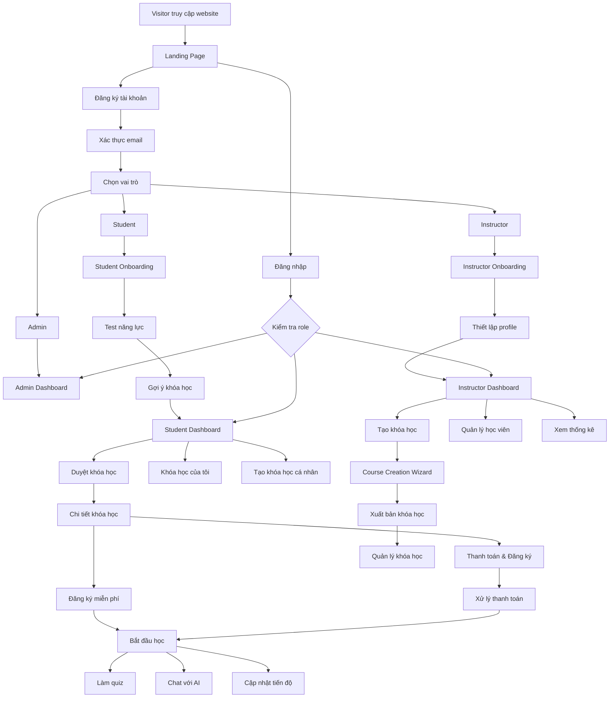
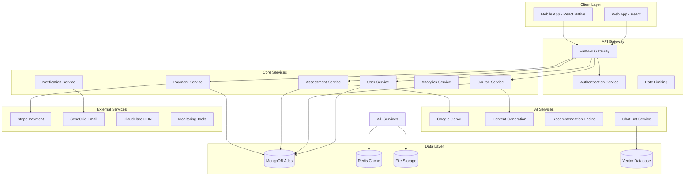
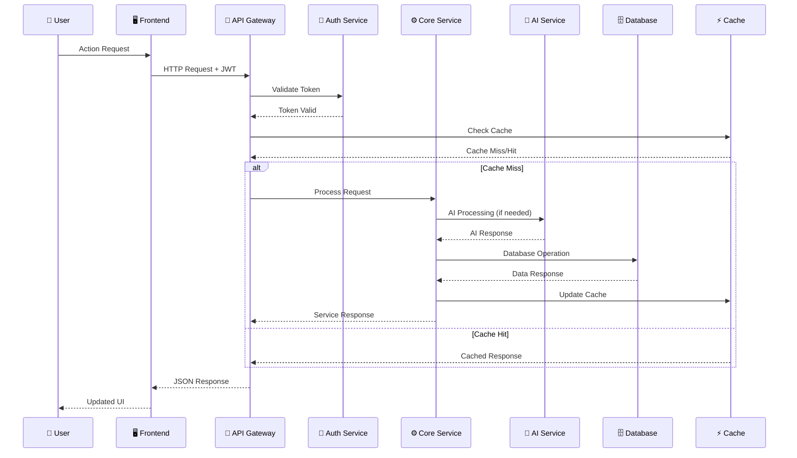
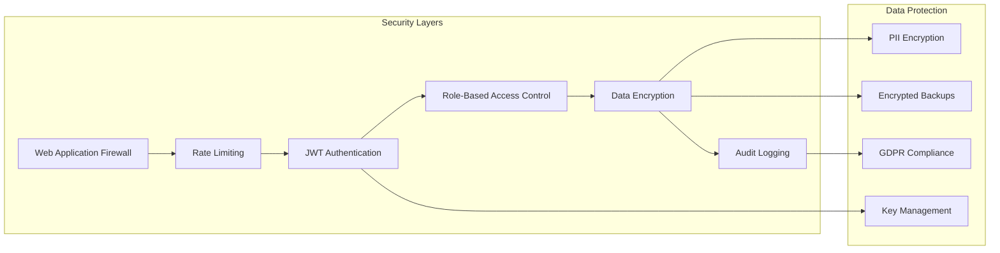
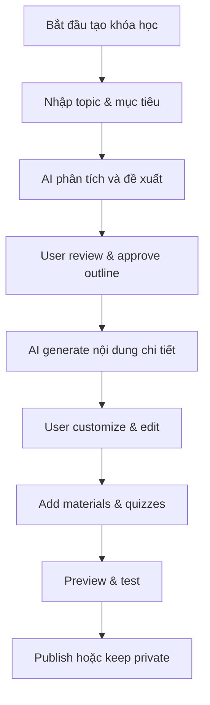
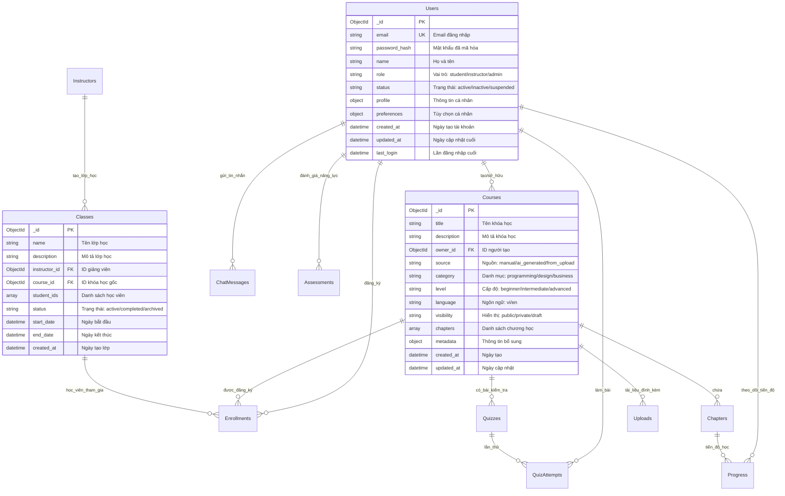

# HỆ THỐNG NỀN TẢNG HỌC TẬP AI - TÀI LIỆU KỸ THUẬT TỔNG QUAN
> người tạo: NGUYỄN NGỌC TUẤN ANH
> Tài liệu kỹ thuật hoàn chỉnh cho Backend và Frontend teams  
> Ngày cập nhật: 04/10/2025

## MỤC LỤC

1. [TỔNG QUAN HỆ THỐNG](#1-tổng-quan-hệ-thống)
2. [USER FLOW TỔNG THỂ](#2-user-flow-tổng-thể)
3. [SYSTEM FLOW & KIẾN TRÚC](#3-system-flow--kiến-trúc)
4. [YÊU CẦU DEVELOPMENT](#4-yêu-cầu-development)
5. [LUỒNG NGƯỜI DÙNG CHI TIẾT](#5-luồng-người-dùng-chi-tiết)
6. [KIẾN TRÚC DATABASE](#6-kiến-trúc-database)
7. [API ENDPOINTS](#7-api-endpoints)
8. [CÔNG NGHỆ SỬ DỤNG](#8-công-nghệ-sử-dụng)
9. [GIAO DIỆN NGƯỜI DÙNG](#9-giao-diện-người-dùng)
10. [BẢNG CHỨC NĂNG THEO VAI TRÒ](#10-bảng-chức-năng-theo-vai-trò)

---

## 1. TỔNG QUAN HỆ THỐNG

### 1.1 Mô tả hệ thống
**AI Learning Platform** là nền tảng học tập thông minh được xây dựng để cung cấp trải nghiệm học tập cá nhân hóa thông qua công nghệ AI. Hệ thống hỗ trợ 3 vai trò chính với các chức năng riêng biệt:

- **Student (Học viên)**: 
  - Tham gia học các khóa học từ giảng viên hoặc khóa học công khai
  - Tự tạo khóa học cá nhân với sự hỗ trợ của AI
  - Làm bài test đánh giá năng lực để nhận gợi ý khóa học phù hợp
  - Theo dõi tiến độ học tập và đạt được các thành tích
  
- **Instructor (Giảng viên)**: 
  - Tạo lớp học và mời học viên tham gia
  - Sử dụng khóa học có sẵn để giảng dạy
  - Tạo quiz và assignments để đánh giá học viên
  - Theo dõi tiến độ và quản lý học viên trong lớp
  
- **Admin (Quản trị viên)**: 
  - Quản lý toàn bộ người dùng và phân quyền
  - Tạo, sửa, xóa tất cả khóa học trong hệ thống
  - Xem và quản lý khóa học cá nhân của học viên
  - Giám sát hoạt động và thống kê hệ thống

### 1.2 Mục tiêu hệ thống

#### 1.2.1 Mục tiêu chính
- **Cá nhân hóa học tập**: Sử dụng AI để đánh giá năng lực và đề xuất lộ trình học phù hợp với từng học viên
- **Linh hoạt tạo nội dung**: Học viên có thể tự tạo khóa học cá nhân, giảng viên tạo lớp học từ khóa học có sẵn
- **Hỗ trợ thông minh**: AI chatbot hỗ trợ giải đáp thắc mắc trong quá trình học tập
- **Theo dõi tiến độ**: Hệ thống analytics chi tiết giúp theo dõi quá trình học tập và giảng dạy
- **Quản lý tập trung**: Admin có toàn quyền quản lý nội dung và người dùng

#### 1.2.2 Giá trị cốt lõi
- **Học tập thông minh**: AI phân tích và gợi ý nội dung phù hợp
- **Tự chủ học tập**: Học viên chủ động tạo và quản lý khóa học riêng
- **Quản lý hiệu quả**: Giảng viên và admin có công cụ quản lý mạnh mẽ
- **Trải nghiệm liền mạch**: Giao diện thân thiện, responsive trên mọi thiết bị

### 1.3 Đối tượng sử dụng

#### 1.3.1 Học viên (Students)
- **Đặc điểm**: Người học muốn nâng cao kiến thức, kỹ năng trong các lĩnh vực khác nhau
- **Nhu cầu**: 
  - Tìm kiếm khóa học phù hợp với trình độ
  - Học theo tốc độ và lịch trình cá nhân
  - Nhận hỗ trợ khi gặp khó khăn
  - Tự tạo nội dung học tập riêng
- **Lợi ích**: Học tập linh hoạt, được hỗ trợ AI, theo dõi tiến độ rõ ràng

#### 1.3.2 Giảng viên (Instructors)
- **Đặc điểm**: Người có kiến thức chuyên môn, muốn chia sẻ và giảng dạy
- **Nhu cầu**:
  - Tạo lớp học và quản lý học viên
  - Sử dụng nội dung khóa học có sẵn
  - Theo dõi tiến độ và đánh giá học viên
  - Giao tiếp với học viên hiệu quả
- **Lợi ích**: Công cụ quản lý lớp học mạnh mẽ, tiết kiệm thời gian tạo nội dung

#### 1.3.3 Quản trị viên (Admins)
- **Đặc điểm**: Người quản lý và vận hành nền tảng
- **Nhu cầu**:
  - Kiểm soát toàn bộ nội dung và người dùng
  - Đảm bảo chất lượng khóa học
  - Giám sát hoạt động hệ thống
  - Xử lý các vấn đề phát sinh
- **Lợi ích**: Quyền quản lý tối đa, dashboard tổng quan chi tiết

### 1.4 Phạm vi hệ thống

#### 1.4.1 Phạm vi chức năng
**Trong phạm vi (In-scope):**
- ✅ Quản lý người dùng (đăng ký, đăng nhập, phân quyền)
- ✅ Quản lý khóa học (tạo, sửa, xóa, xem)
- ✅ Hệ thống lớp học (giảng viên tạo lớp, mời học viên)
- ✅ Khóa học cá nhân (học viên tự tạo)
- ✅ Đánh giá năng lực (skill assessment)
- ✅ Quiz và bài tập
- ✅ AI chatbot hỗ trợ học tập
- ✅ Theo dõi tiến độ và analytics
- ✅ Upload và xử lý tài liệu
- ✅ Hệ thống thông báo

**Ngoài phạm vi (Out-of-scope):**
- ❌ Video conferencing trực tiếp
- ❌ Marketplace thanh toán cho khóa học (giai đoạn đầu)
- ❌ Mobile app native (chỉ web responsive)
- ❌ Gamification nâng cao (badges, leaderboard)
- ❌ Certificate chính thức được công nhận
- ❌ Tích hợp hệ thống LMS của bên thứ ba

#### 1.4.2 Phạm vi kỹ thuật
- **Frontend**: Web application (React + TypeScript)
- **Backend**: REST API (FastAPI + Python)
- **Database**: MongoDB Atlas (NoSQL)
- **AI Services**: Google GenAI (Gemini)
- **Storage**: Cloud storage cho files/media
- **Deployment**: Cloud hosting (DigitalOcean/AWS/Vercel)

### 1.5 Các chức năng chính

#### 1.5.1 Chức năng học viên (Student Features)
- **Test năng lực đầu vào**: 
  - Đánh giá trình độ theo từng lĩnh vực (Programming, Design, Business...)
  - AI phân tích kết quả và đưa ra điểm mạnh/yếu
  - Gợi ý khóa học phù hợp với level hiện tại
  
- **Học tập linh hoạt**:
  - Đăng ký khóa học từ giảng viên hoặc khóa học công khai
  - Học theo tiến độ cá nhân
  - Làm quiz và nhận feedback tức thì
  - Chat với AI để giải đáp thắc mắc
  
- **Khóa học cá nhân**:
  - Tự tạo khóa học với AI hỗ trợ sinh nội dung
  - Upload tài liệu và AI tự động tạo outline
  - Quản lý và theo dõi tiến độ học riêng

#### 1.5.2 Chức năng giảng viên (Instructor Features)
- **Quản lý lớp học**:
  - Tạo lớp học và gắn khóa học có sẵn
  - Mời học viên qua email hoặc mã lớp
  - Thêm, sửa, xóa học viên trong lớp
  
- **Đánh giá học viên**:
  - Tạo quiz và assignments
  - Xem kết quả và tiến độ từng học viên
  - Gửi thông báo và phản hồi
  
- **Thống kê và báo cáo**:
  - Dashboard tổng quan lớp học
  - Theo dõi hoạt động học viên
  - Phân tích hiệu quả giảng dạy

#### 1.5.3 Chức năng quản trị (Admin Features)
- **Quản lý người dùng**:
  - Xem danh sách tất cả users
  - Phân quyền (student/instructor/admin)
  - Kích hoạt/vô hiệu hóa tài khoản
  
- **Quản lý nội dung**:
  - CRUD tất cả khóa học (kể cả khóa học cá nhân)
  - Xem và quản lý lớp học của giảng viên
  - Kiểm duyệt nội dung nếu cần
  
- **Giám sát hệ thống**:
  - Dashboard thống kê tổng thể
  - Báo cáo hoạt động người dùng
  - Cảnh báo và xử lý sự cố

### 1.6 Kiến trúc tổng thể

#### 1.6.1 Sơ đồ kiến trúc cấp cao (High-Level Architecture)

```
┌─────────────────────────────────────────────────────────────────────┐
│                         CLIENT LAYER                                 │
│  ┌──────────────┐  ┌──────────────┐  ┌──────────────┐              │
│  │   Browser    │  │    Mobile    │  │    Tablet    │              │
│  │  (Desktop)   │  │   (Webapp)   │  │   (Webapp)   │              │
│  └──────────────┘  └──────────────┘  └──────────────┘              │
└─────────────────────────────────────────────────────────────────────┘
                              │
                    HTTPS/WebSocket
                              │
┌─────────────────────────────────────────────────────────────────────┐
│                      FRONTEND APPLICATION                            │
│  ┌──────────────────────────────────────────────────────────────┐  │
│  │  React 18 + TypeScript + Vite                                │  │
│  │  ┌─────────────┐  ┌─────────────┐  ┌─────────────┐          │  │
│  │  │   Zustand   │  │ TanStack    │  │  React      │          │  │
│  │  │   (State)   │  │   Query     │  │   Router    │          │  │
│  │  └─────────────┘  └─────────────┘  └─────────────┘          │  │
│  │  ┌─────────────┐  ┌─────────────┐  ┌─────────────┐          │  │
│  │  │  Tailwind   │  │   Axios     │  │  Framer     │          │  │
│  │  │    CSS      │  │  (HTTP)     │  │   Motion    │          │  │
│  │  └─────────────┘  └─────────────┘  └─────────────┘          │  │
│  └──────────────────────────────────────────────────────────────┘  │
└─────────────────────────────────────────────────────────────────────┘
                              │
                         REST API
                              │
┌─────────────────────────────────────────────────────────────────────┐
│                       BACKEND APPLICATION                            │
│  ┌──────────────────────────────────────────────────────────────┐  │
│  │  FastAPI + Python 3.11 + Uvicorn                             │  │
│  │  ┌─────────────┐  ┌─────────────┐  ┌─────────────┐          │  │
│  │  │   Routers   │  │  Services   │  │   Models    │          │  │
│  │  │  (API       │  │  (Business  │  │  (Beanie    │          │  │
│  │  │ Endpoints)  │  │   Logic)    │  │    ODM)     │          │  │
│  │  └─────────────┘  └─────────────┘  └─────────────┘          │  │
│  │  ┌─────────────┐  ┌─────────────┐  ┌─────────────┐          │  │
│  │  │   Schemas   │  │    Auth     │  │  Middleware │          │  │
│  │  │ (Pydantic)  │  │    (JWT)    │  │   (CORS)    │          │  │
│  │  └─────────────┘  └─────────────┘  └─────────────┘          │  │
│  └──────────────────────────────────────────────────────────────┘  │
└─────────────────────────────────────────────────────────────────────┘
                              │
              ┌───────────────┼───────────────┐
              │               │               │
┌─────────────────────┐ ┌────────────────┐ ┌─────────────────────┐
│   AI SERVICES       │ │   DATA LAYER   │ │  STORAGE SERVICES   │
│                     │ │                │ │                     │
│  ┌───────────────┐  │ │ ┌────────────┐ │ │  ┌──────────────┐  │
│  │  Google       │  │ │ │  MongoDB   │ │ │  │  File        │  │
│  │  GenAI API    │  │ │ │  Atlas     │ │ │  │  Storage     │  │
│  │  (Gemini)     │  │ │ │ (Primary)  │ │ │  │  (S3/R2)     │  │
│  └───────────────┘  │ │ └────────────┘ │ │  └──────────────┘  │
│  ┌───────────────┐  │ │ ┌────────────┐ │ │                     │
│  │  Embeddings   │  │ │ │   Redis    │ │ │                     │
│  │  Generation   │  │ │ │  (Cache)   │ │ │                     │
│  └───────────────┘  │ │ └────────────┘ │ │                     │
│  ┌───────────────┐  │ │ ┌────────────┐ │ │                     │
│  │  Content      │  │ │ │  Vector    │ │ │                     │
│  │  Generation   │  │ │ │    DB      │ │ │                     │
│  └───────────────┘  │ │ └────────────┘ │ │                     │
└─────────────────────┘ └────────────────┘ └─────────────────────┘
```

#### 1.6.2 Luồng dữ liệu chính (Data Flow)

**1. Authentication Flow (Luồng xác thực):**
```
User → Frontend → POST /api/v1/auth/login 
    → Backend validates credentials 
    → Generate JWT tokens (access + refresh)
    → Store in localStorage/httpOnly cookie
    → Return user data + tokens to Frontend
```

**2. Course Learning Flow (Luồng học khóa học):**
```
User clicks course → Frontend → GET /api/v1/courses/{id}
    → Backend retrieves from MongoDB
    → Return course data (chapters, materials, quizzes)
    → Frontend renders learning interface
    → User progresses → PATCH /api/v1/enrollments/{id}/progress
    → Backend updates progress in MongoDB
```

**3. AI Interaction Flow (Luồng tương tác AI):**
```
User asks question → Frontend → POST /api/v1/chat/course/{id}
    → Backend retrieves course context from Vector DB
    → Call Google GenAI API with context + question
    → AI generates response
    → Save to MongoDB (chat history)
    → Return response to Frontend
```

**4. Content Creation Flow (Luồng tạo nội dung):**
```
User provides prompt → Frontend → POST /api/v1/courses/from-prompt
    → Backend calls GenAI service
    → AI generates course outline + chapters
    → Save to MongoDB
    → Create embeddings → Store in Vector DB
    → Return course data to Frontend
```

#### 1.6.3 Các lớp kiến trúc (Architecture Layers)

| Lớp (Layer) | Công nghệ | Trách nhiệm | Giao tiếp |
|-------------|-----------|-------------|-----------|
| **Presentation Layer** | React, TypeScript | Giao diện người dùng, xử lý tương tác | REST API calls |
| **API Layer** | FastAPI routers | Xử lý HTTP requests, validation | Routers → Services |
| **Business Logic Layer** | Python services | Xử lý logic nghiệp vụ, AI integration | Services → Models/AI |
| **Data Access Layer** | Beanie ODM | Truy xuất và lưu trữ dữ liệu | Models → Database |
| **Database Layer** | MongoDB Atlas | Lưu trữ dữ liệu persistent | - |
| **AI Services Layer** | Google GenAI | Xử lý AI tasks | API calls |
| **Cache Layer** | Redis | Cache dữ liệu tạm thời | Key-value storage |

#### 1.6.4 Deployment Architecture (Kiến trúc triển khai)

```
┌─────────────────────────────────────────────────────────────┐
│                      PRODUCTION ENVIRONMENT                  │
├─────────────────────────────────────────────────────────────┤
│                                                              │
│  ┌─────────────────┐         ┌─────────────────┐           │
│  │   CDN           │         │  Load Balancer  │           │
│  │  (CloudFlare)   │◄────────│   (Nginx)       │           │
│  └─────────────────┘         └─────────────────┘           │
│           │                           │                     │
│           ▼                           ▼                     │
│  ┌─────────────────┐         ┌─────────────────┐           │
│  │  Frontend       │         │  Backend API    │           │
│  │  (Vercel/       │         │  (DigitalOcean/ │           │
│  │   Netlify)      │         │     AWS EC2)    │           │
│  └─────────────────┘         └─────────────────┘           │
│                                       │                     │
│                    ┌──────────────────┼──────────────┐      │
│                    ▼                  ▼              ▼      │
│           ┌─────────────┐    ┌─────────────┐  ┌─────────┐ │
│           │  MongoDB    │    │   Redis     │  │   S3    │ │
│           │   Atlas     │    │   Cloud     │  │  /R2    │ │
│           └─────────────┘    └─────────────┘  └─────────┘ │
│                                                              │
│  ┌──────────────────────────────────────────────────────┐  │
│  │         Monitoring & Logging                         │  │
│  │  ┌──────────┐  ┌──────────┐  ┌──────────┐           │  │
│  │  │  Sentry  │  │   Logs   │  │ Analytics│           │  │
│  │  └──────────┘  └──────────┘  └──────────┘           │  │
│  └──────────────────────────────────────────────────────┘  │
└─────────────────────────────────────────────────────────────┘
```

---

## 2. USER FLOW TỔNG THỂ

### 2.1 Tổng quan User Journey

```
VISITOR → REGISTRATION → ROLE SELECTION → ONBOARDING → MAIN PLATFORM → LEARNING/TEACHING → GROWTH
```

### 2.2 User Flow Diagram Tổng Thể



### 2.3 Chi tiết các User Journey chính

#### 2.3.1 Student Journey
```
1. Trang chủ → Đăng ký → Xác thực email → Chọn vai trò: Học viên  
2. Thiết lập hồ sơ → Kiểm tra năng lực → Phân tích bởi AI → Gợi ý khóa học  
3. Duyệt danh sách khóa học → Xem chi tiết → Đăng ký (Miễn phí / Trả phí) → Thanh toán (nếu có)  
4. Bảng điều khiển học tập → Chọn khóa học → Duyệt chương → Học nội dung  
5. Học tương tác → Làm quiz → Trò chuyện với AI → Theo dõi tiến độ → Hoàn thành khóa học  
6. Tự tạo khóa học cá nhân → Hỗ trợ AI → Sinh lộ trình học tập riêng  
7. Hệ thống thành tích → Huy hiệu → Chứng chỉ → Bảng xếp hạng
 
```
#### 2.3.2 Instructor Journey
```
1. Landing → Register → Email Verify → Role: Instructor
2. Profile Setup → Teaching Experience → Subject Expertise → Portfolio
3. Instructor Dashboard → Course Creation → Content Development → AI Assistance
4. Course Setup → Pricing → Visibility → Publishing → Student Management
5. Analytics Dashboard → Student Progress → Revenue Tracking → Course Optimization
6. Student Communication → Q&A → Feedback → Course Updates
7. Payout Management → Revenue Reports → Tax Documents
```

#### 2.3.3 Admin Journey
```
1. Truy cập hệ thống → Bảng điều khiển Admin → Tổng quan hệ thống → Theo dõi tình trạng  
2. Quản lý người dùng → Gán vai trò → Kiểm duyệt tài khoản → Theo dõi hoạt động  
3. Kiểm duyệt nội dung → Duyệt khóa học (có thể bỏ) 
4. Phân tích & Báo cáo → Chỉ số nền tảng → Phân tích doanh thu → Thống kê người dùng  
5. Cấu hình hệ thống → Quản lý tính năng → Cài đặt thanh toán → Tham số AI  (có thể bỏ)
6. Hỗ trợ người dùng → Xử lý khiếu nại → Liên hệ hỗ trợ → Chuyển cấp xử lý (có thể bỏ


```

---

## 3. SYSTEM FLOW & KIẾN TRÚC

### 3.1 System Architecture Overview



### 3.2 Data Flow Architecture



### 3.3 Microservices Architecture (kiến trúc)

| Dịch vụ (Service) | Chức năng chính (Responsibility) | Cơ sở dữ liệu (Database) | Tích hợp AI (AI Integration) |
|--------------------|----------------------------------|---------------------------|-------------------------------|
| **User Service** | Xác thực người dùng, quản lý hồ sơ cá nhân và phân quyền (học viên, giảng viên, quản trị viên). | MongoDB | Tối ưu hồ sơ người dùng (đề xuất cải thiện thông tin cá nhân hoặc hồ sơ chuyên môn). |
| **Assessment Service** | Tổ chức và đánh giá bài kiểm tra năng lực, quiz hoặc bài thi tự động. | MongoDB | Tạo câu hỏi tự động và phân tích kết quả đánh giá. |
| **Course Service** | Quản lý nội dung khóa học, bao gồm các thao tác tạo, đọc, cập nhật và xóa (CRUD). | MongoDB | Sinh nội dung khóa học và dịch tự động sang nhiều ngôn ngữ. |
| **Enrollment Service** | Quản lý đăng ký khóa học và theo dõi tiến độ học tập của học viên. | MongoDB | Tối ưu lộ trình học tập cá nhân dựa trên kết quả và hành vi học. |
| **Payment Service** | Xử lý giao dịch thanh toán và quản lý hóa đơn, gói học. | MongoDB | Phát hiện và ngăn chặn gian lận trong thanh toán. |
| **Chat Service** | Cung cấp tính năng trò chuyện với AI và quản lý ngữ cảnh hội thoại. | MongoDB + Vector | Hỗ trợ hội thoại thông minh, trợ lý học tập dựa trên AI. |
| **Analytics Service** | Thu thập, tổng hợp và báo cáo dữ liệu thống kê về người dùng, khóa học và hệ thống. | MongoDB | Phân tích dữ liệu và tạo ra các báo cáo, thông tin chi tiết (insights). |
| **Notification Service** | Gửi email, thông báo đẩy và nhắc nhở tự động cho người dùng. | Redis | Dự đoán thời điểm gửi thông báo tối ưu nhằm tăng khả năng tương tác. |




---

## 4. YÊU CẦU DEVELOPMENT

### 4.1 Environment Setup Requirements

#### 4.1.1 Development Environment
```yaml
Backend Requirements:
  - Python 3.11+
  - MongoDB Atlas cluster
  - Redis instance
  - Google Cloud AI API key
  - Stripe test keys
  - SendGrid API key
  - AWS S3 bucket (optional)

Frontend Requirements:
  - Node.js 18+
  - npm/yarn package manager
  - Modern browser (Chrome 90+)
  - VS Code + extensions

Development Tools:
  - Docker & Docker Compose
  - Git version control
  - Postman/Insomnia (API testing)
  - MongoDB Compass (database GUI)
```

#### 4.1.2 Project Structure Setup
```
LEARNING-AI/
├── BEDB/                           # Backend FastAPI
│   ├── app/
│   │   ├── main.py                # FastAPI entry point
│   │   ├── config.py              # Environment configuration
│   │   ├── models/                # Database models (Beanie ODM)
│   │   ├── routers/               # API endpoints
│   │   ├── schemas/               # Pydantic schemas
│   │   ├── services/              # Business logic
│   │   └── utils/                 # Helper functions
│   ├── requirements.txt           # Python dependencies
│   ├── Dockerfile                 # Container configuration
│   └── .env.example              # Environment variables template
├── learning-app-fe/               # Frontend React
│   ├── src/
│   │   ├── components/           # Reusable UI components
│   │   ├── pages/               # Route components
│   │   ├── stores/              # Zustand state management
│   │   ├── services/            # API integration
│   │   ├── hooks/               # Custom React hooks
│   │   ├── utils/               # Helper functions
│   │   └── types/               # TypeScript definitions
│   ├── package.json             # Dependencies
│   ├── tailwind.config.js       # Styling configuration
│   └── vite.config.ts           # Build configuration
└── docs/                          # Documentation
    ├── API_DOCS.md               # API documentation
    ├── DEPLOYMENT.md             # Deployment guide
    └── DEVELOPMENT.md            # Development guide
```

### 4.2 Development Workflow

#### 4.2.1 Backend Development Process
```
1. Setup & Configuration
   - Install Python dependencies: pip install -r requirements.txt
   - Configure environment variables from .env.example
   - Setup MongoDB Atlas connection
   - Initialize database with sample data

2. API Development
   - Create Pydantic models in schemas/
   - Create database models in models/ (Beanie ODM)
   - Implement business logic in services/
   - Create API endpoints in routers/
   - Add authentication & authorization
   - Write unit tests

3. AI Integration
   - Setup Google GenAI API
   - Implement content generation services
   - Create assessment logic
   - Build recommendation engine
   - Integrate chat functionality

4. Testing & Documentation
   - Unit tests with pytest
   - API documentation with FastAPI auto-docs
   - Integration testing
   - Performance testing
```

#### 4.2.2 Frontend Development Process
```
1. Setup & Configuration
   - Install Node.js dependencies: npm install
   - Configure environment variables
   - Setup development server: npm run dev
   - Configure Tailwind CSS & theme

2. Component Development
   - Create reusable UI components
   - Implement responsive design
   - Add dark mode support
   - Build accessibility features

3. State Management
   - Setup Zustand stores for each feature
   - Implement API integration with React Query
   - Handle loading states & error handling
   - Create form management with React Hook Form

4. Feature Implementation
   - Build authentication flow
   - Create dashboard interfaces
   - Implement course management
   - Add assessment system
   - Build payment integration
   - Create chat interface

5. Testing & Optimization
   - Component testing with Vitest
   - E2E testing with Playwright
   - Performance optimization
   - Bundle size optimization
```

### 4.3 Database Setup & Migration

#### 4.3.1 MongoDB Collections Setup
```javascript
// Collections to create
collections = [
  'users',
  'courses', 
  'assessments',
  'enrollments',
  'payments',
  'quizzes',
  'chat_sessions',
  'chat_messages',
  'uploads',
  'notifications',
  'analytics'
]

// Sample data structure
sampleData = {
  adminUser: {
    email: "admin@example.com",
    role: "admin",
    name: "System Admin"
  },
  sampleCourses: [
    {
      title: "JavaScript Fundamentals",
      category: "programming",
      level: "beginner",
      visibility: "public",
      type: "free"
    }
  ]
}
```

#### 4.3.2 Database Indexes & Optimization
```javascript
// Essential indexes for performance
db.users.createIndex({ "email": 1 }, { unique: true })
db.users.createIndex({ "role": 1, "status": 1 })
db.courses.createIndex({ "instructor_id": 1, "visibility": 1 })
db.courses.createIndex({ "category": 1, "level": 1 })
db.enrollments.createIndex({ "student_id": 1, "status": 1 })
db.enrollments.createIndex({ "course_id": 1, "status": 1 })
db.assessments.createIndex({ "user_id": 1, "assessment_type": 1 })
db.payments.createIndex({ "user_id": 1, "status": 1 })
db.chat_messages.createIndex({ "session_id": 1, "created_at": -1 })

// Vector search index for AI features
db.embeddings.createIndex({
  "embedding": "vector",
  "text": "text"
})
```

### 4.4 API Development Standards

#### 4.4.1 API Naming Conventions
```
Resource naming: /api/v1/{resource}
Actions: POST (create), GET (read), PUT (update), DELETE (delete)
Nested resources: /api/v1/courses/{course_id}/chapters
Query parameters: ?skip=0&limit=10&category=programming
```

#### 4.4.2 Response Standards
```javascript
// Success response
{
  "success": true,
  "data": {
    // response data
  },
  "message": "Operation completed successfully",
  "timestamp": "2025-10-05T10:30:00Z"
}

// Error response
{
  "success": false,
  "error": {
    "code": "VALIDATION_ERROR",
    "message": "Invalid input data",
    "details": {
      "field": "email",
      "issue": "Invalid email format"
    }
  },
  "timestamp": "2025-10-05T10:30:00Z"
}
```

### 4.5 Testing Strategy

#### 4.5.1 Backend Testing
```python
# Unit tests for services
def test_create_user():
    user_data = {"email": "test@example.com", "name": "Test User"}
    user = create_user(user_data)
    assert user.email == "test@example.com"

# Integration tests for APIs
def test_register_endpoint():
    response = client.post("/api/v1/auth/register", json=user_data)
    assert response.status_code == 201
    assert "access_token" in response.json()

# AI service tests
def test_course_generation():
    prompt = "Create a Python course for beginners"
    course = generate_course_from_prompt(prompt)
    assert course.title is not None
    assert len(course.chapters) > 0
```

#### 4.5.2 Frontend Testing
```typescript
// Component tests
test('renders login form', () => {
  render(<LoginForm />);
  expect(screen.getByLabelText(/email/i)).toBeInTheDocument();
  expect(screen.getByLabelText(/password/i)).toBeInTheDocument();
});

// Integration tests
test('user can register and login', async () => {
  // Test registration flow
  const user = userEvent.setup();
  render(<RegistrationFlow />);
  
  await user.type(screen.getByLabelText(/email/i), 'test@example.com');
  await user.type(screen.getByLabelText(/password/i), 'password123');
  await user.click(screen.getByRole('button', { name: /register/i }));
  
  expect(await screen.findByText(/registration successful/i)).toBeInTheDocument();
});
```

### 4.6 Production Deployment Requirements

#### 4.6.1 Infrastructure Requirements
```yaml
Backend Deployment:
  - VPS/Cloud instance (2+ CPU cores, 4GB+ RAM)
  - MongoDB Atlas cluster (M10+ for production)
  - Redis instance (256MB+ memory)
  - SSL certificate (Let's Encrypt or commercial)
  - Domain name with DNS configuration
  - Load balancer (for scaling)

Frontend Deployment:
  - CDN service (CloudFlare, AWS CloudFront)
  - Static hosting (Vercel, Netlify, AWS S3)
  - SSL certificate (auto-configured)
  - Custom domain configuration

Monitoring & Logging:
  - Application monitoring (Sentry, DataDog)
  - Server monitoring (New Relic, Grafana)
  - Log aggregation (ELK stack, Splunk)
  - Uptime monitoring (Pingdom, StatusPage)
```

#### 4.6.2 Security Configuration
```yaml
Production Security:
  - Environment variables in secure vault
  - Database encryption at rest
  - API rate limiting (100 requests/minute/user)
  - CORS configuration for production domains
  - Security headers (HSTS, CSP, X-Frame-Options)
  - Regular security audits
  - Automated backups with encryption
  - DDoS protection
```

#### 4.6.3 Performance Optimization
```yaml
Backend Optimization:
  - Database query optimization
  - Redis caching strategy
  - API response compression
  - Image optimization and CDN
  - Background job processing
  - Connection pooling

Frontend Optimization:
  - Code splitting and lazy loading
  - Bundle size optimization
  - Image lazy loading
  - Service worker for caching
  - Performance monitoring
  - Core Web Vitals optimization
```

---

## 5. LUỒNG NGƯỜI DÙNG CHI TIẾT

### 5.1 STUDENT WORKFLOW (Học viên)

#### 5.1.1 Onboarding và Test Năng lực

```
Đăng ký (gmail/gg) → Điền thông tin cơ bản → Test năng lực → Gợi ý khóa học → Dashboard
```

**Chi tiết test năng lực:**
1. **Bước 1**: Chọn lĩnh vực quan tâm (Programming, Design, Business, etc.)
2. **Bước 2**: Trả lời câu hỏi về mục tiêu học tập
3. **Bước 3**: Làm quiz đánh giá trình độ (10-15 câu hỏi)
4. **Bước 4**: AI phân tích kết quả và đưa ra:
   - Mức độ hiện tại (Beginner/Intermediate/Advanced)
   - Điểm mạnh/yếu cần cải thiện
   - Gợi ý 5-10 khóa học phù hợp
   - Lộ trình học tập cá nhân hóa

#### 5.1.2 Dashboard Student - Chi tiết giao diện

**Layout tổng thể:**
```
┌─────────────────────────────────────────────────────────────────┐
│  Header: Logo | Navigation | User Profile | Notifications      │
├─────────────────────────────────────────────────────────────────┤
│ Sidebar         │             Main Content Area               │
│ - Dashboard     │  ┌─────────────────────────────────────┐   │
│ - My Courses    │  │        Welcome Back, [Name]!        │   │
│ - Browse        │  │      Today's Learning Goals         │   │
│ - AI Chat       │  └─────────────────────────────────────┘   │
│ - Progress      │  ┌─────────────┐ ┌─────────────────────┐   │
│ - Settings      │  │  Continue   │ │   Recommended       │   │
│                 │  │  Learning   │ │     Courses         │   │
│                 │  └─────────────┘ └─────────────────────┘   │
│                 │  ┌─────────────────────────────────────┐   │
│                 │  │        Recent Activities           │   │
│                 │  └─────────────────────────────────────┘   │
└─────────────────────────────────────────────────────────────────┘
```

**Các section chi tiết:**

**1. Tổng quan (Overview Widget):**
- **Metrics hiển thị**:
  - Tổng thời gian học trong tuần: 12h 30m
  - Số khóa học đã hoàn thành: 3/8
  - Điểm trung bình quiz: 87.5%
  - Streak learning: 7 ngày liên tiếp
- **Biểu đồ**: Progress chart theo thời gian
- **Quick actions**: "Tiếp tục học", "Tạo khóa học mới", "Chat với AI"

**2. Khóa học đã đăng ký (Enrolled Courses):**
- **Card format** cho mỗi khóa học:
  ```
  ┌─────────────────────────────────────┐
  │ [Thumbnail] | Course Title         │
  │             | Progress: [██████▒▒▒] 70% │
  │             | Next: Chapter 8      │
  │             | Time spent: 4h 20m   │
  │ [Continue] [Chat AI] [Quiz]        │
  └─────────────────────────────────────┘
  ```
- **Filters**: All, In Progress, Completed, Bookmarked
- **Sort**: Recent, Progress, Alphabetical

**3. Khóa học cá nhân (Personal Courses):**
- **Danh sách khóa học tự tạo**
- **Status indicators**: Draft, Published, Private
- **Quick edit** và **AI suggestions** cho nội dung
- **Template library** để tạo khóa học nhanh

**4. Gợi ý học tập AI (AI Recommendations):**
- **Dựa trên**:
  - Skill assessment results
  - Learning history và preferences
  - Industry trends và job market
  - Peer learning paths (anonymized)
- **Hiển thị**: Carousel với 5-6 khóa học được gợi ý
- **Lý do gợi ý**: "Based on your interest in Python..."

**5. Thành tích & Gamification:**
- **Badges earned**: Beginner, Fast Learner, Quiz Master, etc.
- **Learning streaks**: Calendar heatmap
- **Leaderboard**: Top learners in similar fields (opt-in)
- **Points system**: Để unlock features hoặc certificates

**6. Lịch học & Planning:**
- **Calendar view**: Học gì, khi nào
- **Study reminders**: Smart notifications
- **Goal setting**: Daily/weekly learning targets
- **Time tracking**: Automatic và manual logging

#### 5.1.3 Quản lý khóa học - Chi tiết workflow

**A. Đăng ký khóa học (Course Enrollment):**

**Bước 1: Duyệt và tìm kiếm**
- **Browse interface**: Grid view hoặc list view
- **Advanced filters**:
  - Categories: Programming, Design, Business, Marketing...
  - Level: Beginner, Intermediate, Advanced
  - Duration: < 5h, 5-20h, 20h+
  - Language: Vietnamese, English
  - Price: Free, Paid
- **Search functionality**: Full-text search với auto-suggestions
- **Sorting options**: Popularity, Rating, Recent, A-Z

**Bước 2: Preview khóa học**
- **Course landing page** với:
  - Video trailer (nếu có)
  - Curriculum outline (có thể expand/collapse)
  - Instructor profile và credentials
  - Student reviews và ratings
  - Prerequisites và learning outcomes
  - Estimated completion time
- **Free preview**: 1-2 chapters đầu miễn phí
- **Sample quiz**: Để đánh giá độ khó

**Bước 3: Enrollment process**
- **One-click enrollment** cho khóa học miễn phí
- **Payment flow** cho khóa học trả phí (tích hợp Stripe/PayPal)
- **Join via invitation link** từ giảng viên
- **Bulk enrollment** cho enterprise users

**B. Tạo khóa học cá nhân (Personal Course Creation):**

**Workflow tạo khóa học với AI:**



**Chi tiết từng bước:**

**Bước 1: Khởi tạo (Course Initialization)**
- **Input form**:
  ```
  Course Title: [________________]
  Description: [________________]
  Target Level: [Beginner ▼]
  Category: [Programming ▼]
  Learning Goals: 
  - [Goal 1________________]
  - [Goal 2________________]
  Estimated Duration: [Auto-calculated]
  ```
- **AI prompt engineering**: System sẽ tự động tạo prompt tối ưu

**Bước 2: AI Content Generation**
- **Course outline generation**: AI tạo cấu trúc chương, bài học
- **Content suggestions**: 
  - Learning objectives cho từng chapter
  - Key concepts cần cover
  - Practical exercises
  - Assessment points
- **Customization options**: User có thể adjust, add, remove

**Bước 3: Content Development**
- **Rich text editor** với:
  - Markdown support
  - Code syntax highlighting
  - Image/video embedding
  - Interactive elements
- **AI writing assistant**: Giúp expand ideas, check grammar
- **Version control**: Track changes, rollback nếu cần

**Bước 4: Assessment Integration**
- **Quiz builder**: Drag-drop interface
- **AI quiz generation**: Tự động tạo câu hỏi từ nội dung
- **Multiple question types**: MCQ, True/False, Fill-in-blank, Code
- **Adaptive difficulty**: Câu hỏi adjust theo performance

**Bước 5: Publishing & Sharing**
- **Visibility settings**: Private, Shared with link, Public
- **Export options**: PDF, SCORM package
- **Analytics**: Track engagement nếu share public

### 5.2 INSTRUCTOR WORKFLOW (Giảng viên)

#### 5.2.1 Dashboard Instructor - Giao diện tổng quan

**Layout chính:**
```
┌────────────────────────────────────────────────────────────────────┐
│ Header: AI Learning Platform | Instructor Portal | [Profile] [🔔] │
├────────────────────────────────────────────────────────────────────┤
│ ┌───────────────┐ ┌─────────────────────────────────────────────┐ │
│ │   Quick Stats │ │              Weekly Overview               │ │
│ │ 📊 3 Classes  │ │    Mon  Tue  Wed  Thu  Fri  Sat  Sun     │ │
│ │ 👥 45 Students│ │  ┌─┐ ┌─┐ ┌─┐ ┌─┐ ┌─┐ ┌─┐ ┌─┐           │ │
│ │ 📈 89% Avg    │ │  │5│ │8│ │3│ │12││7│ │0│ │0│           │ │
│ │ ⭐ 4.7 Rating │ │  └─┘ └─┘ └─┘ └─┘ └─┘ └─┘ └─┘           │ │
│ └───────────────┘ └─────────────────────────────────────────────┘ │
│ ┌──────────────────────────────┐ ┌──────────────────────────────┐ │
│ │      My Classes              │ │    Student Activities         │ │
│ │ ┌─────────────────────────┐  │ │ • Mai completed Chapter 3     │ │
│ │ │ Python Basics (15👥)    │  │ │ • Tuấn asked question in... │ │
│ │ │ Progress: ████████▒▒ 80%│  │ │ • New enrollment: Linh       │ │
│ │ │ [Manage] [Analytics]    │  │ │ • Quiz submitted by Hùng     │ │
│ │ └─────────────────────────┘  │ │ [View All Activities]        │ │
│ └──────────────────────────────┘ └──────────────────────────────┘ │
└────────────────────────────────────────────────────────────────────┘
```

**Metrics chính hiển thị:**
- **Tổng số lớp đang giảng dạy**: Active vs Inactive classes
- **Tổng số học viên**: Across all classes với breakdown theo class
- **Engagement rates**: Average completion rate, time spent
- **Performance metrics**: Average quiz scores, assignment submissions  
- **Rating & Feedback**: Student ratings và recent feedback
- **Revenue tracking**: Nếu có khóa học trả phí (tương lai)

**Quick Actions Panel:**
- 🎯 **Tạo lớp học mới**
- 📊 **Xem analytics chi tiết** 
- 💬 **Trả lời câu hỏi đang chờ**
- 📝 **Tạo announcement**
- 🏆 **Tạo quiz/assignment mới**

#### 5.2.2 Tạo lớp và quản lý khóa học - Chi tiết workflow

**A. Quy trình tạo lớp học:**

**Bước 1: Thiết lập cơ bản**
```
┌─ Thông tin lớp học ─────────────────────────────────┐
│ Tên lớp: [_________________________________]       │
│ Mô tả: [___________________________________]       │
│ Chọn khóa học gốc: [Select Course ▼]              │
│ Thời gian bắt đầu: [Date picker]                  │
│ Thời gian kết thúc: [Date picker]                 │
│ Giới hạn học viên: [Number input] (optional)       │
│ Visibility: [🔒Private] [🔗Link] [🌐Public]        │
│ [Advanced Settings ▼]                              │
└────────────────────────────────────────────────────┘
```

**Bước 2: Cấu hình khóa học cho lớp**
- **Chọn từ khóa học có sẵn**: Browse library hoặc search
- **Customize curriculum**: Enable/disable chapters, reorder
- **Set pacing**: Tự học vs guided với deadlines
- **Assessment settings**: Quiz frequency, passing score
- **AI tutor configuration**: Enable/disable cho lớp học

**Bước 3: Quản lý thành viên**
- **Invitation methods**:
  - Email invitations (bulk import CSV)
  - Share invitation link 
  - QR code cho classroom
  - Integration với Google Classroom, Microsoft Teams
- **Enrollment controls**: Auto-approve vs manual review
- **Waitlist management**: Cho lớp có giới hạn

**B. Quản lý học viên chi tiết:**

**Student Management Dashboard:**
```
┌─ Class: Python Basics ─────────────────────────────────┐
│ 📊 Students: 23 | 📈 Avg Progress: 67% | ⭐ Satisfaction: 4.2│
├────────────────────────────────────────────────────────┤
│ 🔍 [Search students] [Filter▼] [Sort▼] [Export CSV]   │
├────────────────────────────────────────────────────────┤
│ Name          Progress    Last Active   Quiz Avg  Action│
│ 👤 Mai Nguyen   [████████▒▒] 80%  2h ago      85%   [👁️] │
│ 👤 Tuấn Anh     [████▒▒▒▒▒▒] 40%  1d ago      92%   [👁️] │
│ 👤 Linh Dao     [██████████] 100% 5m ago      78%   [👁️] │
│ ... (Show 10 per page)                              │
│ [< Previous] [1] [2] [3] [Next >]                    │
└────────────────────────────────────────────────────────┘
```

**Tính năng theo dõi chi tiết:**
- **Individual student profiles**: 
  - Learning path & progress timeline
  - Quiz performance analysis
  - Time spent in each chapter
  - Engagement patterns (active hours, frequency)
- **Communication tools**:
  - Direct messaging
  - Group announcements  
  - Email notifications
  - In-app discussion threads
- **Intervention alerts**: Students at risk of dropping out

**C. Tạo và quản lý assessments:**

**Quiz Builder Interface:**
```
┌─ Tạo Quiz Mới ─────────────────────────────────────────┐
│ Quiz Title: [________________________]                 │
│ Chapter: [Chapter 3: Functions ▼]                     │
│ Question Type: [Multiple Choice ▼] [+ Add Question]    │
├────────────────────────────────────────────────────────┤
│ Question 1: What is a function in Python?             │
│ A) [_____________________] ○                          │
│ B) [_____________________] ●  (Correct)               │
│ C) [_____________________] ○                          │
│ D) [_____________________] ○                          │
│ Explanation: [Optional feedback for students]          │
│ [🤖 Generate with AI] [⚙️ Settings] [🗑️ Delete]        │
└────────────────────────────────────────────────────────┘
```

**Assessment features:**
- **Question types**: MCQ, True/False, Fill-in-blank, Code challenges
- **AI-generated questions**: Từ nội dung chapter tự động
- **Adaptive difficulty**: Câu hỏi khó dần theo performance
- **Auto-grading**: Với detailed feedback
- **Plagiarism detection**: Cho assignments
- **Time limits**: Và multiple attempts settings

### 5.3 ADMIN WORKFLOW (Quản trị viên)

#### 5.3.1 Dashboard Admin - Tổng quan hệ thống

**Master Dashboard Layout:**
```
┌─────────────────────────────────────────────────────────────────────┐
│ 🔧 AI Learning Platform - Admin Portal            [Settings] [🔔]   │
├─────────────────────────────────────────────────────────────────────┤
│ ┌───────────────┐ ┌───────────────┐ ┌───────────────┐ ┌──────────┐ │
│ │📊 Total Users │ │📚 Courses     │ │💰 Revenue     │ │⚡System  │ │
│ │   1,247       │ │   89 Active   │ │  $12,450      │ │ 99.8%   │ │
│ │ (+23 today)   │ │  156 Total    │ │  This Month   │ │ Uptime  │ │
│ └───────────────┘ └───────────────┘ └───────────────┘ └──────────┘ │
│ ┌─────────────────────────────────┐ ┌─────────────────────────────┐ │
│ │     User Activity Trends        │ │      System Health          │ │
│ │  ┌─┐┌─┐┌─┐┌─┐┌─┐┌─┐┌─┐         │ │ CPU: ████████▒▒ 80%        │ │
│ │  │▓││▓││▓││▓││▓││▓││▓│         │ │ Memory: ██████▒▒▒▒ 60%     │ │
│ │  └─┘└─┘└─┘└─┘└─┘└─┘└─┘         │ │ Storage: ████▒▒▒▒▒▒ 40%    │ │
│ └─────────────────────────────────┘ └─────────────────────────────┘ │
│ ┌─────────────────────────────────────────────────────────────────┐ │
│ │                    Recent Activities                             │ │
│ │ • New user registration: minh.nv@example.com                    │ │
│ │ • Course published: "Advanced React" by instructor_123          │ │
│ │ • System alert: High memory usage on server-2                  │ │
│ │ • Payment processed: $49.99 from user_456                      │ │
│ │ [View All Activities] [Export Report]                          │ │
│ └─────────────────────────────────────────────────────────────────┘ │
└─────────────────────────────────────────────────────────────────────┘
```

**System Overview - Metrics chi tiết:**

**A. User Management Metrics:**
- **Total Users**: 1,247 (Students: 1,089 | Instructors: 145 | Admins: 13)
- **Growth Rate**: +23 users today, +156 this week
- **User Activity**: DAU (Daily Active Users), WAU, MAU
- **Retention Rate**: 30-day, 90-day retention
- **Geographic Distribution**: By country/region
- **User Segmentation**: Active vs Inactive, Paid vs Free

**B. Course & Content Metrics:**
- **Total Courses**: 156 (Active: 89, Draft: 34, Archived: 33)
- **Course Categories**: Distribution by subject
- **Engagement**: Average completion rate, time spent
- **Quality Scores**: Average ratings, completion rates
- **Content Creation**: New courses per month trend
- **Popular Courses**: Top 10 by enrollment và engagement

**C. System Performance:**
- **Uptime**: 99.8% (Target: 99.9%)
- **Response Times**: API response times, page load speeds
- **Error Rates**: 4xx và 5xx error percentages
- **Database Performance**: Query times, connection pools
- **AI Service Usage**: GenAI API calls, costs
- **Storage Usage**: Files, images, videos storage

#### 5.3.2 User Management - Quản lý người dùng

**Advanced User Management Interface:**
```
┌─ User Management Portal ───────────────────────────────────────────┐
│ 🔍 [Search users...] [🔽Advanced Filters] [+ Add User] [📤Export]  │
├────────────────────────────────────────────────────────────────────┤
│ Filters: [All Roles ▼] [All Status ▼] [Registration Date ▼]       │
├────────────────────────────────────────────────────────────────────┤
│ Avatar | Name           | Role       | Status  | Last Active | Actions│
│ 👤     | Mai Nguyen     | Student    | ✅Active | 2h ago     | [👁️][✏️]│
│ 👨‍🏫    | Dr. Tuấn Anh  | Instructor | ✅Active | 5m ago     | [👁️][✏️]│
│ 👤     | Linh Dao      | Student    | ⏸️Suspended| 2d ago   | [👁️][✏️]│
│ 🔧     | Admin User    | Admin      | ✅Active | Now       | [👁️][✏️]│
│ ... (Pagination: 50 per page)                                     │
│ [< Previous] [1] [2] [3] ... [15] [Next >]                       │
└────────────────────────────────────────────────────────────────────┘
```

**User Management Features:**

**A. User Profile Management:**
- **View detailed profiles**: Personal info, learning history, statistics
- **Role assignment và changes**: Student ↔ Instructor ↔ Admin
- **Account status management**: Active, Suspended, Deleted
- **Permission customization**: Granular permissions per admin role
- **Bulk operations**: Mass role changes, status updates
- **User impersonation**: For support purposes (với audit log)

**B. Advanced Filtering & Search:**
- **Text search**: Name, email, user ID
- **Role filters**: Multiple role selection
- **Status filters**: Active, Inactive, Suspended
- **Registration date**: Range picker
- **Activity filters**: Last login, course enrollment
- **Performance filters**: Course completion rate, quiz scores

**C. User Analytics & Reports:**
- **User behavior analysis**: Learning patterns, engagement metrics
- **Cohort analysis**: User groups performance over time
- **Churn prediction**: AI-based risk scoring
- **Export capabilities**: CSV, Excel, PDF reports
- **Custom reports**: Drag-drop report builder

#### 5.3.3 Content Management - Quản lý nội dung

**Content Moderation Dashboard:**
```
┌─ Content Management ───────────────────────────────────────────────┐
│ 📚 Courses: [All ▼] | 📝 Status: [Pending Review ▼] | 🏷️ Category: [All ▼]│
├────────────────────────────────────────────────────────────────────┤
│ Course Title               | Creator      | Status      | Actions   │
│ "Python for Data Science"  | dr_tuananh   | ✅Published | [👁️][✏️][🗑️]│
│ "Web Design Fundamentals"  | designer_mai | 📝Review    | [✅][❌][👁️]│
│ "Machine Learning Basics"  | ai_expert    | 📝Draft     | [👁️][✏️]   │
│ "Digital Marketing 101"    | marketer_x   | ⏸️Suspended | [👁️][🔄]   │
├────────────────────────────────────────────────────────────────────┤
│ 📊 Bulk Actions: [Select All] [Approve Selected] [Reject Selected]  │
└────────────────────────────────────────────────────────────────────┘
```

**Content Management Capabilities:**

**A. Course Lifecycle Management:**
- **Review workflow**: Draft → Review → Published/Rejected
- **Content quality checks**: Automated quality scoring
- **Plagiarism detection**: For course content và assignments
- **Version control**: Track changes, rollback capabilities  
- **Bulk operations**: Mass approve, reject, categorize
- **Content archival**: Soft delete với recovery options

**B. System Configuration:**
- **Platform settings**: Global configurations
- **Feature flags**: Enable/disable features for testing
- **AI parameters**: GenAI model settings, rate limits
- **Email templates**: Notification templates management
- **Payment settings**: Stripe/PayPal configuration (future)
- **Security policies**: Password requirements, session timeouts

**C. Analytics & Reporting:**
- **Content performance**: Course popularity, completion rates
- **Revenue analytics**: Course sales, instructor payouts (future)
- **System usage**: Feature adoption, user engagement
- **Custom dashboards**: Drag-drop dashboard builder
- **Automated reports**: Scheduled email reports
- **Data export**: API access for external analytics tools

## 6. KIẾN TRÚC DATABASE

### 6.1 Sơ đồ quan hệ dữ liệu (ERD - Entity Relationship Diagram)



### 6.2 Collections chính và cấu trúc dữ liệu

#### 6.2.1 Users Collection (Bảng người dùng)
```javascript
{
  _id: ObjectId,                    // ID duy nhất của người dùng
  email: String,                    // Email đăng nhập (duy nhất)
  password_hash: String,            // Mật khẩu đã được mã hóa
  name: String,                     // Họ và tên người dùng
  avatar: String,                   // URL ảnh đại diện
  role: String,                     // Vai trò: "student", "instructor", "admin"
  status: String,                   // Trạng thái: "active", "suspended", "pending"
  
  // Thông tin hồ sơ cá nhân chi tiết
  profile: {
    bio: String,                    // Mô tả bản thân
    location: String,               // Địa điểm
    education: String,              // Trình độ học vấn
    interests: [String],            // Sở thích, lĩnh vực quan tâm
    learning_goals: [String],       // Mục tiêu học tập cụ thể
    skills: [String],               // Kỹ năng hiện có
    experience_level: String,       // Trình độ kinh nghiệm tổng thể
    social_links: {                 // Liên kết mạng xã hội
      linkedin: String,
      github: String,
      website: String,
      facebook: String
    }
  },
  
  // Tùy chọn và cài đặt cá nhân
  preferences: {
    language: String,               // Ngôn ngữ giao diện: "vi", "en"
    timezone: String,               // Múi giờ người dùng
    theme: String,                  // Giao diện: "light", "dark", "auto"
    notifications: {                // Cài đặt thông báo
      email: Boolean,               // Nhận thông báo qua email
      push: Boolean,                // Thông báo đẩy trên web
      study_reminders: Boolean,     // Nhắc nhở học tập hàng ngày
      class_updates: Boolean,       // Thông báo cập nhật lớp học
      achievement: Boolean          // Thông báo khi đạt thành tích
    },
    learning_preferences: {         // Tùy chọn học tập
      auto_play_next: Boolean,      // Tự động chuyển bài tiếp theo
      show_hints: Boolean,          // Hiển thị gợi ý khi làm quiz
      difficulty_preference: String  // Độ khó ưa thích
    }
  },
  
  // Thống kê học tập (chủ yếu cho học viên)
  learning_stats: {
    total_courses: Number,          // Tổng số khóa học đã tham gia
    completed_courses: Number,      // Số khóa học đã hoàn thành
    total_study_time: Number,       // Tổng thời gian học (phút)
    streak_days: Number,            // Số ngày học liên tiếp
    last_activity: Date,            // Hoạt động gần nhất
    favorite_categories: [String],   // Danh mục yêu thích
    avg_quiz_score: Number          // Điểm trung bình các bài quiz
  },
  
  created_at: Date,                 // Ngày tạo tài khoản
  updated_at: Date,                 // Ngày cập nhật thông tin gần nhất
  last_login: Date                  // Lần đăng nhập gần nhất
}
```

#### 6.2.2 Assessment Collection (Bảng đánh giá năng lực)
```javascript
{
  _id: ObjectId,                    // ID duy nhất của bài đánh giá
  user_id: ObjectId,                // ID người thực hiện đánh giá
  assessment_type: String,          // Loại đánh giá: "skill_assessment", "placement_test"
  category: String,                 // Danh mục: "programming", "design", "business", "marketing"
  
  // Danh sách câu hỏi và câu trả lời
  questions: [{
    question_id: ObjectId,          // ID câu hỏi
    question_text: String,          // Nội dung câu hỏi
    question_type: String,          // Loại câu hỏi: "multiple_choice", "true_false"
    options: [String],              // Các lựa chọn (cho câu hỏi trắc nghiệm)
    correct_answer: Number,         // Đáp án đúng (index của options)
    user_answer: Number,            // Câu trả lời của người dùng
    is_correct: Boolean,            // Người dùng trả lời đúng hay sai
    difficulty: String,             // Độ khó: "easy", "medium", "hard"
    time_spent_seconds: Number      // Thời gian làm câu hỏi này (giây)
  }],
  
  // Kết quả đánh giá
  result: {
    total_questions: Number,        // Tổng số câu hỏi
    correct_answers: Number,        // Số câu trả lời đúng
    score: Number,                  // Điểm số (0-100)
    percentage: Number,             // Phần trăm đúng
    level: String,                  // Trình độ: "beginner", "intermediate", "advanced"
    strengths: [String],            // Điểm mạnh được xác định
    weaknesses: [String],           // Điểm yếu cần cải thiện
    recommendations: [ObjectId],    // ID các khóa học được gợi ý
    time_taken_minutes: Number      // Tổng thời gian làm bài (phút)
  },
  
  // Phân tích chi tiết theo từng chủ đề
  topic_analysis: [{
    topic: String,                  // Chủ đề cụ thể (VD: "Variables", "Functions")
    questions_count: Number,        // Số câu hỏi trong chủ đề này
    correct_count: Number,          // Số câu trả lời đúng
    mastery_level: String          // Mức độ thành thạo: "poor", "fair", "good", "excellent"
  }],
  
  completed_at: Date,               // Thời điểm hoàn thành đánh giá
  created_at: Date                  // Thời điểm bắt đầu đánh giá
}
```

#### 6.2.3 Courses Collection (Bảng khóa học)
```javascript
{
  _id: ObjectId,                    // ID duy nhất của khóa học
  title: String,                    // Tên khóa học
  description: String,              // Mô tả chi tiết khóa học
  owner_id: ObjectId,               // ID người tạo khóa học (student hoặc instructor)
  category: String,                 // Danh mục: "programming", "design", "business", "marketing"
  tags: [String],                   // Các thẻ tag để tìm kiếm
  level: String,                    // Cấp độ: "beginner", "intermediate", "advanced"
  language: String,                 // Ngôn ngữ nội dung: "vi", "en"
  
  // Cài đặt hiển thị và truy cập
  visibility: String,               // Hiển thị: "public", "private", "draft"
  source: String,                   // Nguồn tạo: "manual", "ai_generated", "from_upload"
  
  // Nội dung khóa học
  content: {
    chapters: [{                    // Danh sách các chương
      _id: ObjectId,                // ID chương
      title: String,                // Tiêu đề chương
      description: String,          // Mô tả chương
      content: String,              // Nội dung chương (HTML/Markdown)
      order: Number,                // Thứ tự chương (1, 2, 3...)
      duration_minutes: Number,     // Thời gian dự kiến học (phút)
      
      // Tài liệu và bài tập
      materials: [{                 // Tài liệu đính kèm
        name: String,               // Tên file
        url: String,                // Đường dẫn file
        type: String,               // Loại file: "pdf", "video", "image", "link"
        size_mb: Number             // Kích thước file (MB)
      }],
      
      quizzes: [ObjectId],          // ID các bài quiz trong chương
      exercises: [{                 // Bài tập thực hành
        title: String,              // Tiêu đề bài tập
        instruction: String,        // Hướng dẫn làm bài
        solution: String            // Lời giải (optional)
      }]
    }],
    
    // Thông tin tổng quan
    total_chapters: Number,         // Tổng số chương
    estimated_duration: Number,     // Thời gian hoàn thành dự kiến (giờ)
    learning_path: [String]         // Lộ trình học tập được đề xuất
  },
  
  // Metadata và yêu cầu
  metadata: {
    difficulty_score: Number,       // Điểm độ khó (1-10)
    prerequisites: [String],        // Kiến thức cần có trước
    learning_outcomes: [String],    // Kết quả đạt được sau khóa học
    target_audience: [String],      // Đối tượng học viên phù hợp
    industry: String,               // Lĩnh vực áp dụng
    skills_gained: [String]         // Kỹ năng đạt được
  },
  
  // Thống kê và đánh giá
  stats: {
    enrolled_count: Number,         // Số học viên đã đăng ký
    completion_rate: Number,        // Tỷ lệ hoàn thành (%)
    average_rating: Number,         // Điểm đánh giá trung bình (1-5)
    total_ratings: Number,          // Tổng số đánh giá
    total_views: Number,            // Lượt xem khóa học
    last_activity: Date             // Hoạt động gần nhất
  },
  
  // Thông tin AI và nguồn tạo
  ai_metadata: {
    is_ai_generated: Boolean,       // Được tạo bởi AI hay không
    generation_prompt: String,      // Prompt đã sử dụng (nếu AI tạo)
    ai_model_version: String,       // Phiên bản AI model đã dùng
    human_edited: Boolean           // Đã được con người chỉnh sửa
  },
  
  created_at: Date,                 // Ngày tạo khóa học
  updated_at: Date,                 // Ngày cập nhật gần nhất
  published_at: Date                // Ngày công bố (nếu đã công bố)
}
```

#### 6.2.4 Enrollments Collection (Bảng đăng ký khóa học)
```javascript
{
  _id: ObjectId,                    // ID duy nhất của đăng ký
  student_id: ObjectId,             // ID học viên
  course_id: ObjectId,              // ID khóa học
  instructor_id: ObjectId,          // ID giảng viên (nếu là lớp học)
  class_id: ObjectId,               // ID lớp học (nếu tham gia qua lớp)
  
  // Trạng thái và loại đăng ký
  status: String,                   // Trạng thái: "active", "completed", "dropped", "suspended"
  enrollment_type: String,          // Loại đăng ký: "self_enrolled", "invited", "assigned"
  source: String,                   // Nguồn: "direct", "class", "recommendation"
  
  // Tiến độ học tập chi tiết
  progress: {
    current_chapter: Number,        // Chương hiện tại đang học
    completed_chapters: [Number],   // Danh sách chương đã hoàn thành
    overall_progress: Number,       // Tiến độ tổng thể (0-100%)
    time_spent_minutes: Number,     // Tổng thời gian đã học (phút)
    last_accessed: Date,            // Lần truy cập gần nhất
    
    // Thống kê chi tiết theo chương
    chapter_progress: [{
      chapter_id: ObjectId,         // ID chương
      chapter_number: Number,       // Số thứ tự chương
      status: String,               // Trạng thái: "not_started", "in_progress", "completed"
      time_spent: Number,           // Thời gian học chương này (phút)
      first_access: Date,           // Lần đầu truy cập chương
      completed_at: Date            // Thời điểm hoàn thành chương
    }],
    
    // Hoạt động học tập
    learning_sessions: [{
      session_date: Date,           // Ngày học
      duration_minutes: Number,     // Thời gian học trong session
      chapters_studied: [Number],   // Các chương đã học
      activities: [String]          // Các hoạt động: "reading", "quiz", "exercise"
    }]
  },
  
  // Kết quả đánh giá và điểm số
  assessments: [{
    quiz_id: ObjectId,              // ID bài quiz
    quiz_title: String,             // Tên bài quiz
    chapter_number: Number,         // Chương chứa quiz
    attempts: [{                    // Các lần thử làm bài
      attempt_number: Number,       // Lần thử thứ mấy
      score: Number,                // Điểm đạt được
      max_score: Number,            // Điểm tối đa
      percentage: Number,           // Phần trăm đúng
      time_taken_minutes: Number,   // Thời gian làm bài
      attempted_at: Date            // Thời gian làm bài
    }],
    best_score: Number,             // Điểm cao nhất
    latest_attempt: Date            // Lần thử gần nhất
  }],
  
  // Tương tác và phản hồi
  interactions: {
    bookmarked_chapters: [Number],  // Chương đã đánh dấu
    notes_count: Number,            // Số ghi chú đã tạo
    questions_asked: Number,        // Số câu hỏi đã hỏi AI
    ai_chat_sessions: Number,       // Số lần chat với AI
    rating: {                       // Đánh giá khóa học
      score: Number,                // Điểm đánh giá (1-5)
      review: String,               // Nhận xét
      rated_at: Date                // Thời gian đánh giá
    }
  },
  
  enrolled_at: Date,                // Thời điểm đăng ký
  started_at: Date,                 // Thời điểm bắt đầu học
  completed_at: Date,               // Thời điểm hoàn thành (nếu đã xong)
  last_activity: Date               // Hoạt động gần nhất
}
```

#### 6.2.5 Quiz Collection (Bảng bài kiểm tra)
```javascript
{
  _id: ObjectId,                    // ID duy nhất của bài quiz
  title: String,                    // Tiêu đề bài quiz
  description: String,              // Mô tả về bài quiz
  course_id: ObjectId,              // ID khóa học chứa quiz
  chapter_id: ObjectId,             // ID chương chứa quiz (nếu có)
  creator_id: ObjectId,             // ID người tạo quiz
  
  // Phân loại và cấu hình
  type: String,                     // Loại quiz: "chapter_quiz", "assessment", "practice", "final_exam"
  category: String,                 // Danh mục kiến thức được kiểm tra
  difficulty: String,               // Độ khó: "easy", "medium", "hard"
  
  // Câu hỏi và nội dung
  questions: [{
    question_id: ObjectId,          // ID câu hỏi
    question_text: String,          // Nội dung câu hỏi
    question_type: String,          // Loại: "multiple_choice", "true_false", "essay", "fill_blank"
    
    // Đối với câu hỏi trắc nghiệm
    options: [String],              // Các lựa chọn
    correct_answer: Number,         // Index của đáp án đúng
    
    // Đối với câu hỏi tự luận
    sample_answer: String,          // Câu trả lời mẫu
    grading_criteria: [String],     // Tiêu chí chấm điểm
    
    // Thông tin bổ sung
    explanation: String,            // Giải thích đáp án
    points: Number,                 // Điểm số của câu hỏi
    difficulty: String,             // Độ khó riêng của câu hỏi
    tags: [String],                 // Thẻ phân loại
    estimated_time: Number,         // Thời gian ước tính (giây)
    
    // Media đính kèm
    media: [{
      type: String,                 // Loại: "image", "audio", "video"
      url: String,                  // Đường dẫn file
      alt_text: String              // Mô tả thay thế
    }]
  }],
  
  // Cài đặt bài kiểm tra
  settings: {
    time_limit_minutes: Number,     // Giới hạn thời gian làm bài (phút)
    max_attempts: Number,           // Số lần làm bài tối đa
    shuffle_questions: Boolean,     // Có trộn thứ tự câu hỏi không
    shuffle_options: Boolean,       // Có trộn thứ tự đáp án không
    show_correct_answers: Boolean,  // Hiển thị đáp án sau khi làm
    show_explanation: Boolean,      // Hiển thị giải thích
    immediate_feedback: Boolean,    // Phản hồi ngay sau mỗi câu
    passing_score: Number,          // Điểm tối thiểu để đạt (%)
    retake_delay_hours: Number,     // Thời gian chờ giữa các lần làm
    randomize_from_pool: Boolean,   // Lấy ngẫu nhiên từ pool câu hỏi
    questions_per_attempt: Number   // Số câu hỏi mỗi lần làm
  },
  
  // Thống kê và phân tích
  statistics: {
    total_attempts: Number,         // Tổng số lần làm bài
    unique_participants: Number,    // Số người đã làm bài
    average_score: Number,          // Điểm trung bình
    highest_score: Number,          // Điểm cao nhất
    lowest_score: Number,           // Điểm thấp nhất
    average_completion_time: Number,// Thời gian làm bài trung bình
    pass_rate: Number,              // Tỷ lệ đạt (%)
    
    // Phân tích từng câu hỏi
    question_analytics: [{
      question_id: ObjectId,        // ID câu hỏi
      correct_rate: Number,         // Tỷ lệ trả lời đúng (%)
      average_time: Number,         // Thời gian trung bình (giây)
      most_chosen_option: Number    // Đáp án được chọn nhiều nhất
    }]
  },
  
  // Thông tin AI và tự động hóa
  ai_generated: {
    is_ai_created: Boolean,         // Được AI tạo hay không
    source_content: String,         // Nội dung nguồn để tạo quiz
    generation_prompt: String,      // Prompt đã sử dụng
    ai_model: String,               // Model AI đã dùng
    human_reviewed: Boolean,        // Đã được review bởi con người
    quality_score: Number           // Điểm chất lượng (1-10)
  },
  
  // Trạng thái và thời gian
  status: String,                   // Trạng thái: "draft", "published", "archived"
  is_active: Boolean,               // Có đang hoạt động không
  created_at: Date,                 // Ngày tạo
  updated_at: Date,                 // Ngày cập nhật
  published_at: Date                // Ngày công bố
}
```

### 6.3 Các Collections bổ sung

#### 6.3.1 Classes Collection (Bảng lớp học - dành cho Instructor)
```javascript
{
  _id: ObjectId,                    // ID duy nhất của lớp học
  name: String,                     // Tên lớp học
  description: String,              // Mô tả lớp học
  instructor_id: ObjectId,          // ID giảng viên tạo lớp
  course_id: ObjectId,              // ID khóa học gốc được sử dụng
  
  // Thông tin lớp học
  class_code: String,               // Mã lớp để học viên tham gia
  max_students: Number,             // Số học viên tối đa
  current_students: Number,         // Số học viên hiện tại
  student_ids: [ObjectId],          // Danh sách ID học viên
  
  // Thời gian và lịch trình
  start_date: Date,                 // Ngày bắt đầu lớp
  end_date: Date,                   // Ngày kết thúc lớp
  schedule: [{                      // Lịch học
    day_of_week: Number,            // Thứ trong tuần (0=CN, 1=T2...)
    start_time: String,             // Giờ bắt đầu
    end_time: String,               // Giờ kết thúc
    timezone: String                // Múi giờ
  }],
  
  // Cài đặt và quy định
  settings: {
    auto_enroll: Boolean,           // Tự động duyệt đăng ký
    allow_late_join: Boolean,       // Cho phép tham gia muộn
    discussion_enabled: Boolean,    // Bật thảo luận
    ai_tutor_enabled: Boolean,      // Bật AI tutor cho lớp
    assignment_due_strict: Boolean  // Nghiêm ngặt về deadline
  },
  
  status: String,                   // Trạng thái: "upcoming", "active", "completed", "cancelled"
  created_at: Date,                 // Ngày tạo lớp
  updated_at: Date                  // Ngày cập nhật
}
```

#### 6.3.2 Chat Messages Collection (Bảng tin nhắn AI)
```javascript
{
  _id: ObjectId,                    // ID tin nhắn
  session_id: String,               // ID phiên chat
  user_id: ObjectId,                // ID người dùng
  course_id: ObjectId,              // ID khóa học (nếu chat trong context khóa học)
  
  // Nội dung tin nhắn
  message_type: String,             // Loại: "user", "ai", "system"
  content: String,                  // Nội dung tin nhắn
  
  // Context và metadata
  context: {
    chapter_id: ObjectId,           // Chương đang học
    current_topic: String,          // Chủ đề hiện tại
    user_progress: Number,          // Tiến độ học của user
    difficulty_level: String        // Mức độ hiểu biết của user
  },
  
  // AI response metadata
  ai_metadata: {
    model_used: String,             // Model AI đã sử dụng
    confidence_score: Number,       // Độ tin cậy của câu trả lời
    response_time_ms: Number,       // Thời gian phản hồi
    token_count: Number,            // Số token sử dụng
    sources_used: [ObjectId]        // Nguồn tài liệu được tham khảo
  },
  
  created_at: Date                  // Thời gian tạo tin nhắn
}
```

#### 6.3.3 Progress Tracking Collection (Bảng theo dõi tiến độ)
```javascript
{
  _id: ObjectId,                    // ID bản ghi tiến độ
  user_id: ObjectId,                // ID học viên
  course_id: ObjectId,              // ID khóa học
  chapter_id: ObjectId,             // ID chương (nếu track theo chương)
  
  // Thông tin tiến độ
  progress_type: String,            // Loại: "course", "chapter", "quiz", "exercise"
  status: String,                   // Trạng thái: "not_started", "in_progress", "completed"
  progress_percentage: Number,      // Phần trăm hoàn thành (0-100)
  time_spent_minutes: Number,       // Thời gian đã dành (phút)
  
  // Dữ liệu chi tiết
  details: {
    actions: [{                     // Lịch sử hành động
      action: String,               // "start", "pause", "resume", "complete"
      timestamp: Date,              // Thời gian thực hiện
      data: Object                  // Dữ liệu bổ sung
    }],
    milestones: [{                  // Các mốc quan trọng
      milestone: String,            // Tên mốc
      achieved_at: Date,            // Thời gian đạt được
      value: Number                 // Giá trị (nếu có)
    }]
  },
  
  created_at: Date,                 // Ngày bắt đầu track
  updated_at: Date                  // Ngày cập nhật gần nhất
}
```

#### 6.3.4 Uploads Collection (Bảng file tải lên)
```javascript
{
  _id: ObjectId,                    // ID file upload
  uploader_id: ObjectId,            // ID người upload
  course_id: ObjectId,              // ID khóa học liên quan (nếu có)
  
  // Thông tin file
  filename: String,                 // Tên file gốc
  stored_filename: String,          // Tên file được lưu trữ
  file_path: String,                // Đường dẫn file
  file_size: Number,                // Kích thước file (bytes)
  file_type: String,                // Loại file: "pdf", "docx", "txt", "image", "video"
  mime_type: String,                // MIME type
  
  // Xử lý và trạng thái
  status: String,                   // Trạng thái: "uploading", "processing", "completed", "failed"
  processing: {
    extracted_text: String,         // Text được extract (cho PDF, DOCX)
    text_length: Number,            // Độ dài text
    language_detected: String,      // Ngôn ngữ được phát hiện
    has_embeddings: Boolean,        // Đã tạo embeddings chưa
    chunk_count: Number,            // Số chunk được tạo
    processing_time_ms: Number      // Thời gian xử lý
  },
  
  // Metadata bổ sung
  metadata: {
    title: String,                  // Tiêu đề (nếu có)
    description: String,            // Mô tả
    tags: [String],                 // Tags để tìm kiếm
    is_public: Boolean,             // Có công khai không
    download_count: Number          // Số lần download
  },
  
  uploaded_at: Date,                // Thời gian upload
  processed_at: Date                // Thời gian xử lý xong
}
```

### 6.4 Database Indexes và Optimization (Chỉ mục và tối ưu hóa)

#### 6.4.1 Primary Indexes (Chỉ mục chính)
```javascript
// Users Collection - Chỉ mục cho bảng người dùng
db.users.createIndex({ "email": 1 }, { unique: true, name: "unique_email" })
db.users.createIndex({ "role": 1, "status": 1 }, { name: "role_status" })
db.users.createIndex({ "created_at": -1 }, { name: "newest_users" })
db.users.createIndex({ "last_login": -1 }, { name: "recent_activity" })

// Courses Collection - Chỉ mục cho bảng khóa học  
db.courses.createIndex({ "owner_id": 1, "visibility": 1 }, { name: "owner_visibility" })
db.courses.createIndex({ "category": 1, "level": 1 }, { name: "category_level" })
db.courses.createIndex({ "visibility": 1, "created_at": -1 }, { name: "public_newest" })
db.courses.createIndex({ "title": "text", "description": "text" }, { name: "course_search" })
db.courses.createIndex({ "tags": 1 }, { name: "course_tags" })

// Classes Collection - Chỉ mục cho bảng lớp học
db.classes.createIndex({ "instructor_id": 1, "status": 1 }, { name: "instructor_classes" })
db.classes.createIndex({ "student_ids": 1 }, { name: "student_classes" })
db.classes.createIndex({ "class_code": 1 }, { unique: true, name: "unique_class_code" })
db.classes.createIndex({ "start_date": 1, "end_date": 1 }, { name: "class_schedule" })

// Enrollments Collection - Chỉ mục cho bảng đăng ký
db.enrollments.createIndex({ "student_id": 1, "status": 1 }, { name: "student_enrollments" })
db.enrollments.createIndex({ "course_id": 1, "status": 1 }, { name: "course_enrollments" })
db.enrollments.createIndex({ "instructor_id": 1 }, { name: "instructor_students" })
db.enrollments.createIndex({ "enrolled_at": -1 }, { name: "recent_enrollments" })

// Quiz Collection - Chỉ mục cho bảng bài kiểm tra
db.quizzes.createIndex({ "course_id": 1, "chapter_id": 1 }, { name: "course_chapter_quiz" })
db.quizzes.createIndex({ "creator_id": 1, "type": 1 }, { name: "creator_quiz_type" })
db.quizzes.createIndex({ "status": 1, "is_active": 1 }, { name: "active_quizzes" })
db.users.createIndex({ "role": 1, "status": 1 })

// Assessments
db.assessments.createIndex({ "user_id": 1, "assessment_type": 1 })
db.assessments.createIndex({ "completed_at": -1 })

// Courses
db.courses.createIndex({ "instructor_id": 1, "visibility": 1 })
db.courses.createIndex({ "category": 1, "level": 1, "visibility": 1 })
db.courses.createIndex({ "type": 1, "visibility": 1 })

// Enrollments
db.enrollments.createIndex({ "student_id": 1, "status": 1 })
db.enrollments.createIndex({ "course_id": 1, "status": 1 })
db.enrollments.createIndex({ "instructor_id": 1, "status": 1 })

// Assessments, Chat Messages, Progress Collections - Indexes bổ sung
db.assessments.createIndex({ "user_id": 1, "assessment_type": 1 })
db.chat_messages.createIndex({ "session_id": 1, "created_at": -1 })
db.progress.createIndex({ "user_id": 1, "course_id": 1 })
db.uploads.createIndex({ "uploader_id": 1, "status": 1 })
```

---

## 7. API ENDPOINTS - CHI TIẾT CÁC ENDPOINT

### 7.1 Authentication & User Management (Xác thực và quản lý người dùng)

#### 7.1.1 Authentication Endpoints (Các endpoint xác thực)
```
POST   /api/v1/auth/register           # Đăng ký tài khoản mới
POST   /api/v1/auth/login             # Đăng nhập
POST   /api/v1/auth/logout            # Đăng xuất
POST   /api/v1/auth/refresh           # Làm mới token
GET    /api/v1/auth/me                # Lấy thông tin người dùng hiện tại
PATCH  /api/v1/auth/me                # Cập nhật thông tin cá nhân
PATCH  /api/v1/auth/me/password       # Đổi mật khẩu
POST   /api/v1/auth/forgot-password   # Quên mật khẩu
POST   /api/v1/auth/reset-password    # Reset mật khẩu
POST   /api/v1/auth/verify-email      # Xác thực email
```

**Chi tiết ví dụ:**

**POST /api/v1/auth/register - Đăng ký tài khoản**
```json
// Request Body
{
  "name": "Nguyễn Văn A",
  "email": "nguyenvana@example.com", 
  "password": "password123",
  "role": "student",                    // "student" | "instructor"  
  "profile": {
    "interests": ["programming", "design"],
    "learning_goals": ["Học Python", "Xây dựng website"]
  }
}

// Response (201 Created)
{
  "success": true,
  "message": "Đăng ký thành công",
  "data": {
    "user": {
      "id": "674abc123def456789",
      "name": "Nguyễn Văn A",
      "email": "nguyenvana@example.com",
      "role": "student",
      "status": "pending",              // Chờ xác thực email
      "created_at": "2025-10-12T10:30:00Z"
    },
    "tokens": {
      "access_token": "eyJhbGciOiJIUzI1NiIs...",
      "refresh_token": "eyJhbGciOiJIUzI1NiIs...",
      "expires_in": 3600
    }
  }
}
```

**POST /api/v1/auth/login - Đăng nhập**
```json
// Request Body
{
  "email": "nguyenvana@example.com",
  "password": "password123"
}

// Response (200 OK)
{
  "success": true,
  "message": "Đăng nhập thành công", 
  "data": {
    "user": {
      "id": "674abc123def456789",
      "name": "Nguyễn Văn A",
      "email": "nguyenvana@example.com",
      "role": "student",
      "status": "active",
      "avatar": "https://cdn.example.com/avatars/user123.jpg",
      "last_login": "2025-10-12T10:30:00Z"
    },
    "tokens": {
      "access_token": "eyJhbGciOiJIUzI1NiIs...",
      "refresh_token": "eyJhbGciOiJIUzI1NiIs...",
      "expires_in": 3600
    }
  }
}
```

### 7.2 Assessment System 

```
GET    /api/v1/assessments/categories           # Lấy danh sách lĩnh vực đánh giá (Programming, Design, Business)
POST   /api/v1/assessments/start               # Bắt đầu bài test đánh giá năng lực mới
GET    /api/v1/assessments/{assessment_id}     # Lấy câu hỏi và thông tin chi tiết của bài test
POST   /api/v1/assessments/{assessment_id}/submit # Nộp bài test và nhận kết quả
GET    /api/v1/assessments/{assessment_id}/result # Xem kết quả chi tiết: điểm, level, điểm mạnh/yếu
GET    /api/v1/assessments/history             # Lịch sử các bài test đã làm của người dùng
POST   /api/v1/assessments/{assessment_id}/recommendations # Lấy gợi ý khóa học dựa trên kết quả test
```

### 7.2 Course Management (Quản lý khóa học)

#### 7.2.1 Basic CRUD Operations (Các thao tác cơ bản)
```
GET    /api/v1/courses                         # Lấy danh sách khóa học của người dùng hiện tại
POST   /api/v1/courses                         # Tạo khóa học mới (thủ công)
GET    /api/v1/courses/{course_id}             # Xem chi tiết khóa học, chapters, materials
PUT    /api/v1/courses/{course_id}             # Cập nhật thông tin khóa học (chỉ chủ sở hữu)
DELETE /api/v1/courses/{course_id}             # Xóa khóa học (chỉ chủ sở hữu)
```

**Chi tiết ví dụ GET /api/v1/courses/{course_id}:**
```json
// Response (200 OK)
{
  "success": true,
  "data": {
    "course": {
      "id": "674abc123def456789",
      "title": "Lập trình Python từ A-Z",
      "description": "Khóa học Python toàn diện cho người mới bắt đầu",
      "owner_id": "674def456789abc123",
      "owner": {
        "id": "674def456789abc123",
        "name": "Nguyễn Văn Giảng",
        "avatar": "https://cdn.example.com/avatars/instructor1.jpg"
      },
      "category": "programming",
      "level": "beginner",
      "language": "vi",
      "visibility": "public",
      "source": "manual",
      "stats": {
        "enrolled_count": 245,
        "completion_rate": 78.5,
        "average_rating": 4.3
      },
      "content": {
        "total_chapters": 8,
        "estimated_duration": 12,
        "chapters": [
          {
            "_id": "674chapter001",
            "title": "Giới thiệu Python",
            "order": 1,
            "duration_minutes": 45,
            "materials": [
              {
                "name": "Python Basics.pdf", 
                "url": "https://storage.example.com/materials/python-basics.pdf"
              }
            ]
          }
        ]
      },
      "created_at": "2025-09-15T08:00:00Z",
      "updated_at": "2025-10-01T14:30:00Z"
    }
  }
}
```

#### 7.2.2 Discovery & Search (Khám phá và tìm kiếm)
```
GET    /api/v1/courses/public                  # Danh sách khóa học công khai
GET    /api/v1/courses/recommended             # Gợi ý khóa học dựa trên AI
GET    /api/v1/courses/search                  # Tìm kiếm khóa học
GET    /api/v1/courses/categories              # Lấy danh sách thể loại
```

#### 7.2.3 AI-Powered Course Creation (Tạo khóa học với AI)
```
POST   /api/v1/courses/from-prompt             # Tạo khóa học từ mô tả bằng AI
POST   /api/v1/courses/from-upload             # Tạo khóa học từ file tài liệu
POST   /api/v1/courses/{course_id}/duplicate   # Sao chép khóa học
PATCH  /api/v1/courses/{course_id}/visibility  # Thay đổi trạng thái hiển thị
```

#### 7.2.4 Chapter Management (Quản lý chương học)
```
GET    /api/v1/courses/{course_id}/chapters    # Lấy danh sách chương
POST   /api/v1/courses/{course_id}/chapters    # Thêm chương mới
PUT    /api/v1/courses/{course_id}/chapters/{chapter_id} # Sửa chương
DELETE /api/v1/courses/{course_id}/chapters/{chapter_id} # Xóa chương
```

### 7.3 Enrollment & Learning Progress (Đăng ký và tiến độ học tập)

```
# Quản lý đăng ký khóa học (miễn phí)
POST   /api/v1/enrollments/{course_id}         # Đăng ký tham gia khóa học miễn phí
DELETE /api/v1/enrollments/{course_id}         # Hủy đăng ký, rời khỏi khóa học
GET    /api/v1/enrollments                     # Danh sách tất cả khóa học đã đăng ký
GET    /api/v1/enrollments/{course_id}/progress # Xem tiến độ học tập chi tiết
POST   /api/v1/enrollments/{course_id}/progress # Cập nhật tiến độ khi hoàn thành bài học

# Quản lý lớp học (Class Management)
GET    /api/v1/classes                         # Danh sách lớp học (instructor)
POST   /api/v1/classes                         # Tạo lớp học mới từ khóa học có sẵn
GET    /api/v1/classes/{class_id}              # Chi tiết lớp học và danh sách học viên
POST   /api/v1/classes/{class_id}/invite       # Mời học viên vào lớp (email/link)
DELETE /api/v1/classes/{class_id}/students/{student_id} # Xóa học viên khỏi lớp
GET    /api/v1/classes/{class_id}/analytics    # Thống kê tiến độ lớp học

POST   /api/v1/payments/create-intent          # Tạo ý định thanh toán cho khóa học trả phí
POST   /api/v1/payments/confirm                # Xác nhận thanh toán thành công
GET    /api/v1/payments/history                # Lịch sử tất cả giao dịch thanh toán
POST   /api/v1/payments/refund                 # Yêu cầu hoàn tiền (trong thời hạn cho phép)
GET    /api/v1/payments/{payment_id}/status    # Kiểm tra trạng thái giao dịch cụ thể

# Quản lý doanh thu giảng viên
GET    /api/v1/instructor/revenue              # Xem tổng doanh thu và thống kê theo thời gian
GET    /api/v1/instructor/payouts              # Lịch sử các lần rút tiền
POST   /api/v1/instructor/payouts/request      # Yêu cầu rút tiền về tài khoản ngân hàng
```

### 7.5 Quiz & Assessment 

```
# Quản lý bài kiểm tra (Quiz Management)
GET    /api/v1/quizzes                         # Lấy danh sách tất cả quiz của người dùng
POST   /api/v1/quizzes                         # Tạo quiz mới (thủ công)
GET    /api/v1/quizzes/{quiz_id}               # Xem chi tiết quiz: câu hỏi, đáp án, cài đặt
PUT    /api/v1/quizzes/{quiz_id}               # Sửa quiz: tiêu đề, câu hỏi, thời gian
DELETE /api/v1/quizzes/{quiz_id}               # Xóa quiz vĩnh viễn

# Tạo quiz tự động bằng AI
POST   /api/v1/quizzes/from-course/{course_id} # Tạo quiz dựa trên nội dung khóa học
POST   /api/v1/quizzes/from-content            # Tạo quiz từ đoạn text hoặc tài liệu
POST   /api/v1/quizzes/adaptive                # Tạo quiz thích ứng theo trình độ người học

# Làm bài kiểm tra
POST   /api/v1/quizzes/{quiz_id}/start         # Bắt đầu làm bài, bắt đầu đếm giờ
POST   /api/v1/quizzes/{quiz_id}/submit        # Nộp bài và nhận điểm tự động
GET    /api/v1/quizzes/{quiz_id}/result        # Xem kết quả chi tiết: điểm, đáp án đúng/sai
GET    /api/v1/quizzes/history                 # Lịch sử tất cả bài quiz đã làm
```

### 7.6 Analytics & Reporting 

```
# Thống kê dành cho học viên (Student Analytics)
GET    /api/v1/analytics/student/dashboard     # Số liệu tổng quan: khóa học, tiến độ, thành tích
GET    /api/v1/analytics/student/progress      # Tiến độ học tập chi tiết từng khóa học
GET    /api/v1/analytics/student/time-spent    # Thời gian học theo ngày/tuần/tháng
GET    /api/v1/analytics/student/achievements  # Hụy hiệu, chứng chỉ, thành tích đạt được

# Thống kê dành cho giảng viên (Instructor Analytics)
GET    /api/v1/analytics/instructor/overview   # Tổng quan: số khóa học, học viên, rating
GET    /api/v1/analytics/instructor/courses    # Hiệu suất từng khóa học: đăng ký, hoàn thành
GET    /api/v1/analytics/instructor/students   # Thông tin học viên: tiến độ, hoạt động
GET    /api/v1/analytics/instructor/revenue    # Doanh thu theo thời gian (nếu có khóa học trả phí)

# Thống kê dành cho quản trị viên (Admin Analytics)
GET    /api/v1/analytics/admin/system          # Trạng thái hệ thống: hiệu suất, lượng truy cập
GET    /api/v1/analytics/admin/users           # Thống kê người dùng: tăng trưởng, hoạt động
GET    /api/v1/analytics/admin/courses         # Thống kê khóa học: phổ biến nhất, chất lượng
GET    /api/v1/analytics/admin/revenue         # Tổng doanh thu nền tảng (nếu có hệ thống thanh toán)
```

### 7.7 Chat & AI 

```
# Quản lý cuộc trò chuyện (Chat Sessions)
GET    /api/v1/chat/sessions                   # Lấy danh sách tất cả cuộc trò chuyện của người dùng
POST   /api/v1/chat/sessions                   # Tạo cuộc trò chuyện mới với AI
DELETE /api/v1/chat/sessions/{session_id}      # Xóa cuộc trò chuyện và lịch sử tin nhắn

# Trò chuyện với AI (Messaging)
POST   /api/v1/chat/freestyle                  # Chat tự do với AI (không giới hạn chủ đề)
POST   /api/v1/chat/course/{course_id}         # Chat với AI về nội dung khóa học cụ thể
POST   /api/v1/chat/assessment                 # Chat hỗ trợ trong quá trình làm bài test
GET    /api/v1/chat/history                    # Lịch sử toàn bộ các cuộc trò chuyện

# Tính năng AI nâng cao (AI Features)
POST   /api/v1/ai/content-generation           # Tạo nội dung khóa học tự động từ prompt
POST   /api/v1/ai/quiz-generation              # Tạo bài kiểm tra tự động từ nội dung
POST   /api/v1/ai/course-recommendations       # AI gợi ý khóa học phù hợp với người dùng
POST   /api/v1/ai/learning-path                # Tạo lộ trình học tập cá nhân hóa
```

### 7.8 File Uploads & Management

```
# Quản lý tập tin (File Management)
POST   /api/v1/uploads                         # Upload tài liệu (PDF, DOCX, TXT) lên hệ thống
GET    /api/v1/uploads                         # Lấy danh sách tất cả file đã upload của người dùng
GET    /api/v1/uploads/{file_id}               # Xem thông tin chi tiết file: tên, kích thước, nội dung
DELETE /api/v1/uploads/{file_id}               # Xóa file và dữ liệu liên quan

# Xử lý tài liệu (File Processing)
POST   /api/v1/uploads/{file_id}/process       # Trích xuất text và tạo vector embeddings
GET    /api/v1/uploads/{file_id}/status        # Kiểm tra tiến độ xử lý: pending/processing/completed
POST   /api/v1/uploads/url                     # Upload tài liệu từ đường link
```

### 7.9 Admin & System Management

```
# Quản lý người dùng (User Management)
GET    /api/v1/admin/users                     # Danh sách tất cả người dùng với phân trang
PUT    /api/v1/admin/users/{user_id}/role      # Thay đổi vai trò: student/instructor/admin
DELETE /api/v1/admin/users/{user_id}            # Vô hiệu hóa tài khoản người dùng

# Kiểm duyệt nội dung (Content Moderation)
GET    /api/v1/admin/courses/pending           # Danh sách khóa học chờ duyệt
PUT    /api/v1/admin/courses/{course_id}/approve # Chấp thuận khóa học được hiển thị công khai
PUT    /api/v1/admin/courses/{course_id}/reject  # Từ chối khóa học kèm lý do

# Quản trị hệ thống (System Management)
GET    /api/v1/admin/system/stats              # Số liệu tổng quan: người dùng, khóa học, hoạt động
POST   /api/v1/admin/system/backup             # Sao lưu dữ liệu (chỉ cho production)
POST   /api/v1/admin/announcements             # Gửi thông báo quan trọng tới tất cả người dùng
```

### 7.10 Search & Permissions

```
# Kiểm tra quyền (User Permissions)
GET    /api/v1/users/me/permissions            # Lấy danh sách quyền của người dùng hiện tại
GET    /api/v1/courses/{course_id}/permissions # Kiểm tra quyền với khóa học (xem/sửa/xóa)
GET    /api/v1/quiz/{quiz_id}/permissions      # Kiểm tra quyền với quiz (làm bài/xem kết quả)

# Tìm kiếm và khám phá (Search & Discovery)
GET    /api/v1/search/courses                  # Tìm kiếm khóa học theo tên, chủ đề, mức độ
GET    /api/v1/search/instructors              # Tìm kiếm giảng viên theo tên, chuyên môn
GET    /api/v1/search/content                  # Tìm kiếm trong nội dung khóa học
GET    /api/v1/search/global                   # Tìm kiếm toàn diện trên toàn hệ thống

# Gợi ý thông minh (AI Recommendations)
GET    /api/v1/recommendations/courses         # AI gợi ý khóa học dựa trên sở thích
GET    /api/v1/recommendations/learning-path   # Gợi ý lộ trình học tập tối ưu
GET    /api/v1/recommendations/instructors     # Gợi ý giảng viên phù hợp
```

**Lưu ý Development:**
- **Response Format**: Tất cả API trả về JSON với HTTP status codes chuẩn (200, 201, 400, 401, 404, 500)
- **Authentication**: JWT token trong header `Authorization: Bearer <token>`, token tự động refresh khi hết hạn
- **Error Handling**: Trả về error messages tiếng Việt/English kèm error codes rõ ràng
- **Validation**: Sử dụng Pydantic schemas cho tất cả request/response validation
- **Rate Limiting**: Cân nhắc implement để tránh spam, đặc biệt cho AI endpoints
- **Pagination**: Các endpoint list data nên có pagination (page, size, total)
- **Documentation**: Tự động tạo docs bằng FastAPI tại http://localhost:8000/docs

---

## 8. CÔNG NGHỆ SỬ DỤNG - CHI TIẾT VÀ LÝ DO CHỌN

### 8.1 Bảng tổng quan công nghệ và phiên bản

| Lớp (Layer) | Công nghệ | Phiên bản | Lý do chọn |
|-------------|-----------|-----------|-------------|
| **Backend Core** | FastAPI | 0.104.1 | Framework Python hiện đại, tự động tạo OpenAPI docs, hiệu suất cao, async native |
| | Python | 3.11+ | Phiên bản ổn định mới nhất, hỗ trợ async/await tốt, ecosystem AI phong phú |
| | Pydantic | 2.5.0 | Validation dữ liệu mạnh mẽ, tích hợp tốt FastAPI, type safety |
| | Uvicorn | 0.24.0 | ASGI server hiệu suất cao, hỗ trợ WebSocket, phù hợp production |
| **Database** | MongoDB | 7.0+ | NoSQL linh hoạt cho dữ liệu đa dạng, Atlas managed service, vector search |
| | Beanie | 1.24.0 | ODM hiện đại cho MongoDB, async native, type hints tốt |
| | Redis | 7.2+ | Cache nhanh, session storage, queue tasks |
| **AI Services** | Google GenAI | 0.3.2 | API ổn định, giá cả hợp lý, hỗ trợ tiếng Việt tốt |
| | Sentence Transformers | 2.2.2 | Tạo embeddings chất lượng cao cho semantic search |
| **Storage** | CloudFlare R2 | - | Chi phí thấp, tốc độ cao, tương thích S3 API |
| **Frontend** | React | 18.2.0 | UI library phổ biến, ecosystem lớn, component-based |
| | TypeScript | 5.3.0 | Type safety, IntelliSense tốt, maintainability cao |
| | Vite | 5.0.0 | Build tool nhanh, HMR tốt, plugin ecosystem phong phú |
| | Zustand | 4.4.7 | State management đơn giản, ít boilerplate |
| | Tailwind CSS | 3.3.6 | Utility-first, design system nhất quán, responsive |

### 8.2 Backend Technologies - Chi tiết kỹ thuật

#### 8.2.1 Core Framework (Khung chính)
```python
# Cấu trúc project backend
BEDB/
├── app/
│   ├── main.py              # FastAPI application entry point
│   ├── config.py            # Environment variables và settings
│   ├── database.py          # MongoDB connection setup
│   ├── models/              # Beanie ODM models
│   │   ├── user.py
│   │   ├── course.py
│   │   └── ...
│   ├── routers/             # API route handlers
│   │   ├── auth.py
│   │   ├── courses.py
│   │   └── ...
│   ├── schemas/             # Pydantic request/response models
│   ├── services/            # Business logic
│   │   ├── genai_service.py
│   │   ├── vector_service.py
│   │   └── ...
│   └── utils/               # Helper functions
├── requirements.txt         # Python dependencies
└── .env.example            # Environment variables template
```

**FastAPI 0.104.1** - Framework chính
- **Ưu điểm**: Tự động generate OpenAPI docs, type validation, async support
- **Cấu hình**: Auto-reload trong development, production-ready
- **Performance**: ~65k requests/second (benchmark)

**Python 3.11+** - Ngôn ngữ lập trình
- **Lý do chọn**: Ecosystem AI/ML mạnh mẽ, syntax đơn giản
- **Features sử dụng**: Type hints, async/await, dataclasses
- **Packages chính**: FastAPI, Beanie, Google GenAI, Pydantic

#### 8.2.2 Database Layer (Lớp cơ sở dữ liệu)

**MongoDB Atlas 7.0+** - Primary Database
- **Lý do chọn**: 
  - Schema linh hoạt phù hợp với dữ liệu đa dạng (courses, assessments, chat)
  - Vector Search tích hợp cho AI features
  - Atlas managed service, auto-scaling
  - Aggregation pipeline mạnh mẽ cho analytics
- **Configuration**:
  ```python
  # Connection settings
  MONGODB_URL = "mongodb+srv://cluster.mongodb.net"
  MAX_CONNECTIONS = 50
  MIN_CONNECTIONS = 5
  ```

**Beanie 1.24.0** - ODM (Object Document Mapper)
- **Lý do chọn**: 
  - Async native, tích hợp type hints
  - Validation tự động với Pydantic
  - Relationship handling tốt
- **Example Model**:
  ```python
  class Course(Document):
      title: str
      description: str
      owner_id: PydanticObjectId
      chapters: List[Chapter]
      
      class Settings:
          name = "courses"
  ```

**Redis 7.2+** - Caching & Session
- **Use cases**:
  - Session storage (JWT blacklist)
  - Cache API responses thường xuyên
  - Rate limiting counters
  - Temporary data (OTP, reset tokens)

#### 8.2.3 AI & Machine Learning Stack

**Google GenAI (Gemini) 0.3.2** - Primary AI Service  
- **Lý do chọn**:
  - Giá cả hợp lý (1M tokens = $0.5)
  - Hỗ trợ tiếng Việt tốt
  - Context window lớn (1M tokens)
  - Multimodal support (text + images)
- **Use cases**:
  - Course content generation
  - Quiz question creation  
  - Chat responses
  - Content summarization

**Sentence Transformers 2.2.2** - Text Embeddings
- **Model sử dụng**: `all-MiniLM-L6-v2` (384 dimensions)
- **Purpose**: Vector embeddings cho semantic search
- **Performance**: ~14K sentences/second

**Vector Search Architecture**:
```python
# Workflow tạo và tìm kiếm embeddings
1. Content → Chunking (500 words) → Embedding → MongoDB Vector Index
2. User Query → Embedding → Vector Search → Relevant Content → GenAI
```

#### 8.2.4 Authentication & Security (Xác thực và bảo mật)

**JWT (JSON Web Tokens)** - Authentication
- **Access Token**: 15 phút expiry, chứa user info
- **Refresh Token**: 7 ngày expiry, stored in HTTP-only cookie
- **Implementation**:
  ```python
  # JWT configuration
  ALGORITHM = "HS256"
  ACCESS_TOKEN_EXPIRE_MINUTES = 15
  REFRESH_TOKEN_EXPIRE_DAYS = 7
  ```

**Security Measures**:
- **Password Hashing**: bcrypt with salt rounds = 12
- **CORS**: Configured origins for frontend domains
- **Rate Limiting**: 100 requests/minute per IP
- **Input Validation**: Pydantic schemas validate all inputs

#### 8.2.5 File Storage & Processing

**CloudFlare R2** - Object Storage
- **Lý do chọn**: 
  - Chi phí thấp ($0.015/GB/month)
  - Không tính phí egress bandwidth
  - S3-compatible API
- **File Types**: PDF, DOCX, TXT, images, videos
- **Processing Pipeline**:
  ```
  Upload → Virus Scan → Text Extraction → Chunking → Embedding → Storage
  ```

**File Processing Services**:
- **PDF**: PyPDF2 for text extraction
- **DOCX**: python-docx for document processing
- **Images**: Pillow for image optimization
- **Max Size**: 10MB per file

### 8.3 Frontend Technologies - Chi tiết kỹ thuật

#### 8.3.1 Core Framework (Khung giao diện chính)

**React 18.2.0** - UI Library
- **Lý do chọn**:
  - Component-based architecture, tái sử dụng code hiệu quả
  - Virtual DOM cho performance tốt
  - Ecosystem lớn, community support mạnh
  - Concurrent features cho UX mượt mà
- **Features sử dụng**: Hooks, Suspense, Error Boundaries, Context API

**TypeScript 5.3.0** - Language
- **Lý do chọn**:
  - Type safety giảm bugs trong production
  - IntelliSense tốt, refactoring an toàn
  - Maintainability cao cho team development
- **Configuration**: Strict mode, path mapping, interface definitions

**Vite 5.0.0** - Build Tool  
- **Lý do chọn**:
  - Hot Module Replacement (HMR) cực nhanh
  - Bundle size tối ưu với tree-shaking
  - Plugin ecosystem phong phú
  - Dev server khởi động nhanh (<1s)

#### 8.3.2 State Management (Quản lý trạng thái)

**Zustand 4.4.7** - Global State
- **Lý do chọn**:
  - API đơn giản, ít boilerplate code
  - Performance tốt, không re-render không cần thiết  
  - TypeScript support tốt
  - Persist store với localStorage
- **Usage Pattern**:
  ```typescript
  const useAuthStore = create<AuthState>()(
    persist(
      (set) => ({
        user: null,
        login: async (credentials) => {
          const user = await authService.login(credentials);
          set({ user });
        },
      }),
      { name: 'auth-storage' }
    )
  );
  ```

**TanStack Query 4.36.1** - Server State
- **Lý do chọn**: 
  - Caching thông minh, background refetch
  - Optimistic updates cho UX tốt
  - Error handling và retry logic
- **Features**: Infinite queries, mutations, devtools

**React Hook Form 7.48.2** - Form State
- **Lý do chọn**: Performance cao (uncontrolled forms), validation mạnh mẽ

#### 8.3.3 UI & Styling (Giao diện và thiết kế)

**Tailwind CSS 3.3.6** - CSS Framework
- **Lý do chọn**:
  - Utility-first approach, development nhanh
  - Design system nhất quán
  - Responsive design dễ dàng
  - Tree-shaking tự động, bundle size nhỏ
- **Configuration**:
  ```javascript
  // tailwind.config.js
  module.exports = {
    darkMode: 'class',
    theme: {
      extend: {
        colors: {
          primary: { 50: '#eff6ff', 500: '#3b82f6', 900: '#1e3a8a' }
        }
      }
    }
  }
  ```

**Headless UI 1.7.17** - Accessible Components
- **Components sử dụng**: Dialog, Dropdown, Toggle, Tabs
- **Lý do chọn**: WAI-ARIA compliant, keyboard navigation

**Framer Motion 10.16.5** - Animation Library  
- **Use cases**: Page transitions, micro-interactions, loading states
- **Performance**: Hardware-accelerated animations

#### 8.3.4 Data Visualization (Trực quan hóa dữ liệu)

**Chart.js 4.4.0** - Primary Charting
- **Chart types**: Line (progress), Doughnut (completion), Bar (statistics)
- **Lý do chọn**: Responsive, customizable, good documentation

**Recharts 2.8.0** - React Charts
- **Use cases**: Interactive dashboards, real-time data
- **Integration**: Tích hợp tốt với React ecosystem

#### 8.3.5 Communication & Utils (Giao tiếp và tiện ích)

**Axios 1.6.2** - HTTP Client
- **Configuration**: Request/response interceptors, auto token refresh
- **Error Handling**: Global error handling với toast notifications

**React Toastify 9.1.3** - Notifications
- **Positioning**: Top-right, auto-dismiss sau 5s
- **Types**: Success, error, warning, info với icons

**React i18next 13.5.0** - Internationalization
- **Languages**: Tiếng Việt (primary), English (secondary)
- **Features**: Namespace, lazy loading, pluralization

#### 8.3.6 Development Tools (Công cụ phát triển)

**ESLint 8.55.0** + **Prettier 3.1.0** - Code Quality
- **Rules**: React hooks, TypeScript strict, accessibility
- **Integration**: VSCode extensions, pre-commit hooks

**Vitest 1.0.0** - Testing Framework
- **Features**: Component testing, mocking, coverage reports
- **Performance**: Nhanh hơn Jest, tích hợp tốt Vite

### 8.4 Deployment & DevOps (Triển khai và vận hành)

#### 8.4.1 Development Environment (Môi trường phát triển)
```bash
# Frontend development
npm run dev          # Vite dev server với HMR
npm run build        # Production build với optimizations  
npm run preview      # Preview production build locally
npm run test         # Run unit tests với Vitest

# Backend development  
uvicorn app.main:app --reload    # FastAPI với auto-reload
python scripts/init_database.py # Initialize sample data
pytest tests/                   # Run test suite
```

#### 8.4.2 Production Deployment (Triển khai production)

**Frontend**: Vercel/Netlify
- **Build**: Automatic từ GitHub push
- **CDN**: Global edge locations
- **Performance**: Core Web Vitals optimization

**Backend**: DigitalOcean Droplet / AWS EC2  
- **Container**: Docker với multi-stage build
- **Reverse Proxy**: Nginx cho static files và load balancing
- **Process Manager**: Gunicorn với multiple workers

**Database**: MongoDB Atlas
- **Tier**: M10 (2GB RAM, backup tự động)
- **Regions**: Singapore (gần Việt Nam nhất)
- **Security**: IP whitelist, authentication

### 8.3 DevOps & Deployment (tậm thời chưa quan tâm, và có thể để sau)

**Containerization:**
- Docker (Application containers)
- Docker Compose (Development environment)

**CI/CD:**
- GitHub Actions (Automated deployment)
- Vercel (Frontend deployment)
- DigitalOcean/AWS (Backend deployment)

**Monitoring:**
- Sentry (Error tracking)
- LogRocket (User session recording)
- Google Analytics (Usage analytics)

---

## 9. THIẾT KẾ UI/UX VÀ GIAO DIỆN NGƯỜI DÙNG

### 9.1 Nguyên tắc thiết kế tổng thể

#### 9.1.1 Design System (Hệ thống thiết kế)
- **Color Palette**: 
  - Primary: Blue (#3B82F6) - Tin cậy, chuyên nghiệp
  - Secondary: Green (#10B981) - Success, hoàn thành
  - Warning: Orange (#F59E0B) - Cảnh báo
  - Error: Red (#EF4444) - Lỗi
  - Neutral: Gray scale - Text và background
- **Typography**: Inter font family, responsive text sizes
- **Spacing**: 4px base unit, consistent margins/padding
- **Elevation**: 4 levels shadow cho depth hierarchy

#### 9.1.2 Responsive Design (Thiết kế đáp ứng)
```
Mobile: 320-640px    | Single column layout
Tablet: 641-1024px   | Two column layout  
Desktop: 1025px+     | Multi-column layout
```

#### 9.1.3 Accessibility Standards (Tiêu chuẩn truy cập)
- WCAG 2.1 AA compliance
- Keyboard navigation support
- Screen reader compatibility
- Color contrast ratio > 4.5:1
- Focus indicators rõ ràng

### 9.2 Layout Structure (Cấu trúc bố cục)

#### 9.2.1 Cấu trúc trang chung
```
┌─────────────────────────────────────────────────────────────────┐
│                    Header Navigation                            │
│  Logo | Main Menu | Search Bar | Notifications | User Avatar   │
├─────────────────────────────────────────────────────────────────┤
│          │                                                      │
│ Sidebar  │                Main Content Area                     │
│ Menu     │         (Dynamic based on page)                     │
│ (Collap- │                                                      │
│ sible)   │                                                      │
├─────────────────────────────────────────────────────────────────┤
│                    Footer (Links & Info)                       │
└─────────────────────────────────────────────────────────────────┘
```

#### 9.2.2 Component Hierarchy (Phân cấp component)
```
AppLayout
├── Header
│   ├── Logo
│   ├── MainNavigation
│   ├── SearchBar
│   ├── NotificationDropdown
│   └── UserMenu
├── Sidebar (Collapsible)
│   ├── PrimaryNavigation
│   └── SecondaryActions
├── MainContent
│   ├── PageHeader (Breadcrumb + Actions)
│   ├── ContentArea (Dynamic routing)
│   └── FloatingActionButton
└── Footer
    ├── FooterLinks
    └── Copyright
```

### 9.3 Student Interface - Giao diện học viên

#### 9.3.1 Luồng đăng ký và onboarding
**Bước 1: Trang chào mừng**
```
┌─────────────────────────────────────────────────────────────────┐
│                    🎓 AI LEARNING PLATFORM                     │
│                                                                 │
│            "Học tập thông minh với sức mạnh AI"                │
│                                                                 │
│     ┌─────────────────┐    ┌─────────────────┐                │
│     │  ĐĂNG KÝ NGAY   │    │   ĐĂNG NHẬP     │                │
│     │  (Primary Btn)  │    │ (Secondary Btn) │                │
│     └─────────────────┘    └─────────────────┘                │
│                                                                 │
│  ✨ Khóa học AI miễn phí  🚀 Tiến độ cá nhân  💬 Hỗ trợ 24/7  │
└─────────────────────────────────────────────────────────────────┘
```

**Bước 2-4: Form đăng ký và xác thực**
- Multi-step form với progress indicator
- Real-time validation và error messages
- OTP verification với resend functionality

**Bước 5-8: Đánh giá kỹ năng ban đầu**
```
┌─────────────────────────────────────────────────────────────────┐
│  📊 ĐÁNH GIÁ KỸ NĂNG BAN ĐẦU                    [Bước 1/3]     │
├─────────────────────────────────────────────────────────────────┤
│                                                                 │
│  "Chọn lĩnh vực bạn muốn đánh giá để nhận gợi ý khóa học phù   │
│   hợp với trình độ hiện tại của bạn"                           │
│                                                                 │
│  ┌─────────────┐ ┌─────────────┐ ┌─────────────┐              │
│  │    💻       │ │    🎨       │ │    📊       │              │
│  │Programming  │ │   Design    │ │Data Science │              │
│  │             │ │             │ │             │              │
│  └─────────────┘ └─────────────┘ └─────────────┘              │
│                                                                 │
│  ┌─────────────┐ ┌─────────────┐ ┌─────────────┐              │
│  │    📱       │ │    📈       │ │     🔧      │              │
│  │Mobile Dev   │ │  Marketing  │ │   DevOps    │              │
│  └─────────────┘ └─────────────┘ └─────────────┘              │
│                                                                 │
│               ┌─────────────────┐                              │
│               │   BỎ QUA BƯỚC   │                              │
│               │ (Skip for now)  │                              │
│               └─────────────────┘                              │
└─────────────────────────────────────────────────────────────────┘
```

#### 9.3.2 Dashboard học viên
**Header Section:**
```
┌─────────────────────────────────────────────────────────────────┐
│ 👋 Chào mừng trở lại, Nguyễn Văn A!    🔔(2)  👤 [Avatar]       │
│ "Hôm nay bạn đã học được gì mới?"                              │
├─────────────────────────────────────────────────────────────────┤
│ ┌──────────────┐ ┌──────────────┐ ┌──────────────┐ ┌──────────┐│
│ │📚 Khóa học   │ │📈 Tiến độ TB │ │⏰ Thời gian  │ │🏆 Thành  ││
│ │ đã đăng ký   │ │              │ │   học tập    │ │   tích   ││
│ │      8       │ │     72%      │ │   127 giờ    │ │    24    ││
│ └──────────────┘ └──────────────┘ └──────────────┘ └──────────┘│
└─────────────────────────────────────────────────────────────────┘
```

**Tiếp tục học tập:**
```
┌─────────────────────────────────────────────────────────────────┐
│ 📖 TIẾP TỤC HỌC TẬP                                            │
├─────────────────────────────────────────────────────────────────┤
│ ┌────────────────────────────────────────────────────────────┐  │
│ │ [🖼️ Thumbnail] React Fundamentals - Chapter 5: State Mgmt │  │
│ │                                                            │  │
│ │ Tiến độ: ████████████░░░░ 75%  ⏰ 15 phút còn lại         │  │
│ │                                                            │  │
│ │              ┌─────────────────┐                          │  │
│ │              │   TIẾP TỤC →    │                          │  │
│ │              └─────────────────┘                          │  │
│ └────────────────────────────────────────────────────────────┘  │
└─────────────────────────────────────────────────────────────────┘
```

**Khóa học của tôi & Gợi ý:**
```
┌─────────────────────────────────────────────────────────────────┐
│ 📚 KHÓA HỌC CỦA TÔI                    │ 💡 GỢI Ý CHO BẠN      │
│                                        │                        │
│ ┌─────────────┐ ┌─────────────┐       │ ┌─────────────┐        │
│ │[Thumbnail]  │ │[Thumbnail]  │       │ │[Thumbnail]  │        │
│ │JavaScript   │ │Python Basic │       │ │TypeScript   │        │
│ │Cơ bản       │ │Hoàn thành ✅│       │ │Nâng cao     │        │
│ │████░░ 60%   │ │████████100% │       │ │⭐⭐⭐⭐⭐ 4.9  │        │
│ └─────────────┘ └─────────────┘       │ └─────────────┘        │
│                                        │                        │
│ ┌─────────────┐ ┌─────────────┐       │ ┌─────────────┐        │
│ │Node.js API  │ │React Redux  │       │ │Vue.js 3     │        │
│ │███░░░ 30%   │ │███████░ 80% │       │ │Fundamentals │        │
│ └─────────────┘ └─────────────┘       │ └─────────────┘        │
└─────────────────────────────────────────────────────────────────┘
```

#### 9.3.3 Giao diện học tập (Learning Interface)
```
┌─────────────────────────────────────────────────────────────────┐
│ ← Khóa học | React Fundamentals    🔊 📝 ⚙️     👤 Support Bot │
├─────────────────────────────────────────────────────────────────┤
│ Ch.Navigation │                                                 │
│ ┌───────────┐ │           📹 Video Player                      │
│ │✅ Intro   │ │     ┌─────────────────────────────────┐       │
│ │✅ Setup   │ │     │                                 │       │
│ │🔄 State   │ │     │       [▶️] Video Content       │       │
│ │○ Props    │ │     │         00:05:30 / 00:12:45    │       │
│ │○ Hooks    │ │     │                                 │       │
│ │○ Quiz     │ │     └─────────────────────────────────┘       │
│ └───────────┘ │                                                 │
│               │  📝 Ghi chú của tôi:                           │
│ Progress:     │  ┌─────────────────────────────────────────┐   │
│ ████████░ 80% │  │ State là khái niệm quan trọng...        │   │
│               │  │                                         │   │
│               │  └─────────────────────────────────────────┘   │
├─────────────────────────────────────────────────────────────────┤
│                     💬 AI Chat Support                         │
│ 🤖: "Bạn có câu hỏi nào về State Management không?"           │
│ ┌─────────────────────────────────────────────────────────────┐ │
│ │ Nhập câu hỏi của bạn...                            [Gửi] │ │
│ └─────────────────────────────────────────────────────────────┘ │
└─────────────────────────────────────────────────────────────────┘
```

### 9.4 Instructor Interface - Giao diện giảng viên

#### 9.4.1 Dashboard giảng viên
```
┌─────────────────────────────────────────────────────────────────┐
│ 👨‍🏫 Dashboard Giảng viên               ┌─────────────────────┐ │
│                                        │ ➕ TẠO KHÓA HỌC MỚI │ │
│                                        │   (AI Assistant)    │ │
│                                        └─────────────────────┘ │
├─────────────────────────────────────────────────────────────────┤
│ ┌─────────────┐ ┌─────────────┐ ┌─────────────┐ ┌─────────────┐│
│ │📚 Tổng khóa │ │👥 Tổng học  │ │📊 Engagement│ │⭐ Đánh giá  ││
│ │    học      │ │    viên     │ │    Rate     │ │  trung bình ││
│ │     15      │ │    1,247    │ │    87%      │ │   4.8/5.0   ││
│ └─────────────┘ └─────────────┘ └─────────────┘ └─────────────┘│
├─────────────────────────────────────────────────────────────────┤
│ 📈 PHÂN TÍCH HIỆU SUẤT                                         │
│ ┌─────────────────────────────────────────────────────────────┐ │
│ │     [📊 Chart: Học viên theo tháng]                        │ │
│ │ 200┤                                                       │ │
│ │ 150┤     📈                                                │ │
│ │ 100┤  📊 📈                                                │ │
│ │  50┤📊 📊 📊                                               │ │
│ │    └─────────────────────────────────────────────────────  │ │
│ │     Jan Feb Mar Apr May Jun                                │ │
│ └─────────────────────────────────────────────────────────────┘ │
└─────────────────────────────────────────────────────────────────┘
```

#### 9.4.2 Tạo khóa học với AI
```
┌─────────────────────────────────────────────────────────────────┐
│ 🤖 TẠO KHÓA HỌC VỚI AI ASSISTANT                 [Bước 1/5]     │
├─────────────────────────────────────────────────────────────────┤
│                                                                 │
│  "Mô tả chủ đề khóa học bạn muốn tạo:"                        │
│  ┌─────────────────────────────────────────────────────────────┐ │
│  │ VD: "Khóa học React cho người mới bắt đầu, từ cơ bản đến  │ │
│  │ nâng cao, bao gồm hooks, routing và state management"      │ │
│  │                                                             │ │
│  │                                                             │ │
│  └─────────────────────────────────────────────────────────────┘ │
│                                                                 │
│  📚 Cấp độ:  ○ Cơ bản  ○ Trung bình  ○ Nâng cao              │
│  ⏰ Thời lượng dự kiến: [Dropdown: 2-4 giờ / 5-10 giờ / 10+]   │
│  🏷️ Thể loại: [Dropdown: Programming / Design / Business...]   │
│                                                                 │
│              ┌─────────────────┐                              │
│              │  TIẾP THEO →    │                              │
│              └─────────────────┘                              │
└─────────────────────────────────────────────────────────────────┘
```

#### 9.4.3 Quản lý khóa học
```
┌─────────────────────────────────────────────────────────────────┐
│ 📚 QUẢN LÝ KHÓA HỌC                    [Tìm kiếm...] [Filter]  │
├─────────────────────────────────────────────────────────────────┤
│ ┌─────────────────────────────────────────────────────────────┐ │
│ │ React Fundamentals            👥 156 học viên  📈 85% hoàn  │ │
│ │ Trạng thái: 🟢 Công khai      ⭐ 4.7/5         💰 Miễn phí │ │
│ │ ┌─────────┐ ┌─────────┐ ┌─────────┐ ┌─────────────────────┐│ │
│ │ │   SỬA   │ │ PHÂN TÍCH│ │ HỌC VIÊN│ │      XÓA KHÓA HỌC   ││ │
│ │ └─────────┘ └─────────┘ └─────────┘ └─────────────────────┘│ │
│ └─────────────────────────────────────────────────────────────┘ │
│                                                                 │
│ ┌─────────────────────────────────────────────────────────────┐ │
│ │ Vue.js Complete Guide         👥 89 học viên   📈 72% hoàn  │ │
│ │ Trạng thái: 🟡 Bản nháp       ⭐ 4.9/5         💰 Miễn phí │ │
│ │ ┌─────────┐ ┌─────────┐ ┌─────────┐ ┌─────────────────────┐│ │
│ │ │XUẤT BẢN │ │   SỬA   │ │ PREVIEW │ │      XÓA BẢN NHÁP   ││ │
│ │ └─────────┘ └─────────┘ └─────────┘ └─────────────────────┘│ │
│ └─────────────────────────────────────────────────────────────┘ │
└─────────────────────────────────────────────────────────────────┘
```

### 9.5 Admin Interface - Giao diện quản trị

#### 9.5.1 Dashboard tổng quan
```
┌─────────────────────────────────────────────────────────────────┐
│ 🔧 ADMIN DASHBOARD                             📊 System Health │
├─────────────────────────────────────────────────────────────────┤
│ ┌─────────────┐ ┌─────────────┐ ┌─────────────┐ ┌─────────────┐│
│ │👥 Tổng người│ │📚 Tổng khóa │ │💬 AI Chat   │ │🗄️ Database  ││
│ │    dùng     │ │    học      │ │ Requests    │ │   Usage     ││
│ │   12,847    │ │    3,429    │ │   15.2K     │ │   87% Full  ││
│ └─────────────┘ └─────────────┘ └─────────────┘ └─────────────┘│
├─────────────────────────────────────────────────────────────────┤
│ ⚠️ CẢNH BÁO HỆ THỐNG                                           │
│ • Database connection spike (200% increase)                     │
│ • AI API usage approaching limit (85% of quota)                │
│ • 3 courses pending approval                                    │
├─────────────────────────────────────────────────────────────────┤
│ 📊 THỐNG KÊ REAL-TIME                                          │
│ ┌─────────────────────────────────────────────────────────────┐ │
│ │ Người dùng online: ████████████░░ 1,247 users             │ │
│ │ Server load:      ████████░░░░░░ 68%                       │ │
│ │ API response time: ████░░░░░░░░░ 145ms avg                 │ │
│ └─────────────────────────────────────────────────────────────┘ │
└─────────────────────────────────────────────────────────────────┘
```

### 9.6 Responsive Design Patterns (Mẫu thiết kế đáp ứng)

#### 9.6.1 Mobile Layout (Mobile: 320-640px)
- Collapsed sidebar thành hamburger menu
- Single column layout
- Touch-friendly buttons (min 44px)
- Swipe gestures cho navigation
- Bottom tab bar cho main actions

#### 9.6.2 Tablet Layout (Tablet: 641-1024px)  
- Sidebar có thể toggle
- Two-column layout cho content
- Adaptive font sizes
- Optimized for both portrait/landscape

#### 9.6.3 Desktop Layout (Desktop: 1025px+)
- Full sidebar visible
- Multi-column layouts
- Hover states và tooltips
- Keyboard shortcuts
- Advanced filtering và sorting
│ │ Advanced JavaScript     | 32 students | Free | ██████████  │ │
│ │ Python for Beginners    | 78 students | $199 | ███████░░░  │ │
│ └─────────────────────────────────────────────────────────────┘ │
└─────────────────────────────────────────────────────────────────┘
```

#### 9.3.2 Course Creation Wizard
1. **Basic Info**: Title, description, category, level
2. **Pricing Setup**: Free/paid, price, payment model
3. **Content Creation**: Manual or AI-generated
4. **Chapter Structure**: Add/edit chapters and lessons
5. **Materials Upload**: Videos, documents, resources
6. **Quiz Creation**: Auto-generate or manual creation
7. **Settings**: Visibility, enrollment limits, deadlines
8. **Preview & Publish**: Final review before publishing

#### 9.3.3 Student Management Interface
- **Student List**: Searchable/filterable table
- **Progress Tracking**: Individual student progress
- **Communication Tools**: Direct messaging, announcements
- **Analytics Dashboard**: Engagement metrics, completion rates
- **Grading Interface**: Quiz results, manual grading

### 9.4 Admin Interface

#### 9.4.1 System Overview Dashboard
```
┌─────────────────────────────────────────────────────────────────┐
│ System Administration                                           │
├─────────────────────────────────────────────────────────────────┤
│ ┌─────────────┐ ┌─────────────┐ ┌─────────────┐ ┌─────────────┐│
│ │Total Users  │ │Total Courses│ │Active       │ │System       ││
│ │   1,247     │ │     156     │ │Sessions: 89 │ │Health: Good ││
│ └─────────────┘ └─────────────┘ └─────────────┘ └─────────────┘│
├─────────────────────────────────────────────────────────────────┤
│                    Recent System Activity                       │
│ • New instructor registration: jane.doe@email.com              │
│ • Course flagged for review: "Suspicious Content"              │
│ • Payment issue resolved for order #12345                      │
├─────────────────────────────────────────────────────────────────┤
│ Quick Actions                                                   │
│ [Review Pending Courses] [Manage Users] [System Settings]      │
└─────────────────────────────────────────────────────────────────┘
```

#### 9.4.2 User Management Interface
- **User Table**: Paginated list with search and filters
- **User Details Modal**: Profile info, activity history
- **Role Management**: Assign/change user roles
- **Bulk Actions**: Suspend/activate multiple users
- **Activity Monitoring**: User behavior analytics

#### 9.4.3 Content Moderation
- **Pending Reviews**: Queue of courses awaiting approval
- **Reported Content**: User-reported inappropriate content
- **Automated Flags**: AI-detected potential issues
- **Moderation Tools**: Approve/reject/request changes

### 9.5 Responsive Design Breakpoints

```css
/* Mobile First Approach */
/* Mobile: 320px - 767px */
.mobile-layout {
  /* Stack navigation, hide sidebar */
  /* Single column content */
  /* Touch-friendly buttons */
}

/* Tablet: 768px - 1023px */
.tablet-layout {
  /* Collapsible sidebar */
  /* Two-column content where appropriate */
  /* Optimized for touch */
}

/* Desktop: 1024px+ */
.desktop-layout {
  /* Full sidebar navigation */
  /* Multi-column layouts */
  /* Hover interactions */
}
```

### 9.6 Dark Mode Support
- All components support dark/light theme toggle
- System preference detection
- Smooth theme transitions
- High contrast mode support for accessibility

---

## 10. BẢNG CHỨC NĂNG THEO VAI TRÒ

### 10.1 Phân quyền tổng quan

| Chức năng | Student | Instructor | Admin |
|-----------|---------|------------|-------|
| **Account Management** |
| Đăng ký tài khoản | ✅ | ✅ | ✅ |
| Đăng nhập/Đăng xuất | ✅ | ✅ | ✅ |
| Cập nhật profile | ✅ | ✅ | ✅ |
| Đổi mật khẩu | ✅ | ✅ | ✅ |

| **Assessment & Onboarding** |
| Làm test năng lực | ✅ | ❌ | ✅ |
| Xem kết quả test | ✅ | OK| ✅ |
| Nhận gợi ý khóa học | ✅ | ❌ | ✅ |
| **Course Discovery** |
| Xem khóa học  | ✅ | ✅ | ✅ |
| Tìm kiếm khóa học | ✅ | ✅ | ✅ |
| Lọc khóa học | ✅ | ✅ | ✅ |
| Xem chi tiết khóa học | ✅ | ✅ | ✅ |
| **Course Enrollment** |
| Đăng ký khóa học | ✅ | X | ✅ |
| Hủy đăng ký | ✅ | ❌ | ✅ |
| Nhận mời khóa học  | ✅ | ❌ | ✅ |
| **Learning Experience** |
| Học bài học | ✅ | ✅ | ✅ |
| Xem progress | ✅ | ✅ | ✅ |
| Làm quiz | ✅ | ✅ | ✅ |
| Chat với AI | ✅ | ✅ | ✅ |
| **Personal Course Creation** |
| Tạo khóa học cá nhân , các khóa học cá nhân của học sinh được cả admin xem và quản lý trong database| ✅ | X | ✅ |
| AI tạo nội dung | ✅ | X | ✅ |
| Upload tài liệu | ✅ | X | ✅ |
| **Instructor Features** |
| Tạo khóa học | ❌ | x| ✅ |
| Mời học viên | ❌ | ✅ | ✅ |
| Xem danh sách học viên | ❌ | ✅ | ✅ |
| Theo dõi tiến độ học viên | ❌ | ✅ | ✅ |
| Tạo quiz cho khóa học | ❌ | ✅ | ✅ |
| Xem thống kê khóa học | ❌ | ✅ | ✅ |
| Nhận doanh thu | ❌ | ✅ | ❌ |
| **Admin Functions** |
| Quản lý tất cả người dùng | ❌ | ❌ | ✅ |
| Phân quyền user | ❌ | ❌ | ✅ |
| Xem tất cả khóa học | ❌ | ❌ | ✅ |
tạo sửa xóa khóa học | ❌ | ❌ | ✅ |
| Xem thống kê hệ thống | ❌ | ❌ | ✅ |
| Tạo thông báo hệ thống | ❌ | ❌ | ✅ |

### 10.2 Chi tiết chức năng theo vai trò

#### 10.2.1 STUDENT Functions

**Dashboard & Overview:**
- Xem tổng quan tiến độ học tập
- Thống kê thời gian học, điểm số
- Danh sách khóa học đã đăng ký với giáo viên và khóa học của bản thân hoặc khóa học được giáo viên thêm vào lớp
- Lịch học 
- Thông báo từ instructors và hệ thống

**Skill Assessment:**
- Chọn lĩnh vực muốn đánh giá (Programming, Design, Business, etc.) (phần này sẽ là dữ liệu cứng được hiển thị bên FE và BE sẽ lấy kết quả để gợi ý khóa học có sẵn)
- Làm quiz đánh giá trình độ (10-15 câu hỏi) để biết được trình độ để đưaa gợi ý khóa học có sẵn
- Xem kết quả chi tiết: level, strengths, weaknesses
- Nhận gợi ý khóa học dựa trên kết quả
  

**Course Enrollment & Learning:**
- Browse danh sách khóa học public với filters
- Preview nội dung khóa học trước khi đăng ký
- Đăng ký khóa học miễn phí ngay lập tức
- Học theo tiến độ cá nhân hóa, dựa vào phần đánh giá sau khi làm bài test để cập nhật
- Tương tác với AI chatbot trong context khóa học
- Làm quiz và xem kết quả trong khóa học

**Personal Learning:**
- Tạo khóa học cá nhân với AI assistance
- Upload tài liệu và tạo khóa học từ file do học sinh up lên
- Tự tạo quiz practice cho khóa học do học sinh up lên
- Chat với AI về nội dung đã upload
- Theo dõi tiến độ học tập cá nhân

#### 10.2.2 INSTRUCTOR Functions

**Course Creation & Management:**
- Tạo lớp cho học sinh đăng ký hoặc mời học sinh vào lớp, sử dụng khóa học có sẵn , không được phép tạo khóa học.
- Tạo quiz và assignments trong các khóa học có sẵn
quản lý học sinh trong lớp (thêm sửa xóa... ra khỏi lớp)


**Student Management:**
- Xem danh sách học viên đã enrolled
- Theo dõi progress từng học viên
- Gửi thông báo và announcements
- Trả lời câu hỏi của học viên
- Invite học viên vào khóa học 
- Grade quiz và assignments 


#### 10.2.3 ADMIN Functions

**User Management:**
- Xem danh sách tất cả users với search/filter
- View detailed user profiles và activity
- Assign/change user roles

---

**Kết thúc tài liệu HE_THONG.md**

> Nếu cần thêm chi tiết hoặc chỉnh sửa, vui lòng thông báo!
còn thiếu 10,11,12,13