# 🌐 AI Learning Platform - System Overview

## 🏗️ Kiến trúc tổng thể hệ thống

```mermaid
graph TB
    subgraph "👤 User Layer"
        USER[User Browser]
        MOBILE[Mobile App]
    end
    
    subgraph "🌐 Frontend Layer (React + TypeScript)"
        subgraph "🎨 UI Components"
            PAGES[Pages]
            COMPONENTS[Components]
            LAYOUTS[Layouts]
        end
        
        subgraph "🔄 State Management"
            STORES[Zustand Stores]
            CONTEXT[React Context]
        end
        
        subgraph "🌍 Internationalization"
            I18N[react-i18next]
            LOCALES[Language Files]
        end
        
        subgraph "🎭 Theme & Animation"
            THEME[Theme System]
            MOTION[Framer Motion]
        end
    end
    
    subgraph "🔗 API Layer"
        subgraph "📡 Frontend Services"
            API_CLIENT[Axios Client]
            AUTH_SERVICE[Auth Service]
            COURSE_SERVICE[Course Service]
            CHAT_SERVICE[Chat Service]
            QUIZ_SERVICE[Quiz Service]
            UPLOAD_SERVICE[Upload Service]
            DASHBOARD_SERVICE[Dashboard Service]
            ADMIN_SERVICE[Admin Service]
        end
    end
    
    subgraph "🚀 Backend Layer (FastAPI + Python)"
        subgraph "🛣️ API Routes"
            AUTH_ROUTER[Auth Router]
            COURSE_ROUTER[Course Router]
            CHAT_ROUTER[Chat Router]
            QUIZ_ROUTER[Quiz Router]
            UPLOAD_ROUTER[Upload Router]
            DASHBOARD_ROUTER[Dashboard Router]
            ADMIN_ROUTER[Admin Router]
            SEARCH_ROUTER[Search Router]
        end
        
        subgraph "🔧 Business Services"
            GENAI_SERVICE[GenAI Service]
            FILE_SERVICE[File Service]
            VECTOR_SERVICE[Vector Service]
        end
        
        subgraph "🗄️ Data Models"
            USER_MODEL[User Model]
            COURSE_MODEL[Course Model]
            CHAT_MODEL[Chat Model]
            QUIZ_MODEL[Quiz Model]
            UPLOAD_MODEL[Upload Model]
        end
    end
    
    subgraph "🗄️ Database Layer"
        MONGODB[(MongoDB Atlas)]
        VECTOR_INDEX[Vector Search Index]
        EMBEDDINGS[Embeddings Collection]
    end
    
    subgraph "🤖 AI Services"
        GOOGLE_AI[Google GenAI API]
        EMBEDDINGS_API[Embeddings API]
    end
    
    subgraph "☁️ External Services"
        FILE_STORAGE[File Storage]
        EMAIL_SERVICE[Email Service]
        CDN[Content Delivery Network]
    end
    
    %% User Connections
    USER --> PAGES
    MOBILE --> PAGES
    
    %% Frontend Internal Connections
    PAGES --> COMPONENTS
    PAGES --> LAYOUTS
    COMPONENTS --> STORES
    COMPONENTS --> CONTEXT
    PAGES --> I18N
    COMPONENTS --> THEME
    COMPONENTS --> MOTION
    
    %% Frontend to API Layer
    STORES --> API_CLIENT
    API_CLIENT --> AUTH_SERVICE
    API_CLIENT --> COURSE_SERVICE
    API_CLIENT --> CHAT_SERVICE
    API_CLIENT --> QUIZ_SERVICE
    API_CLIENT --> UPLOAD_SERVICE
    API_CLIENT --> DASHBOARD_SERVICE
    API_CLIENT --> ADMIN_SERVICE
    
    %% API Layer to Backend
    AUTH_SERVICE -.->|HTTP/JSON| AUTH_ROUTER
    COURSE_SERVICE -.->|HTTP/JSON| COURSE_ROUTER
    CHAT_SERVICE -.->|HTTP/JSON| CHAT_ROUTER
    QUIZ_SERVICE -.->|HTTP/JSON| QUIZ_ROUTER
    UPLOAD_SERVICE -.->|HTTP/JSON| UPLOAD_ROUTER
    DASHBOARD_SERVICE -.->|HTTP/JSON| DASHBOARD_ROUTER
    ADMIN_SERVICE -.->|HTTP/JSON| ADMIN_ROUTER
    
    %% Backend Internal Connections
    AUTH_ROUTER --> USER_MODEL
    COURSE_ROUTER --> COURSE_MODEL
    COURSE_ROUTER --> GENAI_SERVICE
    CHAT_ROUTER --> CHAT_MODEL
    CHAT_ROUTER --> GENAI_SERVICE
    QUIZ_ROUTER --> QUIZ_MODEL
    QUIZ_ROUTER --> GENAI_SERVICE
    UPLOAD_ROUTER --> UPLOAD_MODEL
    UPLOAD_ROUTER --> FILE_SERVICE
    SEARCH_ROUTER --> VECTOR_SERVICE
    
    %% Database Connections
    USER_MODEL --> MONGODB
    COURSE_MODEL --> MONGODB
    CHAT_MODEL --> MONGODB
    QUIZ_MODEL --> MONGODB
    UPLOAD_MODEL --> MONGODB
    VECTOR_SERVICE --> VECTOR_INDEX
    VECTOR_INDEX --> MONGODB
    EMBEDDINGS --> MONGODB
    
    %% External Service Connections
    GENAI_SERVICE --> GOOGLE_AI
    VECTOR_SERVICE --> EMBEDDINGS_API
    FILE_SERVICE --> FILE_STORAGE
    AUTH_ROUTER --> EMAIL_SERVICE
    PAGES --> CDN
```

## 🔄 Data Flow Chi tiết

### 📊 Complete User Journey Flow

## 📁 File Structure Mapping

### 🎯 Frontend to Backend File Relationships

## 🔗 API Endpoint Mapping

### 📡 Complete API Endpoints Coverage

| Frontend Service | Backend Router | Endpoints | Description |
|-----------------|----------------|-----------|-------------|
| **authService.ts** | **auth.py** | | |
| `login()` | `POST /api/v1/auth/login` | User authentication |
| `register()` | `POST /api/v1/auth/register` | User registration |
| `logout()` | `POST /api/v1/auth/logout` | User logout |
| `getCurrentUser()` | `GET /api/v1/auth/me` | Get current user |
| `refreshToken()` | `POST /api/v1/auth/refresh` | Refresh JWT token |
| `updateProfile()` | `PATCH /api/v1/users/me` | Update user profile |
| `changePassword()` | `PATCH /api/v1/users/me/password` | Change password |
| **courseService.ts** | **courses.py** | | |
| `getCourses()` | `GET /api/v1/courses` | List user courses |
| `getCourse()` | `GET /api/v1/courses/{id}` | Get course details |
| `createCourse()` | `POST /api/v1/courses` | Create manual course |
| `createCourseFromPrompt()` | `POST /api/v1/courses/from-prompt` | AI course generation |
| `updateCourse()` | `PATCH /api/v1/courses/{id}` | Update course |
| `deleteCourse()` | `DELETE /api/v1/courses/{id}` | Delete course |
| `chatWithCourse()` | `POST /api/v1/courses/{id}/chat` | Course-specific chat |
| `summarizeChapter()` | `POST /api/v1/courses/{id}/summarize` | Summarize content |
| `generateFlashcards()` | `POST /api/v1/courses/{id}/flashcards` | Generate flashcards |
| **uploadService.ts** | **uploads.py** | | |
| `uploadFile()` | `POST /api/v1/uploads` | Upload file |
| `getUploads()` | `GET /api/v1/uploads` | List user uploads |
| `deleteUpload()` | `DELETE /api/v1/uploads/{id}` | Delete upload |
| `getUploadStatus()` | `GET /api/v1/uploads/{id}/status` | Check upload status |
| **chatService.ts** | **chat.py** | | |
| `freestyleChat()` | `POST /api/v1/chat` | Freestyle AI chat |
| `getSessions()` | `GET /api/v1/chat/sessions` | List chat sessions |
| `getSession()` | `GET /api/v1/chat/sessions/{id}` | Get session details |
| `getMessages()` | `GET /api/v1/chat/sessions/{id}/messages` | Get session messages |
| `saveAsCourse()` | `POST /api/v1/chat/sessions/{id}/save-as-course` | Convert chat to course |
| `getChatHistory()` | `GET /api/v1/chat/history` | Get chat history |
| **quizService.ts** | **quiz.py** | | |
| `generateQuiz()` | `POST /api/v1/quiz/generate` | AI quiz generation |
| `createQuiz()` | `POST /api/v1/quiz/manual` | Manual quiz creation |
| `getQuiz()` | `GET /api/v1/quiz/{id}` | Get quiz details |
| `submitQuiz()` | `POST /api/v1/quiz/{id}/submit` | Submit quiz answers |
| `gradeQuiz()` | `POST /api/v1/quiz/{id}/grade` | Grade quiz |
| `getQuizResults()` | `GET /api/v1/quiz/{id}/results` | Get quiz results |
| `getQuizHistory()` | `GET /api/v1/quiz/history` | Get quiz history |
| **dashboardService.ts** | **dashboard.py** | | |
| `getOverview()` | `GET /api/v1/dashboard/overview` | Dashboard statistics |
| `getCourseProgress()` | `GET /api/v1/dashboard/progress/{id}` | Course progress |
| `updateCourseProgress()` | `POST /api/v1/dashboard/progress/{id}` | Update progress |
| `getCourseStats()` | `GET /api/v1/dashboard/course-stats/{id}` | Course statistics |
| `getRecommendations()` | `GET /api/v1/dashboard/recommendations` | Learning recommendations |
| **adminService.ts** | **admin.py** | | |
| `getUsers()` | `GET /api/v1/admin/users` | List all users |
| `updateUserRole()` | `PATCH /api/v1/admin/users/{id}/role` | Update user role |
| `getAllCourses()` | `GET /api/v1/admin/courses` | List all courses |
| `deleteCourse()` | `DELETE /api/v1/admin/courses/{id}` | Delete any course |
| `getSystemStats()` | `GET /api/v1/admin/stats` | System statistics |
| **searchService.ts** | **search.py** | | |
| `search()` | `POST /api/v1/search` | Vector search |
| `reindexEmbeddings()` | `POST /api/v1/embeddings` | Reindex content |
| `reindexCourse()` | `POST /api/v1/courses/{id}/reindex` | Reindex course |
| **leaderboardService.ts** | **leaderboard.py** | | |
| `getLeaderboard()` | `GET /api/v1/leaderboard` | User rankings |

## 🔄 State Management Flow

### 📦 Zustand Store Interactions

## 🔐 Authentication & Security Flow

### 🛡️ Complete Security Architecture

```mermaid
sequenceDiagram
    participant User as 👤 User
    participant FE as 🌐 Frontend
    participant AuthStore as 📦 Auth Store
    participant Interceptor as 🔗 Axios Interceptor
    participant BE as 🚀 Backend
    participant Middleware as 🛡️ Auth Middleware
    participant DB as 🗄️ Database
    
    %% Initial Login
    User->>FE: Enter Credentials
    FE->>AuthStore: login(credentials)
    AuthStore->>BE: POST /api/v1/auth/login
    BE->>DB: Validate User
    DB->>BE: User Data
    BE->>AuthStore: JWT Tokens + User
    AuthStore->>FE: Update Auth State
    FE->>User: Redirect to Dashboard
    
    %% Authenticated Request
    User->>FE: Make Request
    FE->>AuthStore: Call API Method
    AuthStore->>Interceptor: HTTP Request
    Interceptor->>Interceptor: Add JWT Header
    Interceptor->>BE: Request + Authorization
    BE->>Middleware: Validate JWT
    Middleware->>BE: User Context
    BE->>DB: Process Request
    DB->>BE: Data
    BE->>Interceptor: Response
    Interceptor->>AuthStore: Data
    AuthStore->>FE: Update State
    FE->>User: Show Data
    
    %% Token Refresh
    Interceptor->>BE: Request with Expired Token
    BE->>Interceptor: 401 Unauthorized
    Interceptor->>AuthStore: Token Expired
    AuthStore->>BE: POST /api/v1/auth/refresh
    BE->>AuthStore: New Access Token
    AuthStore->>Interceptor: Retry Original Request
    Interceptor->>BE: Request with New Token
    BE->>Interceptor: Success Response
    Interceptor->>AuthStore: Data
    AuthStore->>FE: Update State
```

## 📊 Database Schema Relationships

### 🗄️ Complete Data Model

## 🚀 Deployment Architecture

### 🌐 Production Environment

```mermaid
graph TB
    subgraph "🌍 Internet"
        USER[👤 Users]
        CDN[🌐 CDN/CloudFlare]
    end
    
    subgraph "☁️ Frontend Hosting"
        VERCEL[📦 Vercel/Netlify]
        STATIC[📄 Static Files]
        BUILD[🔨 Build Process]
    end
    
    subgraph "🖥️ Backend Infrastructure"
        NGINX[🔄 Nginx Reverse Proxy]
        DOCKER[🐳 Docker Container]
        FASTAPI[🚀 FastAPI Application]
        GUNICORN[⚡ Gunicorn Workers]
    end
    
    subgraph "🗄️ Database Layer"
        MONGODB[📊 MongoDB Atlas]
        VECTOR_INDEX[🔍 Vector Search]
        REDIS[⚡ Redis Cache]
    end
    
    subgraph "🤖 AI Services"
        GOOGLE_AI[🧠 Google GenAI]
        EMBEDDINGS[📈 Embeddings API]
    end
    
    subgraph "📧 External Services"
        EMAIL[📬 Email Service]
        FILE_STORAGE[📁 File Storage]
        MONITORING[📊 Monitoring]
    end
    
    %% User Flow
    USER --> CDN
    CDN --> VERCEL
    VERCEL --> STATIC
    STATIC --> BUILD
    
    %% API Calls
    VERCEL -.->|API Requests| NGINX
    NGINX --> DOCKER
    DOCKER --> FASTAPI
    FASTAPI --> GUNICORN
    
    %% Database Connections
    FASTAPI --> MONGODB
    FASTAPI --> VECTOR_INDEX
    FASTAPI --> REDIS
    
    %% AI Connections
    FASTAPI --> GOOGLE_AI
    FASTAPI --> EMBEDDINGS
    
    %% External Services
    FASTAPI --> EMAIL
    FASTAPI --> FILE_STORAGE
    FASTAPI --> MONITORING
```

## 📈 Performance & Monitoring

### 🔍 Complete Monitoring Stack

```mermaid
graph TD
    subgraph "Frontend Monitoring"
        WEB_VITALS[📊 Web Vitals]
        ERROR_BOUNDARY[🚨 Error Boundary]
        ANALYTICS[📈 User Analytics]
        PERFORMANCE[⚡ Performance Metrics]
    end
    
    subgraph "Backend Monitoring"
        API_METRICS[📊 API Metrics]
        ERROR_LOGS[📝 Error Logs]
        HEALTH_CHECK[💚 Health Checks]
        REQUEST_LOGS[📋 Request Logs]
    end
    
    subgraph "Infrastructure Monitoring"
        SERVER_METRICS[🖥️ Server Metrics]
        DATABASE_METRICS[🗄️ DB Metrics]
        UPTIME[⏰ Uptime Monitoring]
        ALERTS[🚨 Alert System]
    end
    
    subgraph "External Monitoring"
        SENTRY[🐛 Sentry Error Tracking]
        DATADOG[📊 DataDog APM]
        PINGDOM[🌐 Pingdom Uptime]
        GOOGLE_ANALYTICS[📈 Google Analytics]
    end
    
    WEB_VITALS --> SENTRY
    ERROR_BOUNDARY --> SENTRY
    ANALYTICS --> GOOGLE_ANALYTICS
    PERFORMANCE --> DATADOG
    
    API_METRICS --> DATADOG
    ERROR_LOGS --> SENTRY
    HEALTH_CHECK --> PINGDOM
    REQUEST_LOGS --> DATADOG
    
    SERVER_METRICS --> DATADOG
    DATABASE_METRICS --> DATADOG
    UPTIME --> PINGDOM
    ALERTS --> SENTRY
```

---

## 🎯 Tổng kết System Overview

### ✅ **Hoàn thành **

**🎨 Frontend (React + TypeScript)**
- ✅ Modern UI với Dark/Light mode
- ✅ Đa ngôn ngữ (Tiếng Việt/English)
- ✅ Smooth animations (Framer Motion)
- ✅ Responsive design
- ✅ State management (Zustand)
- ✅ Complete API integration

**🚀 Backend (FastAPI + Python)**
- ✅ RESTful API với OpenAPI docs
- ✅ JWT authentication
- ✅ MongoDB với Beanie ODM
- ✅ Google GenAI integration
- ✅ Vector search capabilities
- ✅ File upload & processing

**🔗 Integration**
- ✅ 100% API endpoints connected
- ✅ Real-time data synchronization
- ✅ Error handling & recovery
- ✅ Security & authentication
- ✅ Performance optimization

**🚀 Production Ready**
- ✅ Docker containerization
- ✅ Environment configuration
- ✅ Monitoring & logging
- ✅ Health checks
- ✅ Deployment guides
