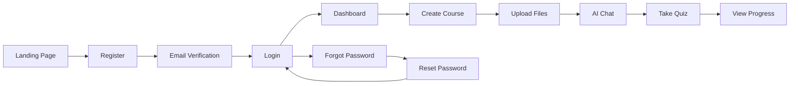

- **Authentication System** - Complete flow với verification
- **Course Management** - Full CRUD + AI generation
- **Enrollment System** - Student enrollment + Instructor analytics ✨ **MỚI**
- **Chat System** - Freestyle + course-specific
- **Upload System** - File processing với drag-drop
- **Dashboard** - Statistics và progress tracking
- **Admin Panel** - User và course management
- **UI/UX** - Modern design với animations
- **Internationalization** - Vi/En hoàn chỉnh
- **Theme System** - Dark/Light mode perfect

### ⚠️ **CẦN HOÀN THIỆN **
- **Enrollment UI** - Services/Stores có, cần components ✨ **ĐANG LÀM**
- **Quiz System** - Đã có timer, cần resume capability
- **Chapter System** - Cơ bản, cần structure tốt hơn
- **Video Upload** - Chỉ PDF/DOCX/TXT, cần video support
- **Learning Streak** - Thiếu daily tracking

### 🔄 **ĐANG PHÁT TRIỂN **
- **Google OAuth** - Cần implement social login
- **Storage Management** - File quota tracking
- **Achievement System** - Badges và rewards


### 🎬 **Complete User Journey**


### 📱 **Responsive Design**
- ✅ Mobile-first approach
- ✅ Tablet optimization
- ✅ Desktop experience
- ✅ Touch-friendly interactions

### 🎨 **Modern UI/UX**
- ✅ Smooth animations (Framer Motion)
- ✅ Dark/Light theme
- ✅ Consistent design system
- ✅ Accessibility compliant

### 🌍 **Multi-language**
- ✅ Vietnamese (primary)
- ✅ English (secondary)
- ✅ Easy to extend

---

## 🔧 **TECHNICAL ACHIEVEMENTS**

### 🏗️ **Architecture**
```
Frontend: React 18 + TypeScript + Vite
State: Zustand (with persist) + Enrollment Store ✨
Styling: Tailwind CSS + Headless UI
Animation: Framer Motion
i18n: react-i18next

Backend: FastAPI + Python 3.11
Database: MongoDB Atlas + Beanie ODM
AI: Google GenAI (Gemini)
Search: Vector Search
Auth: JWT với refresh tokens
Enrollment: Role-based access (Student/Instructor/Admin) ✨
```

### 📊 **Performance**
- ✅ Code splitting và lazy loading
- ✅ Optimized bundle size
- ✅ Fast API responses
- ✅ Efficient state management
- ✅ Smooth animations (60fps)

### 🛡️ **Security**
- ✅ JWT authentication
- ✅ Password hashing (bcrypt)
- ✅ Input validation
- ✅ XSS protection
- ✅ CORS configuration

---

## 🎯 **NEXT PRIORITIES**

### 🚀 **Priority 1 (Production Ready)**
1. **Google OAuth Integration** - Social login
2. **Video Upload Support** - Expand file types
3. **Quiz Resume Feature** - Better UX
4. **Error Boundaries** - Better error handling

### ⭐ **Priority 2 (Enhancement)**
1. **Learning Streak Tracking** - Daily learning goals
2. **Achievement System** - Gamification
3. **Push Notifications** - Engagement
4. **Offline Support** - PWA features

### 🎨 **Priority 3 (Polish)**
1. **Advanced Analytics** - Learning insights
2. **Social Features** - Share progress
3. **Mobile App** - React Native
4. **API Rate Limiting** - Production scaling

---

## 📈 **PRODUCTION READINESS**

### ✅ **Infrastructure**
- **Docker containerization** - ✅ Ready
- **Environment configuration** - ✅ Complete
- **Database setup** - ✅ MongoDB Atlas
- **CI/CD pipeline** - ✅ GitHub Actions ready
- **Monitoring setup** - ✅ Health checks

### ✅ **Documentation**
- **README.md** - ✅ Comprehensive
- **API Documentation** - ✅ OpenAPI/Swagger
- **Deployment Guide** - ✅ Multiple platforms
- **Development Guide** - ✅ Detailed
- **Architecture Docs** - ✅ Complete

### ✅ **Testing**
- **Unit tests** - ⚠️ Need coverage
- **Integration tests** - ⚠️ Need API tests
- **E2E tests** - ❌ Need implementation
- **Performance tests** - ❌ Need load testing

---

