# 🎯 Luồng Hoạt Động Người Dùng - Nền Tảng Học Tập AI

> **Tài liệu luồng hoạt động hoàn chỉnh cho AI Learning Platform**  
> Phiên bản 2.1.0 - Cập nhật ngày 3/10/2025

## 📝 Tóm Tắt Điều Hành

AI Learning Platform là nền tảng học tập thông minh với ba vai trò chính: Học viên, Giáo viên và Quản trị viên. Hệ thống tích hợp AI để tạo khóa học tự động, chat thông minh, tạo quiz và theo dõi tiến độ. Enrollment system cho phép học viên đăng ký khóa học và giảng viên quản lý học viên hiệu quả.

### 🎯 Mục Tiêu Chính
- **Trải nghiệm học tập cá nhân hóa** với AI tutor thông minh
- **Quản lý khóa học hiệu quả** cho giảng viên
- **Theo dõi tiến độ chi tiết** và phân tích dữ liệu
- **Hệ thống đăng ký linh hoạt** với enrollment system

### 📊 Thống Kê Nhanh
- 🎓 3 vai trò người dùng (Student/Instructor/Admin)
- 🔄 2 khu vực chính (Public/Protected)
- 📱 8+ trang chức năng chính
- 🤖 4 tích hợp AI (Course Gen, Chat, Quiz, File Processing)

---

## 📑 Mục Lục

### 1. [👥 Các Vai Trò Người Dùng](#-các-vai-trò-người-dùng)
- [🎓 Student (Học viên)](#-student-học-viên)
- [👨‍🏫 Instructor (Giảng viên)](#-instructor-giảng-viên)
- [👑 Admin (Quản trị viên)](#-admin-quản-trị-viên)

### 2. [🔄 Luồng Hoạt Động Chi Tiết](#-luồng-hoạt-động-chi-tiết)
- [🌐 Khu Vực Công Khai](#1--public-area-khu-vực-công-khai)
- [🔒 Khu Vực Bảo Mật](#2--protected-area-khu-vực-bảo-mật)

### 3. [📊 Hệ Thống Đăng Ký Học](#-enrollment-system-integration)
- [👤 Luồng Đăng Ký H���c Viên](#enrollment-data-flow)
- [📈 Schema Cơ Sở Dữ Liệu](#database-schema-updates)

### 4. [🔑 Đường Dẫn Điều Hướng](#-key-navigation-paths)
- [📱 Thiết Kế Responsive](#-responsive-design-breakpoints)
- [🎨 Mẫu UI/UX](#-uiux-patterns)

### 5. [🚀 Tối Ưu Hóa & Bảo Mật](#-performance-optimizations)
- [🔐 Bảo Mật & Phân Quyền](#-security--permissions)
- [📈 Phân Tích & Theo Dõi](#-analytics--tracking)

### 6. [🔄 Kế Hoạch Phát Triển](#-next-steps--roadmap)
- [📚 Tài Liệu Liên Quan](#-related-documentation)

---

## 📋 Tổng Quan Chi Tiết

Tài liệu này mô tả chi tiết luồng hoạt động của người dùng trong hệ thống AI Learning Platform, bao gồm tất cả các chức năng chính và enrollment system mới được tích hợp.

---

## 👥 Các vai trò người dùng

### 🎓 Student (Học viên)
- Đăng ký và học các khóa học
- Tạo khóa học cá nhân
- Sử dụng AI chat và quiz
- Theo dõi tiến độ học tập

### 👨‍🏫 Instructor (Giảng viên)
- Tất cả quyền của Student
- Tạo và quản lý khóa học công khai
- Xem danh sách học viên đã đăng ký
- Phân tích dữ liệu khóa học

### 👑 Admin (Quản trị viên)
- Tất cả quyền của Instructor
- Quản lý người dùng
- Quản lý toàn bộ khóa học trong hệ thống
- Xem thống kê hệ thống

---

## 🔄 Luồng hoạt động chi tiết

### 1. 🌐 Khu Vực Công Khai (Public Area)

#### 1.1 Trang Chủ (Landing Page)
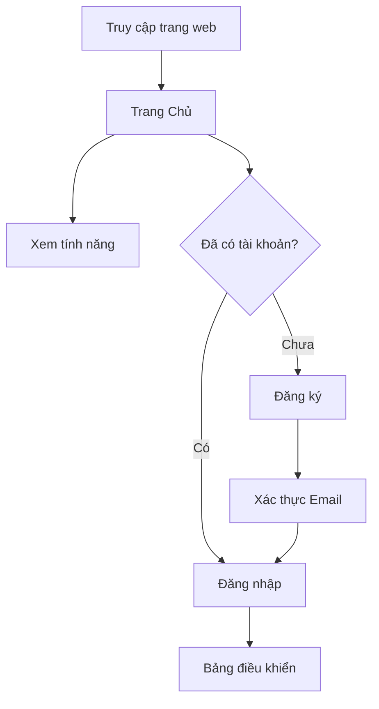

**Các thành phần:**
- Phần hero với các nút hành động
- Giới thiệu tính năng (Tải lên, Chat AI, Quiz)
- Giới thiệu về nền tảng
- Footer với các liên kết

**Đường dẫn:**
- `/` - Trang Chủ

---

#### 1.2 Luồng Xác Thực (Authentication Flow)

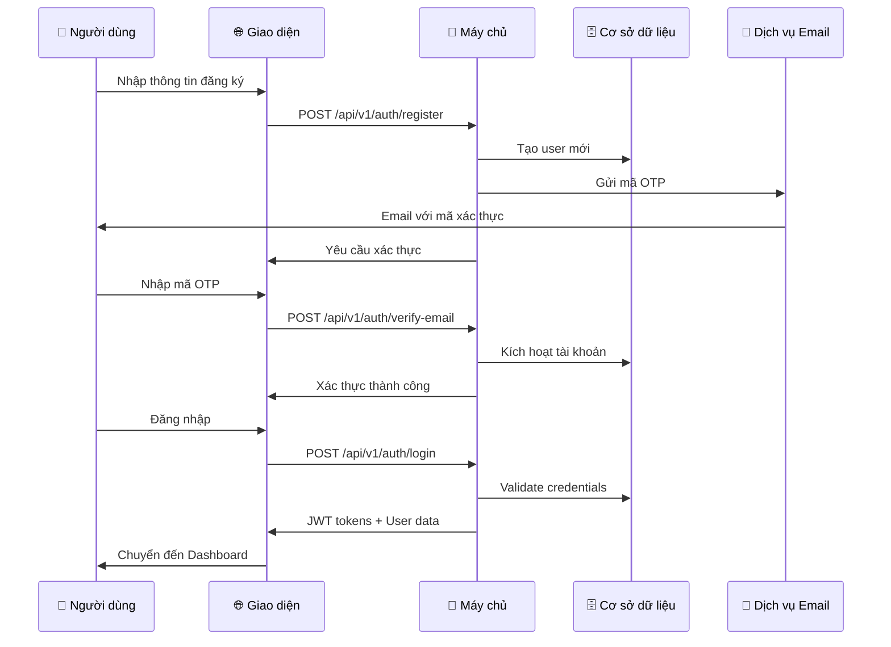

**Các trang:**
- `/login` - Trang đăng nhập
- `/register` - Trang đăng ký
- `/auth/verify-email` - Xác thực email
- `/auth/forgot-password` - Quên mật khẩu
- `/auth/reset-password` - Đặt lại mật khẩu

**Chức năng:**
- ✅ Xác thực bằng Email/Mật khẩu
- ✅ Xác thực email với mã OTP
- ✅ Luồng quên mật khẩu
- ✅ JWT token với tự động làm mới
- ⚠️ Google OAuth (đang lên kế hoạch)

---

### 2. 🔒 Khu Vực Bảo Mật (Protected Area)

#### 2.1 Bảng Điều Khiển (Dashboard)

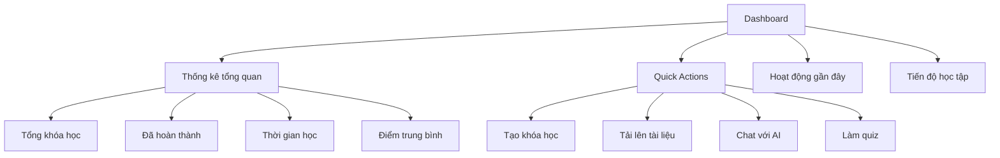

**Đường dẫn:** `/dashboard`

**Các thành phần:**
- Thẻ thống kê (4 chỉ số)
- Các nút hành động nhanh
- Danh sách hoạt động gần đây
- Biểu đồ tiến độ
- Phần tiếp tục học tập

---

#### 2.2 Quản Lý Khóa Học (Course Management)

##### 2.2.1 Trang Khóa Học

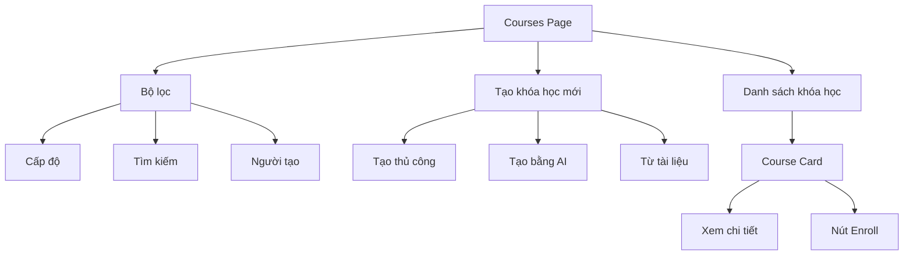

**Đường dẫn:** `/courses`

**Chức năng:**
- ✅ Hiển thị tất cả khóa học (công khai + sở hữu)
- ✅ Tìm kiếm theo tiêu đề/mô tả
- ✅ Lọc theo cấp độ (cơ bản/trung bình/nâng cao)
- ✅ Tạo khóa học thủ công
- ✅ Tạo khóa học bằng AI từ gợi ý
- ✅ Tạo từ tập tin đã tải lên
- ✅ Nút đăng ký học (cho học viên)

**Phương Thức Tạo Khóa Học:**
1. **Tạo Thủ Công**
   - Nhập tiêu đề, mô tả, cấp độ, thẻ
   - Thêm chương thủ công
   
2. **Tạo Bằng AI**
   - Nhập chủ đề và cấp độ
   - AI tạo dàn bài và nội dung
   - Có thể chỉnh sửa sau khi tạo
   
3. **Từ Tập Tin Tải Lên**
   - Tải lên tập tin PDF/DOCX
   - AI trích xuất và tạo cấu trúc khóa học

---

##### 2.2.2 Trang Chi Tiết Khóa Học

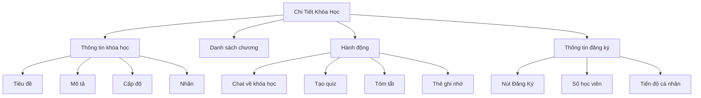

**Đường dẫn:** `/courses/:courseId`

**Chức năng cho Student:**
- ✅ View course information
- ✅ **Enroll/Unenroll button** 🆕
- ✅ View enrollment status
- ✅ Access chapters (if enrolled)
- ✅ Chat with AI about course
- ✅ Generate quiz from course
- ✅ View personal progress

**Chức năng cho Instructor/Admin:**
- ✅ Edit course
- ✅ Add/edit/delete chapters
- ✅ View enrolled students 🆕
- ✅ Course analytics 🆕
- ✅ Set visibility (PUBLIC/PRIVATE/DRAFT) 🆕

---

#### 2.3 🆕 Hệ Thống Đăng Ký Học (Enrollment System)

##### 2.3.1 Luồng Đăng Ký Của Học Viên

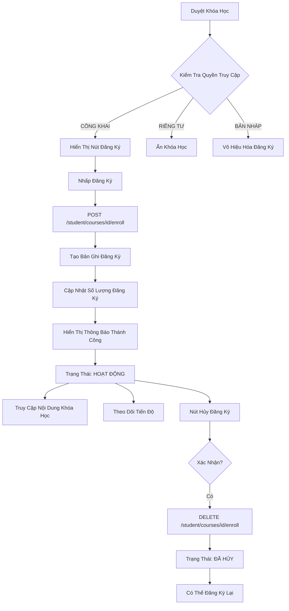

**Đường Dẫn Học Viên:**
- `/my-learning` - Dashboard đăng ký học tập 🆕
- `/my-courses` - Danh sách khóa học đã đăng ký 🆕

**Tính Năng Học Viên:**
- ✅ Duyệt khóa học công khai
- ✅ Đăng ký một cú nhấp
- ✅ Xem khóa học đã đăng ký với bộ lọc (hoạt động/hoàn thành/đã hủy)
- ✅ Theo dõi tiến độ từng khóa học
- ✅ Hủy đăng ký khóa học
- ✅ Hỗ trợ đăng ký lại
- ✅ Dashboard học viên với thống kê

**Chỉ Số Dashboard Học Viên:**
- Tổng khóa học đã đăng ký
- Khóa học đã hoàn thành
- Khóa học đang học
- Tiến độ trung bình (%)
- Tổng thời gian học
- Khóa học gần đây với thanh tiến độ

---

##### 2.3.2 Instructor Course Management

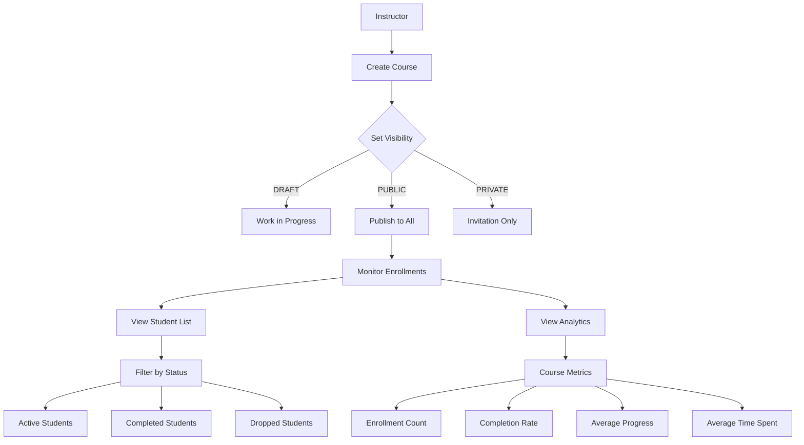

**Instructor Routes:**
- `/instructor/dashboard` - Instructor analytics dashboard 🆕
- `/courses/:courseId` - Enhanced with enrollment info 🆕

**Instructor Features:**
- ✅ Create courses with visibility control
- ✅ View enrolled students per course
- ✅ Filter students by status
- ✅ Course analytics dashboard
- ✅ Instructor overview dashboard
- ✅ Track student progress
- ✅ View enrollment trends

**Instructor Dashboard Metrics:**
- Total courses created
- Total students (unique)
- Total enrollments
- Average course rating
- Recent course analytics (top 5)
- Per-course metrics:
  - Enrollment count
  - Active students
  - Completed students
  - Average progress
  - Completion rate
  - Average time spent

---

##### 2.3.3 Course Visibility & Access Control

| Visibility | Student Can See | Student Can Enroll | Who Can Edit |
|------------|----------------|-------------------|--------------|
| **PUBLIC** | ✅ Yes | ✅ Yes | Owner + Admin |
| **PRIVATE** | ❌ No | ❌ No | Owner + Admin |
| **DRAFT** | ❌ No | ❌ No | Owner + Admin |

**Enrollment Status Flow:**
```
NOT_ENROLLED → [Enroll] → ACTIVE → [Complete] → COMPLETED
                              ↓
                         [Unenroll]
                              ↓
                           DROPPED → [Re-enroll] → ACTIVE
```

---

#### 2.4 AI Chat System

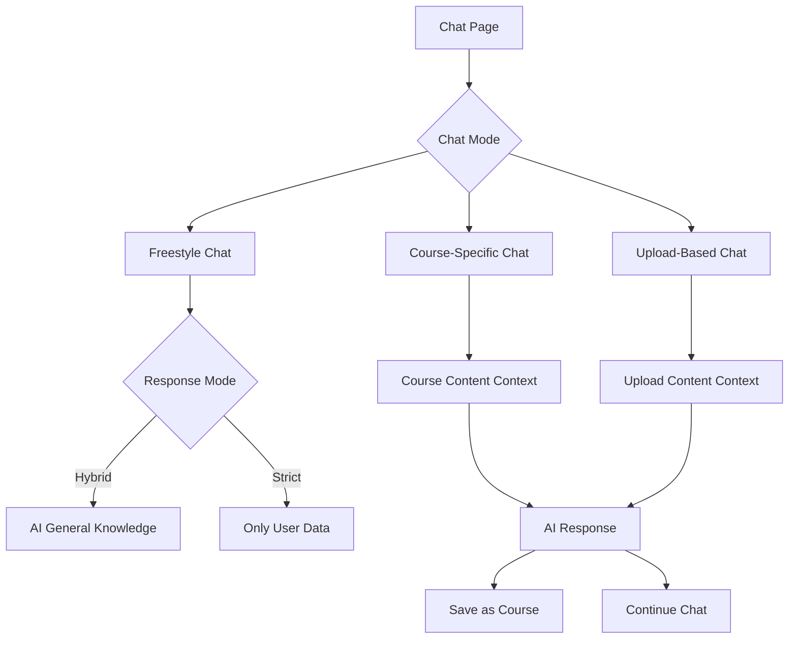

**Route:** `/chat`

**Chức năng:**
- ✅ Freestyle chat with AI tutor
- ✅ Course-specific Q&A
- ✅ Upload-based Q&A
- ✅ Chat history
- ✅ Session management
- ✅ Save chat as course
- ✅ Strict vs Hybrid mode

**Chat Modes:**
- **Freestyle**: General AI conversation
- **Course-specific**: AI uses course content as context
- **Upload-based**: AI uses uploaded file as context

**Response Modes:**
- **Strict**: Only answers from provided context
- **Hybrid**: Combines context with general AI knowledge

---

#### 2.5 File Upload System

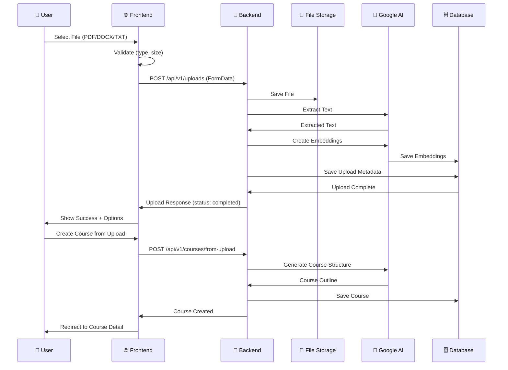

**Route:** `/uploads`

**Chức năng:**
- ✅ Drag & drop file upload
- ✅ File type validation (PDF, DOCX, TXT)
- ✅ File size limit (10MB)
- ✅ Upload progress tracking
- ✅ Upload status (pending/processing/completed/failed)
- ✅ Create course from upload
- ✅ Chat with upload content
- ✅ Delete uploads

**Supported Files:**
- ✅ PDF documents
- ✅ DOCX documents
- ✅ TXT files
- ⚠️ Video files (planned)

---

#### 2.6 Quiz System

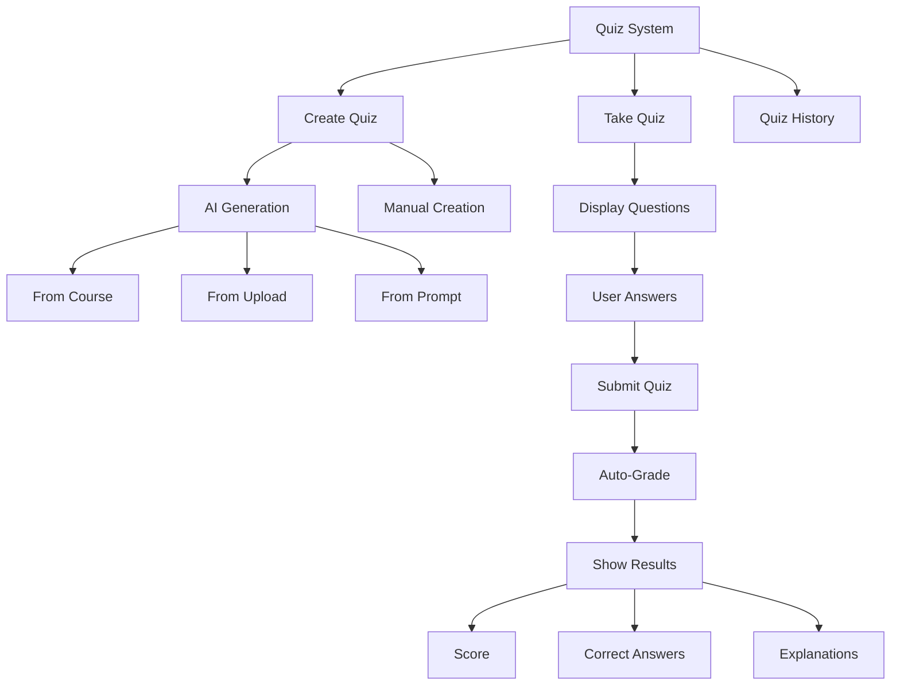

**Routes:**
- `/quiz` - Quiz list page
- `/quiz/:quizId` - Take/view quiz

**Chức năng:**
- ✅ AI-generated quizzes
- ✅ Manual quiz creation
- ✅ Multiple choice questions
- ✅ Auto-grading
- ✅ Detailed results with explanations
- ✅ Quiz history
- ✅ Retake quizzes
- ⚠️ Timer functionality (basic)
- ❌ Resume on disconnect (planned)

---

#### 2.7 Progress Tracking

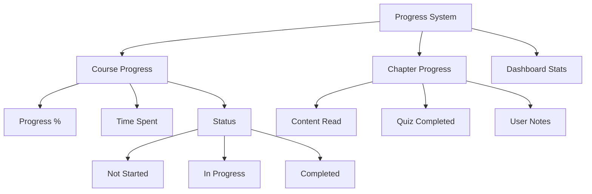

**Route:** `/progress`

**Chức năng:**
- ✅ Track time spent per course
- ✅ Calculate completion percentage
- ✅ Chapter-level tracking
- ✅ Progress visualization
- ✅ Learning streak (basic)
- ❌ Daily streak tracking (planned)
- ❌ Achievements/badges (planned)

---

#### 2.8 Profile & Settings

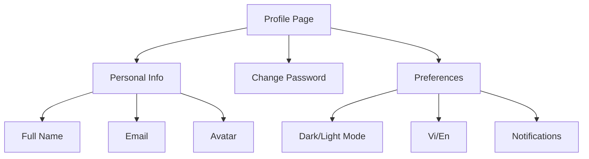

**Route:** `/profile`

**Chức năng:**
- ✅ Update profile information
- ✅ Change password
- ✅ Theme toggle (dark/light)
- ✅ Language switcher (Vi/En)
- ✅ View activity history
- ❌ Notification settings (planned)

---

#### 2.9 Admin Panel

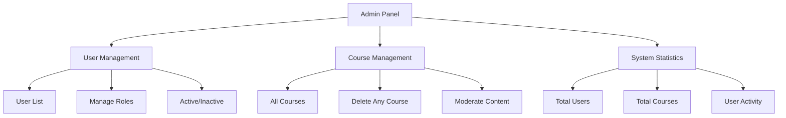

**Route:** `/admin/*`

**Chức năng (Admin only):**
- ✅ View all users
- ✅ Change user roles (student/instructor/admin)
- ✅ Activate/deactivate users
- ✅ View all courses (including private)
- ✅ Delete any course
- ✅ System statistics
- ❌ Content moderation (planned)

---

## 📊 Enrollment System Integration

### Enrollment Data Flow

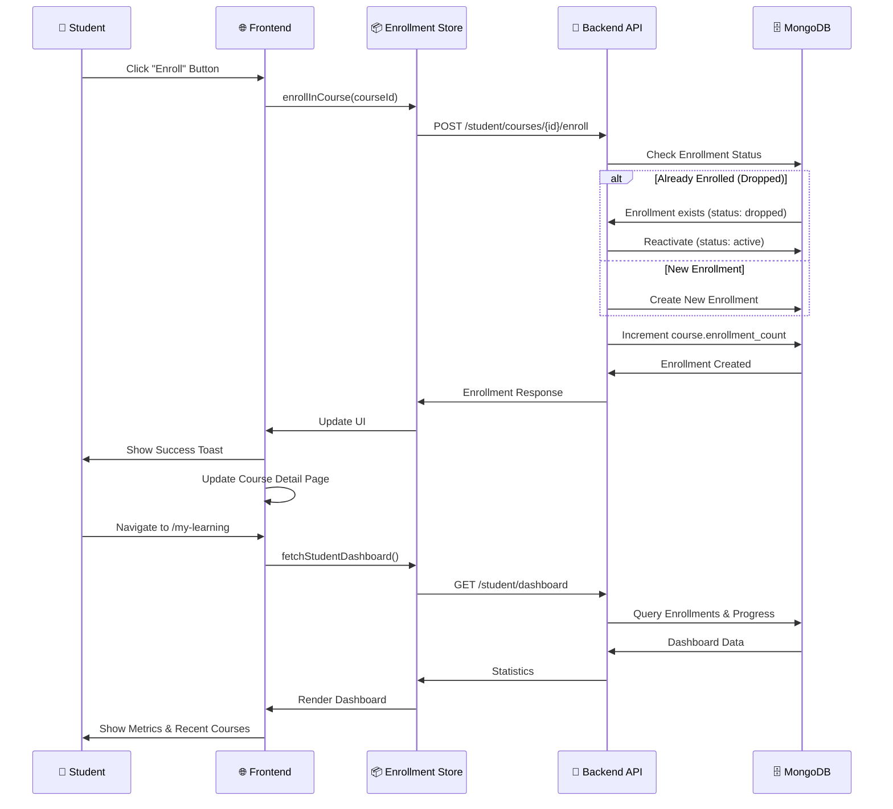

### Database Schema Updates

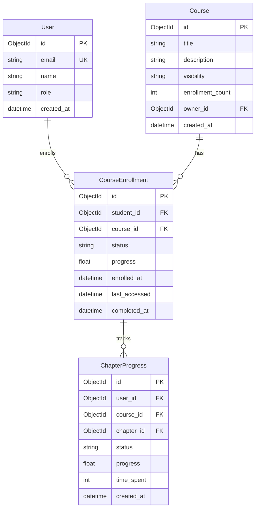

---

## 🔑 Các Đường Dẫn Điều Hướng Chính

### Hành Trình Học Viên
```
/ (Trang chủ) 
  → /register → /auth/verify-email → /login 
  → /dashboard (Tổng quan)
  → /courses (Duyệt khóa học)
  → /courses/:id (Xem và Đăng ký) 🆕
  → /my-courses (Khóa học của tôi) 🆕
  → /courses/:id/chapters/:chapterId (Học)
  → /my-learning (Bảng điều khiển học tập) 🆕
  → /quiz/:id (Luyện tập)
  → /progress (Theo dõi tiến độ)
```

### Hành Trình Giảng Viên
```
/ (Trang chủ)
  → /login
  → /dashboard
  → /courses (Tạo khóa học CÔNG KHAI) 🆕
  → /courses/:id (Quản lý và Chỉnh sửa)
  → /courses/:id (Xem học viên đã đăng ký) 🆕
  → /instructor/dashboard (Phân tích) 🆕
  → /courses/:id/analytics (Chỉ số khóa học) 🆕
```

### Hành Trình Quản Trị Viên
```
/ (Trang chủ)
  → /login
  → /dashboard
  → /admin (Quản lý người dùng)
  → /admin/courses (Tất cả khóa học)
  → /admin/stats (Tổng quan hệ thống)
  → /instructor/dashboard (Tất cả phân tích) 🆕
```

---

## 📱 Điểm Ngắt Thiết Kế Responsive

| Thiết Bị | Kích Thước | Class Tailwind | Mô Tả |
|------------|-------------|----------------|----------|
| **Mobile** | < 640px | `sm` | Điện thoại thông minh |
| **Tablet** | 640px - 1024px | `md/lg` | Máy tính bảng |
| **Desktop** | > 1024px | `xl/2xl` | Máy tính để bàn |

### Đặc Tính Responsive
- ✅ Tiếp cận mobile-first
- ✅ Tương tác thân thiện với đi chạm
- ✅ Bố cục thích ứng
- ✅ Điều hướng thu gọn được

---

## 🎨 Mẫu Thiết Kế UI/UX

### Các Thành Phần Chính
| Thành Phần | Mô Tả | Công Nghệ |
|--------------|-----------|-------------|
| **Điều hướng** | Sidebar + Thanh trên | React Router |
| **Thẻ** | Thiết kế Glass morphism | Tailwind CSS |
| **Nút** | Primary/Secondary/Outline | Custom Components |
| **Form** | Xác thực với thông báo lỗi | React Hook Form |
| **Modal** | Hộp thoại phủ lớp | Radix UI |
| **Toast** | Thông báo thành công/lỗi | React Hot Toast |
| **Loading** | Spinners và skeletons | Custom Animations |
| **Empty States** | Thông điệp thân thiện với CTAs | Illustrations |

### Hiệu Ứng Animation
- ✨ Chuyển đổi trang (Framer Motion)
- ✨ Hiệu ứng hover thẻ
- ✨ Tương tác nút
- ✨ Cuộn trơn trơn
- ✨ Animation tiến độ

### Hỗ Trợ Chủ Đề
- 🌅 Chế độ sáng (mặc định)
- 🌙 Chế độ tối (chuyển đổi)
- 📱 Phát hiện thiết lập hệ thống
- ✨ Chuyển đổi mượt mà

---

## 🔐 Security & Permissions

### Route Protection
```typescript
// Public routes
/ /login /register /auth/*

// Protected routes (authenticated users)
/dashboard /courses /chat /quiz /uploads /progress /profile

// Role-specific routes
/my-learning (student) 🆕
/my-courses (student) 🆕
/instructor/dashboard (instructor/admin) 🆕

// Admin-only routes
/admin/*
```

### API Authorization
- JWT token trong Authorization header
- Token auto-refresh on 401
- Role-based endpoint access
- Owner-based resource access

---

## 🚀 Tối ƯU Hóa Hiệu Suất

### Frontend Optimizations
| Kỹ Thuật | Mô Tả | Công Cụ |
|-----------|-----------|----------|
| **Code Splitting** | Tách mã theo route | React.lazy() |
| **Lazy Loading** | Tải components theo yêu cầu | Suspense |
| **Image Optimization** | Tối ưu hóa hình ảnh | Next/Image |
| **API Caching** | Cache phản hồi API | React Query |
| **Debounced Search** | Trì hoãn tìm kiếm | Lodash debounce |
| **Virtualization** | Danh sách ảo dài | React Window |
| **Optimistic UI** | Cập nhật UI tức thì | Zustand |

### Backend Optimizations
- 🗄️ Database indexing và query optimization
- 📋 Response compression (gzip)
- ⚡ Async/await patterns cho non-blocking I/O
- 📊 Connection pooling cho MongoDB


---

---

## 📚 Tài Liệu Liên Quan

### Tài Liệu Chính
- [README.md](./README.md) - Tổng quan dự án và hướng dẫn nhanh
- [KIEN_TRUC_HE_THONG.md](./KIEN_TRUC_HE_THONG.md) - Kiến trúc hệ thống chi tiết
- [HUONG_DAN_CAI_DAT.md](./HUONG_DAN_CAI_DAT.md) - Hướng dẫn cài đặt toàn diện
- [HUONG_DAN_DEPLOY.md](./HUONG_DAN_DEPLOY.md) - Hướng dẫn triển khai production

### Tài Liệu Kỹ Thuật
- [BEDB/README.md](./BEDB/README.md) - Tài liệu Backend API
- [learning-app-fe/README.md](./learning-app-fe/README.md) - Tài liệu Frontend React

### Tài Liệu Bổ Sung
- [tailieubosung/RULES.md](./tailieubosung/RULES.md) - Quy tắc phát triển
- [tailieubosung/ANALYSIS_AND_REQUIREMENTS.md](./tailieubosung/ANALYSIS_AND_REQUIREMENTS.md) - Phân tích yêu cầu

---

## 📊 Thông Tin Phiên Bản

| Thông Tin | Giá Trị |
|-------------|----------|
| **Cập nhật cuối** | 3 tháng 10, 2025 |
| **Phiên bản** | 2.1.0 (Có Hệ Thống Đăng Ký + Tài Liệu Tiếng Việt) |
| **Nội dung** | Luồng hoạt động đầy đủ với enrollment system |
| **Ngôn ngữ** | Tiếng Việt (chính) + Tiếng Anh (kỹ thuật) |

---

> **Lưu ý**: Tài liệu này sẽ được cập nhật thường xuyên theo tiến độ phát triển dự án. 
> Vui lòng kiểm tra phiên bản mới nhất trước khi sử dụng.
