# 🎯 Luồng Hoạt Động Người Dùng - Nền Tảng Học Tập AI

> **Tài liệu luồng hoạt động đã xác thực từ Code Analysis**  
> **📊 Cập nhật 100% từ Actual Routing & API** - Ngày 4/10/2025  
> **🔍 Verified**: 87 endpoints, 16 routes thực tế, role-based protection

## 📝 Tóm Tắt Điều Hành (Cập Nhật Từ Code Thực Tế)

AI Learning Platform với **16 protected routes** và **12 microservices** backend. Hệ thống có role-based authentication với hierarchy (Student < Instructor < Admin), tích hợp sâu Google GenAI, enrollment system hoàn chỉnh, và dashboard analytics chi tiết.

### 🎯 Mục Tiêu Thực Tế (Từ Code Analysis)
- **Role-based Access Control**: Student/Instructor/Admin với hierarchy
- **87 API Endpoints**: Across 12 microservices với authentication
- **16 Frontend Routes**: Protected routes với role requirements  
- **Enrollment System**: Student enrollment, instructor analytics, admin management
- **AI Integration**: Google GenAI 1.38.0 với chat, course gen, quiz gen, file processing

### 📊 Thống Kê Routes Thực Tế
- � **6 Public Routes**: Landing, Login, Register, Auth flows
- 🔒 **10 Protected Routes**: Dashboard, Courses, Chat, Quiz, Upload, etc.
- �‍🎓 **2 Student Routes**: /my-learning, /my-courses (role: student)
- �‍🏫 **1 Instructor Route**: /instructor/dashboard (role: instructor)  
- 👑 **1 Admin Route**: /admin/* (role: admin)
- 🔄 **Role Hierarchy**: Admin > Instructor > Student (inheritance)

---

## 📑 Mục Lục

### 1. [👥 Các Vai Trò Người Dùng](#-các-vai-trò-người-dùng)
- [🎓 Student (Học viên)](#-student-học-viên)
- [👨‍🏫 Instructor (Giảng viên)](#-instructor-giảng-viên)
- [👑 Admin (Quản trị viên)](#-admin-quản-trị-viên)

### 2. [🔄 Luồng Hoạt Động Chi Tiết](#-luồng-hoạt-động-chi-tiết)
- [🌐 Khu Vực Công Khai](#1--public-area-khu-vực-công-khai)
- [🔒 Khu Vực Bảo Mật](#2--protected-area-khu-vực-bảo-mật)

### 3. [📊 Hệ Thống Đăng Ký Học](#-enrollment-system-integration)
- [👤 Luồng Đăng Ký H���c Viên](#enrollment-data-flow)
- [📈 Schema Cơ Sở Dữ Liệu](#database-schema-updates)

### 4. [🔑 Đường Dẫn Điều Hướng](#-key-navigation-paths)
- [📱 Thiết Kế Responsive](#-responsive-design-breakpoints)
- [🎨 Mẫu UI/UX](#-uiux-patterns)

### 5. [🚀 Tối Ưu Hóa & Bảo Mật](#-performance-optimizations)
- [🔐 Bảo Mật & Phân Quyền](#-security--permissions)
- [📈 Phân Tích & Theo Dõi](#-analytics--tracking)

### 6. [🔄 Kế Hoạch Phát Triển](#-next-steps--roadmap)
- [📚 Tài Liệu Liên Quan](#-related-documentation)

---

## 📋 Tổng Quan Chi Tiết

Tài liệu này mô tả chi tiết luồng hoạt động của người dùng trong hệ thống AI Learning Platform, bao gồm tất cả các chức năng chính và enrollment system mới được tích hợp.

---

## 👥 Các vai trò người dùng

### 🎓 Student (Học viên)
- Đăng ký và học các khóa học
- Tạo khóa học cá nhân
- Sử dụng AI chat và quiz
- Theo dõi tiến độ học tập

### 👨‍🏫 Instructor (Giảng viên)
- Tất cả quyền của Student
- Tạo và quản lý khóa học công khai
- Xem danh sách học viên đã đăng ký
- Phân tích dữ liệu khóa học

### 👑 Admin (Quản trị viên)
- Tất cả quyền của Instructor
- Quản lý người dùng
- Quản lý toàn bộ khóa học trong hệ thống
- Xem thống kê hệ thống

---

## 🔄 Luồng hoạt động chi tiết

### 1. 🌐 Khu Vực Công Khai (Public Area)

#### 1.1 Trang Chủ (Landing Page)

```mermaid
graph TB
    START[Truy cập trang web] --> LANDING[Trang Chủ]
    LANDING --> VIEW_FEATURES[Xem tính năng]
    LANDING --> LOGIN_BTN{Đã có tài khoản?}
    LOGIN_BTN -->|Có| LOGIN[Đăng nhập]
    LOGIN_BTN -->|Chưa| REGISTER[Đăng ký]
    
    REGISTER --> VERIFY[Xác thực Email]
    VERIFY --> LOGIN
    LOGIN --> DASHBOARD[Bảng điều khiển]
```


**Các thành phần:**
- Phần hero với các nút hành động
- Giới thiệu tính năng (Tải lên, Chat AI, Quiz)
- Giới thiệu về nền tảng
- Footer với các liên kết

**Đường dẫn:**
- `/` - Trang Chủ

---

#### 1.2 Luồng Xác Thực (11 API Endpoints - Từ auth.py)

```mermaid
sequenceDiagram
    participant User as 👤 Người dùng
    participant FE as 🌐 Frontend React
    participant Store as 📦 Auth Store (Zustand)
    participant API as 🚀 FastAPI Backend
    participant DB as 🗄️ MongoDB
    participant Email as 📧 Email Service
    
    %% Registration Flow (3 endpoints)
    User->>FE: Điền form register
    FE->>Store: setLoading(true)
    Store->>API: POST /api/v1/auth/register
    API->>DB: Create user (inactive)
    API->>Email: Send OTP email
    Email->>User: Email với OTP code
    API->>Store: Registration success
    
    User->>FE: Nhập OTP code
    FE->>Store: verifyEmail(otp)
    Store->>API: POST /api/v1/auth/verify-email
    API->>DB: Activate user account
    API->>Store: Verification success
    Store->>FE: Navigate to /login
    
    %% Login Flow (1 endpoint + token refresh)
    User->>FE: Email + Password
    FE->>Store: login(credentials)
    Store->>API: POST /api/v1/auth/login
    API->>DB: Validate credentials
    API->>Store: {access_token, refresh_token, token_type, user}
    Store->>Store: Save tokens + user data
    Store->>FE: Navigate to /dashboard
    
    %% Auto Token Refresh
    Note over Store,API: Token expires after 30 minutes
    Store->>API: POST /api/v1/auth/refresh
    API->>Store: New access_token
    
    %% Password Reset Flow (2 endpoints)
    User->>FE: Forgot password
    FE->>API: POST /api/v1/auth/forgot-password
    API->>Email: Send reset link
    User->>FE: Click reset link
    FE->>API: POST /api/v1/auth/reset-password
    API->>DB: Update password
```



**Routes Thực Tế (Từ App.tsx):**
- `/` - Landing Page (public)
- `/login` hoặc `/auth/login` - Login Page
- `/register` hoặc `/auth/register` - Register Page  
- `/auth/verify-email` - Email verification
- `/auth/forgot-password` - Forgot password
- `/auth/reset-password` - Reset password with token

**11 Authentication Endpoints (Từ auth.py):**
- ✅ `POST /register` - User registration
- ✅ `POST /login` - Login with email/password  
- ✅ `GET /me` - Get current user info
- ✅ `PUT /me` - Update user profile
- ✅ `PATCH /me` - Partial profile update
- ✅ `PATCH /me/password` - Change password
- ✅ `POST /refresh` - Refresh access token
- ✅ `POST /logout` - Logout (invalidate tokens)
- ✅ `POST /verify-email` - Email verification with OTP
- ✅ `POST /forgot-password` - Request password reset
- ✅ `POST /reset-password` - Reset password with token

**Role-Based Redirect Logic:**
```typescript
// ProtectedRoute hierarchy: Admin > Instructor > Student
const roleHierarchy = {
  student: 0,
  instructor: 1, 
  admin: 2
};
// Admin có thể truy cập tất cả instructor và student routes
// Instructor có thể truy cập student routes
// Student chỉ truy cập student routes
```

---

### 2. 🔒 Khu Vực Bảo Mật (Protected Area)

#### 2.1 Bảng Điều Khiển (Dashboard - 6 API Endpoints)

```mermaid
graph TB
    DASHBOARD[/dashboard Route] --> LAYOUT[DashboardLayout Wrapper]
    LAYOUT --> SIDEBAR[Navigation Sidebar]
    LAYOUT --> MAIN[Main Content Area]
    
    MAIN --> STATS[Dashboard Stats API]
    MAIN --> QUICK_ACTIONS[Quick Action Buttons]
    MAIN --> RECENT[Recent Activity Feed]
    MAIN --> PROGRESS[Progress Overview]
    
    STATS --> API_STATS[GET /api/v1/dashboard/stats]
    STATS --> API_PROGRESS[GET /api/v1/dashboard/progress]
    STATS --> API_ACTIVITY[GET /api/v1/dashboard/activity]
    
    QUICK_ACTIONS --> NAV_COURSES[→ /courses]
    QUICK_ACTIONS --> NAV_UPLOAD[→ /uploads]
    QUICK_ACTIONS --> NAV_CHAT[→ /chat]
    QUICK_ACTIONS --> NAV_QUIZ[→ /quiz]
    
    SIDEBAR --> NAV_MY_LEARNING[→ /my-learning - Student Only]
    SIDEBAR --> NAV_INSTRUCTOR[→ /instructor/dashboard - Instructor+]
    SIDEBAR --> NAV_ADMIN[→ /admin/* - Admin Only]
```

**Route Protection (Từ App.tsx):**
```tsx
<Route path="/dashboard" element={
  <ProtectedRoute>  // Tất cả authenticated users
    <DashboardLayout>
      <DashboardPage />
    </DashboardLayout>
  </ProtectedRoute>
} />
```

**Dashboard APIs (6 Endpoints từ dashboard.py):**
- ✅ `GET /stats` - Overall dashboard statistics
- ✅ `GET /progress` - User progress overview  
- ✅ `GET /activity` - Recent activity feed
- ✅ `GET /courses/{course_id}/progress` - Specific course progress
- ✅ `POST /progress` - Update progress tracking
- ✅ `GET /leaderboard` - User rankings (connects to leaderboard.py)

**Role-Based Navigation (Từ DashboardLayout):**
- **All Users**: Dashboard, Courses, Chat, Quiz, Upload, Progress, Profile
- **Student**: + My Learning (`/my-learning`), My Courses (`/my-courses`)
- **Instructor**: + Instructor Dashboard (`/instructor/dashboard`)
- **Admin**: + Admin Panel (`/admin/*`)

---

#### 2.2 Quản Lý Khóa Học (20 API Endpoints - Từ courses.py)

##### 2.2.1 Trang Danh Sách Khóa Học

```mermaid
graph TB
    COURSES[/courses Route] --> LOAD[Load Course Data]
    LOAD --> API_ALL[GET /api/v1/courses - My + Public]
    LOAD --> API_PUBLIC[GET /api/v1/courses/public - Public only]
    
    COURSES --> FILTERS[Advanced Filtering]
    FILTERS --> LEVEL_FILTER[Level: beginner/intermediate/advanced]
    FILTERS --> SEARCH_FILTER[Search: title/description]
    FILTERS --> OWNER_FILTER[Owner: me/others/all]
    FILTERS --> VISIBILITY_FILTER[Visibility: public/private/draft]
    
    COURSES --> CREATE_OPTIONS[Create Course Options]
    CREATE_OPTIONS --> MANUAL[POST /courses - Manual Creation]
    CREATE_OPTIONS --> AI_PROMPT[POST /courses/from-prompt - AI Generation]
    CREATE_OPTIONS --> FROM_UPLOAD[POST /courses/from-upload - File Based]
    
    COURSES --> COURSE_GRID[Course Cards Display]
    COURSE_GRID --> COURSE_CARD[Individual Course Card]
    COURSE_CARD --> VIEW_DETAIL[Navigate to /courses/:id]
    COURSE_CARD --> QUICK_ACTIONS[Owner Actions]
    
    QUICK_ACTIONS --> EDIT_BTN[PUT /courses/:id - Edit]
    QUICK_ACTIONS --> DELETE_BTN[DELETE /courses/:id - Delete]
    QUICK_ACTIONS --> DUPLICATE_BTN[POST /courses/:id/duplicate]
    QUICK_ACTIONS --> VISIBILITY_BTN[PATCH /courses/:id/visibility]
```

**Route Protection:**
```tsx
<Route path="/courses" element={
  <ProtectedRoute>  // All authenticated users
    <DashboardLayout><CoursesPage /></DashboardLayout>
  </ProtectedRoute>
} />
```

**20 Course Management Endpoints (Từ courses.py):**

**Basic CRUD (5 endpoints):**
- ✅ `GET /courses` - Get user's courses + public courses
- ✅ `GET /courses/public` - Get only public courses  
- ✅ `POST /courses` - Create new course manually
- ✅ `GET /courses/{course_id}` - Get course details
- ✅ `PUT /courses/{course_id}` - Update course (owner/admin only)
- ✅ `DELETE /courses/{course_id}` - Delete course (owner/admin only)

**AI-Powered Creation (2 endpoints):**
- ✅ `POST /courses/from-prompt` - Create course from AI prompt
- ✅ `POST /courses/from-upload` - Create course from uploaded file

**Chapter Management (4 endpoints):**
- ✅ `GET /courses/{course_id}/chapters` - Get course chapters
- ✅ `POST /courses/{course_id}/chapters` - Add new chapter
- ✅ `PUT /courses/{course_id}/chapters/{chapter_id}` - Update chapter
- ✅ `DELETE /courses/{course_id}/chapters/{chapter_id}` - Delete chapter

**Advanced Features (5 endpoints):**
- ✅ `POST /courses/{course_id}/duplicate` - Duplicate course
- ✅ `PATCH /courses/{course_id}/visibility` - Change visibility
- ✅ `GET /courses/{course_id}/summary` - Generate AI summary
- ✅ `POST /courses/{course_id}/flashcards` - Generate flashcards
- ✅ `GET /courses/{course_id}/analytics` - Course analytics (owner/admin)

**Visibility System (Từ Code):**
```typescript
enum CourseVisibility {
  PUBLIC = "public",      // Visible to all, enrollable
  PRIVATE = "private",    // Only visible to owner
  DRAFT = "draft"         // Work in progress, not public
}
```

**Course Creation Flows:**

**1. Manual Creation:**


**2. AI-Powered Creation:**


**3. File-Based Creation:**


---

##### 2.2.2 Trang Chi Tiết Khóa Học

```mermaid
graph TB
    DETAIL[/courses/:courseId Route] --> LOAD_DATA[Load Course Data]
    LOAD_DATA --> API_COURSE[GET /api/v1/courses/:id]
    LOAD_DATA --> API_CHAPTERS[GET /api/v1/courses/:id/chapters]
    LOAD_DATA --> API_ENROLLMENT[Check Enrollment Status]
    
    DETAIL --> INFO_SECTION[Course Information]
    INFO_SECTION --> BASIC_INFO[Title, Description, Level, Tags]
    INFO_SECTION --> METADATA[Owner, Created, Updated, Visibility]
    INFO_SECTION --> STATS[Enrollment Count, Rating, Duration]
    
    DETAIL --> ROLE_BASED_ACTIONS{User Role Check}
    
    ROLE_BASED_ACTIONS -->|Student| STUDENT_ACTIONS[Student Actions]
    STUDENT_ACTIONS --> ENROLL_BTN[Enroll/Unenroll Button]
    STUDENT_ACTIONS --> PROGRESS_VIEW[Personal Progress]
    STUDENT_ACTIONS --> ACCESS_CHAPTERS[Chapter Access if Enrolled]
    
    ROLE_BASED_ACTIONS -->|Instructor/Admin| OWNER_ACTIONS[Owner Actions]
    OWNER_ACTIONS --> EDIT_COURSE[Edit Course Info]
    OWNER_ACTIONS --> MANAGE_CHAPTERS[Chapter Management]
    OWNER_ACTIONS --> VIEW_ANALYTICS[Course Analytics]
    OWNER_ACTIONS --> MANAGE_VISIBILITY[Visibility Settings]
    
    DETAIL --> AI_FEATURES[AI-Powered Features]
    AI_FEATURES --> COURSE_CHAT[Chat About Course]
    AI_FEATURES --> GENERATE_QUIZ[Generate Quiz]
    AI_FEATURES --> COURSE_SUMMARY[AI Summary]
    AI_FEATURES --> FLASHCARDS[Generate Flashcards]
    
    DETAIL --> CHAPTER_LIST[Chapter Navigation]
    CHAPTER_LIST --> CHAPTER_CARD[Individual Chapter]
    CHAPTER_CARD --> CHAPTER_DETAIL[Navigate to /courses/:id/chapters/:chapterId]
```

**Route Protection:**
```tsx
<Route path="/courses/:courseId" element={
  <ProtectedRoute>
    <DashboardLayout><CourseDetailPage /></DashboardLayout>
  </ProtectedRoute>
} />

<Route path="/courses/:courseId/chapters/:chapterId" element={
  <ProtectedRoute>
    <DashboardLayout><ChapterPage /></DashboardLayout>
  </ProtectedRoute>
} />
```

**Student View Logic (CourseDetailPage.tsx):**
```typescript
// Enrollment status determines available actions
const enrollmentStatus = await checkEnrollment(courseId);

if (course.visibility === 'private' && !isOwner && !isAdmin) {
  return <Navigate to="/courses" />; // Redirect if no access
}

const showEnrollButton = 
  course.visibility === 'public' && 
  !isOwner && 
  user.role === 'student';

const canAccessChapters = 
  isOwner || 
  isAdmin || 
  enrollmentStatus === 'active';
```

**AI Features Integration:**
- ✅ **Course Chat**: `POST /api/v1/chat/freestyle` với course context
- ✅ **Quiz Generation**: `POST /api/v1/quiz/from-course/{course_id}`
- ✅ **AI Summary**: `GET /api/v1/courses/{course_id}/summary`
- ✅ **Flashcards**: `POST /api/v1/courses/{course_id}/flashcards`

**Chapter Management (Owner Only):**
- ✅ **Add Chapter**: `POST /api/v1/courses/{course_id}/chapters`
- ✅ **Edit Chapter**: `PUT /api/v1/courses/{course_id}/chapters/{chapter_id}`
- ✅ **Delete Chapter**: `DELETE /api/v1/courses/{course_id}/chapters/{chapter_id}`
- ✅ **Reorder Chapters**: Via drag-and-drop interface

**Analytics Access (Owner/Admin):**
- ✅ **Course Analytics**: `GET /api/v1/courses/{course_id}/analytics`
- ✅ **Student List**: `GET /api/v1/instructor/courses/{course_id}/students`
- ✅ **Progress Tracking**: `GET /api/v1/instructor/courses/{course_id}/progress`

---

#### 2.3 🆕 Hệ Thống Đăng Ký Học (8 API Endpoints Total)

##### 2.3.1 Student Enrollment System (3 Endpoints - student.py)

```mermaid
graph TB
    START[Student browses /courses] --> CHECK_COURSE{Course Visibility Check}
    CHECK_COURSE -->|PUBLIC| SHOW_ENROLL[Show Enroll Button]
    CHECK_COURSE -->|PRIVATE| HIDE_COURSE[Course Hidden]
    CHECK_COURSE -->|DRAFT| DISABLE_ENROLL[Enroll Disabled]
    
    SHOW_ENROLL --> CLICK_ENROLL[Click Enroll Button]
    CLICK_ENROLL --> API_ENROLL[POST /api/v1/student/courses/{course_id}/enroll]
    API_ENROLL --> DB_CHECK{Check Existing Enrollment}
    
    DB_CHECK -->|New User| CREATE_NEW[Create CourseEnrollment]
    DB_CHECK -->|Previously Dropped| REACTIVATE[Update status: active]
    
    CREATE_NEW --> UPDATE_COURSE[Increment course.enrollment_count]
    REACTIVATE --> UPDATE_COURSE
    UPDATE_COURSE --> INIT_PROGRESS[Create DashboardProgress]
    INIT_PROGRESS --> SUCCESS_TOAST[Show Success Message]
    
    SUCCESS_TOAST --> ENROLLED_STATE[Status: ACTIVE]
    ENROLLED_STATE --> ACCESS_CONTENT[Access Course Chapters]
    ENROLLED_STATE --> TRACK_PROGRESS[Progress Tracking]
    ENROLLED_STATE --> UNENROLL_OPTION[Unenroll Option Available]
    
    UNENROLL_OPTION --> CONFIRM_UNENROLL{Confirm Unenroll?}
    CONFIRM_UNENROLL -->|Yes| API_UNENROLL[DELETE /api/v1/student/courses/{course_id}/enroll]
    API_UNENROLL --> UPDATE_STATUS[Status: DROPPED]
    UPDATE_STATUS --> DECREMENT_COUNT[Decrement enrollment_count]
    DECREMENT_COUNT --> CAN_REENROLL[Can Re-enroll Later]
```

**Student Routes (Role: "student" required):**
```tsx
<Route path="/my-learning" element={
  <ProtectedRoute requiredRole="student">
    <DashboardLayout><StudentEnrollmentPage /></DashboardLayout>
  </ProtectedRoute>
} />

<Route path="/my-courses" element={
  <ProtectedRoute requiredRole="student">
    <DashboardLayout><MyCoursesPage /></DashboardLayout>
  </ProtectedRoute>
} />
```

**3 Student API Endpoints (Từ student.py):**
- ✅ `POST /student/courses/{course_id}/enroll` - Enroll in course
- ✅ `DELETE /student/courses/{course_id}/enroll` - Unenroll from course  
- ✅ `GET /student/dashboard` - Get student dashboard data

**Student Dashboard Data Structure:**
```typescript
interface StudentDashboard {
  totalEnrollments: number;
  activeEnrollments: number; 
  completedCourses: number;
  averageProgress: number;
  totalTimeSpent: number; // minutes
  recentCourses: CourseEnrollment[];
  progressStats: {
    coursesInProgress: number;
    chaptersCompleted: number;
    quizzesCompleted: number;
  };
}
```

**Enrollment Status Flow:**
```
NOT_ENROLLED → [POST /enroll] → ACTIVE → [Mark Complete] → COMPLETED
                                   ↓
                            [DELETE /enroll] 
                                   ↓
                                DROPPED → [POST /enroll again] → ACTIVE
```

**Student Dashboard Features (/my-learning):**
- 📊 **Enrollment Statistics**: Total, Active, Completed counts
- 📈 **Progress Overview**: Average progress across all courses
- ⏱️ **Time Tracking**: Total learning time spent
- 📚 **Recent Courses**: Last accessed courses with quick access
- 🎯 **Learning Goals**: Progress toward completion targets
- 📋 **Quick Actions**: Continue learning, browse new courses

**My Courses Page (/my-courses):**
- 🔍 **Filter by Status**: Active, Completed, Dropped
- 📊 **Progress Bars**: Visual progress for each course
- ⏱️ **Time Per Course**: Individual time tracking
- 🎓 **Completion Badges**: Visual completion indicators
- 📱 **Responsive Cards**: Mobile-friendly course grid

---

##### 2.3.2 Instructor Analytics System (5 Endpoints - instructor.py)

```mermaid
graph TB
    INSTRUCTOR[Instructor/Admin User] --> ACCESS[Access Instructor Routes]
    ACCESS --> DASHBOARD_ROUTE[GET /instructor/dashboard]
    ACCESS --> COURSE_ANALYTICS[GET /instructor/courses/{id}/analytics]
    
    DASHBOARD_ROUTE --> OVERVIEW_API[API: GET /api/v1/instructor/dashboard]
    OVERVIEW_API --> FETCH_STATS[Fetch Overall Statistics]
    FETCH_STATS --> INSTRUCTOR_STATS[Total Courses, Students, Enrollments]
    
    COURSE_ANALYTICS --> COURSE_API[API: GET /api/v1/instructor/courses/{id}/analytics]
    COURSE_API --> ENROLLMENT_DATA[Enrollment Statistics]
    COURSE_API --> PROGRESS_DATA[Student Progress Data]
    COURSE_API --> TIME_DATA[Learning Time Analytics]
    
    INSTRUCTOR --> STUDENT_MGMT[Student Management]
    STUDENT_MGMT --> LIST_STUDENTS[GET /instructor/courses/{id}/students]
    STUDENT_MGMT --> FILTER_STATUS[Filter by Enrollment Status]
    
    FILTER_STATUS --> ACTIVE_FILTER[Active Students]
    FILTER_STATUS --> COMPLETED_FILTER[Completed Students] 
    FILTER_STATUS --> DROPPED_FILTER[Dropped Students]
    
    INSTRUCTOR --> PROGRESS_TRACKING[Progress Monitoring]
    PROGRESS_TRACKING --> INDIVIDUAL_PROGRESS[GET /instructor/courses/{id}/progress]
    PROGRESS_TRACKING --> COMPLETION_RATES[Calculate Completion Rates]
    PROGRESS_TRACKING --> TIME_ANALYSIS[Analyze Learning Times]
```

**Instructor Route (Role: "instructor" or higher):**
```tsx
<Route path="/instructor/dashboard" element={
  <ProtectedRoute requiredRole="instructor">
    <DashboardLayout><InstructorDashboardPage /></DashboardLayout>
  </ProtectedRoute>
} />
```

**5 Instructor API Endpoints (Từ instructor.py):**
- ✅ `GET /instructor/dashboard` - Overall instructor statistics
- ✅ `GET /instructor/courses/{course_id}/students` - List enrolled students
- ✅ `GET /instructor/courses/{course_id}/analytics` - Detailed course analytics
- ✅ `GET /instructor/courses/{course_id}/progress` - Student progress tracking
- ✅ `GET /instructor/courses` - Instructor's courses with enrollment data

**Instructor Dashboard Data Structure:**
```typescript
interface InstructorDashboard {
  overview: {
    totalCourses: number;
    totalStudents: number;        // Unique students across all courses
    totalEnrollments: number;     // Total enrollment records
    averageRating: number;
    totalRevenue?: number;        // Future feature
  };
  recentActivity: {
    newEnrollments: CourseEnrollment[];
    recentCompletions: CourseEnrollment[];
    activeStudents: number;
  };
  topCourses: Array<{
    courseId: string;
    title: string;
    enrollmentCount: number;
    completionRate: number;
    averageProgress: number;
    averageTimeSpent: number;
  }>;
  analytics: {
    enrollmentTrends: ChartData[];
    completionTrends: ChartData[];
    engagementMetrics: EngagementData;
  };
}
```

**Course Analytics Features (/instructor/dashboard):**
- 📊 **Overview Cards**: Total courses, students, enrollments, rating
- 📈 **Enrollment Trends**: Time-series enrollment data
- 🎯 **Top Performing Courses**: Sorted by engagement metrics
- 👥 **Student Activity**: Recent enrollments and completions
- 💡 **Insights Panel**: AI-generated teaching insights
- 📱 **Responsive Charts**: Interactive data visualizations

**Individual Course Analytics:**
- 👥 **Student List**: Filterable by enrollment status
- 📊 **Progress Distribution**: Histogram of student progress
- ⏱️ **Time Analytics**: Average learning time, session duration
- 🎯 **Completion Funnel**: Chapter-by-chapter completion rates
- 💬 **Engagement Metrics**: Chat usage, quiz attempts
- 📈 **Trend Analysis**: Enrollment and completion over time

**Student Management Features:**
- 🔍 **Search & Filter**: Find students by name, status, progress
- 📋 **Bulk Actions**: Message multiple students, export data
- 👤 **Individual Profiles**: Detailed student progress view
- 📊 **Progress Tracking**: Real-time progress monitoring
- 🎓 **Completion Management**: Mark courses as completed
- 📧 **Communication Tools**: Direct messaging (future feature)

---

##### 2.3.3 Course Visibility & Access Control

| Visibility | Student Can See | Student Can Enroll | Who Can Edit |
|------------|----------------|-------------------|--------------|
| **PUBLIC** | ✅ Yes | ✅ Yes | Owner + Admin |
| **PRIVATE** | ❌ No | ❌ No | Owner + Admin |
| **DRAFT** | ❌ No | ❌ No | Owner + Admin |

**Enrollment Status Flow:**
```
NOT_ENROLLED → [Enroll] → ACTIVE → [Complete] → COMPLETED
                              ↓
                         [Unenroll]
                              ↓
                           DROPPED → [Re-enroll] → ACTIVE
```

---

#### 2.4 AI Chat System (11 API Endpoints - chat.py)

```mermaid
graph TB
    CHAT[/chat Route] --> LOAD_SESSIONS[Load Chat Sessions]
    LOAD_SESSIONS --> API_SESSIONS[GET /api/v1/chat/sessions]
    
    CHAT --> CREATE_SESSION[Create New Chat]
    CREATE_SESSION --> SESSION_TYPE{Choose Chat Type}
    
    SESSION_TYPE -->|Freestyle| FREESTYLE[POST /api/v1/chat/freestyle]
    SESSION_TYPE -->|Course-based| COURSE_CHAT[POST /api/v1/chat/course/{course_id}]
    SESSION_TYPE -->|Upload-based| UPLOAD_CHAT[POST /api/v1/chat/upload/{upload_id}]
    
    FREESTYLE --> MODE_SELECT{Response Mode}
    MODE_SELECT -->|Hybrid| HYBRID_AI[AI + General Knowledge]
    MODE_SELECT -->|Strict| STRICT_CONTEXT[Only User Context]
    
    COURSE_CHAT --> COURSE_CONTEXT[Use Course Chapters as Context]
    UPLOAD_CHAT --> UPLOAD_CONTEXT[Use File Content as Context]
    
    CHAT --> SESSION_MGMT[Session Management]
    SESSION_MGMT --> UPDATE_SESSION[PUT /api/v1/chat/sessions/{session_id}]
    SESSION_MGMT --> DELETE_SESSION[DELETE /api/v1/chat/sessions/{session_id}]
    SESSION_MGMT --> GET_MESSAGES[GET /api/v1/chat/sessions/{session_id}/messages]
    
    CHAT --> AI_INTEGRATION[Google GenAI Integration]
    AI_INTEGRATION --> GENERATE_RESPONSE[AI Response Generation]
    AI_INTEGRATION --> CONTEXT_ANALYSIS[Context Understanding]
    AI_INTEGRATION --> SAVE_RESPONSE[Save to Chat History]
    
    CHAT --> ADVANCED_FEATURES[Advanced Features]
    ADVANCED_FEATURES --> SAVE_AS_COURSE[POST /api/v1/chat/sessions/{session_id}/save-as-course]
    ADVANCED_FEATURES --> EXPORT_CHAT[GET /api/v1/chat/sessions/{session_id}/export]
    ADVANCED_FEATURES --> SEARCH_HISTORY[GET /api/v1/chat/search]
```

**Chat Route Protection:**
```tsx
<Route path="/chat" element={
  <ProtectedRoute>
    <DashboardLayout><ChatPage /></DashboardLayout>
  </ProtectedRoute>
} />
```

**11 Chat API Endpoints (Từ chat.py):**

**Core Chat Functionality (3 endpoints):**
- ✅ `POST /chat/freestyle` - General AI conversation
- ✅ `POST /chat/course/{course_id}` - Chat with course context
- ✅ `POST /chat/upload/{upload_id}` - Chat with file context

**Session Management (4 endpoints):**
- ✅ `GET /chat/sessions` - List user's chat sessions
- ✅ `POST /chat/sessions` - Create new chat session
- ✅ `PUT /chat/sessions/{session_id}` - Update session (title, settings)
- ✅ `DELETE /chat/sessions/{session_id}` - Delete chat session

**Message Handling (3 endpoints):**
- ✅ `GET /chat/sessions/{session_id}/messages` - Get chat history
- ✅ `POST /chat/sessions/{session_id}/messages` - Add message to session
- ✅ `GET /chat/search` - Search across chat history

**Advanced Features (1 endpoint):**
- ✅ `POST /chat/sessions/{session_id}/save-as-course` - Convert chat to course

**Chat Session Data Structure:**
```typescript
interface ChatSession {
  id: string;
  title: string;
  mode: 'freestyle' | 'course' | 'upload';
  courseId?: string;        // For course-based chats
  uploadId?: string;        // For upload-based chats
  responseMode: 'strict' | 'hybrid';
  status: 'active' | 'archived';
  messageCount: number;
  createdAt: string;
  updatedAt: string;
}

interface ChatMessage {
  id: string;
  sessionId: string;
  role: 'user' | 'assistant';
  content: string;
  context?: string;         // Context used for AI response
  timestamp: string;
}
```

**Chat Modes & Context:**

**1. Freestyle Chat:**
- 🤖 **General AI Conversation**: No specific context
- 🔄 **Hybrid Mode**: AI knowledge + user's courses/uploads
- 🔒 **Strict Mode**: Only from user's existing content

**2. Course-Specific Chat:**
- 📚 **Course Context**: Uses course chapters as context
- 🎯 **Focused Responses**: AI answers based on course content
- 📖 **Chapter Navigation**: Can reference specific chapters

**3. Upload-Based Chat:**
- 📄 **File Context**: Uses uploaded file content
- 🔍 **Document Q&A**: Ask questions about specific documents
- 💡 **Content Analysis**: AI provides insights from file

**Google GenAI Integration Flow:**


**Advanced Chat Features:**
- 💾 **Save as Course**: Convert valuable chat into structured course
- 🔍 **Search History**: Find previous conversations
- 📝 **Session Titles**: Auto-generated or custom titles
- 🗂️ **Session Organization**: Archive old chats
- 📊 **Usage Analytics**: Track chat patterns and effectiveness

---

#### 2.5 File Upload System

```mermaid
sequenceDiagram
    participant User as 👤 User
    participant FE as 🌐 Frontend
    participant BE as 🚀 Backend
    participant Storage as 📁 File Storage
    participant AI as 🤖 Google AI
    participant DB as 🗄️ Database
    
    User->>FE: Select File (PDF/DOCX/TXT)
    FE->>FE: Validate (type, size)
    FE->>BE: POST /api/v1/uploads (FormData)
    BE->>Storage: Save File
    BE->>AI: Extract Text
    AI->>BE: Extracted Text
    BE->>AI: Create Embeddings
    AI->>DB: Save Embeddings
    BE->>DB: Save Upload Metadata
    DB->>BE: Upload Complete
    BE->>FE: Upload Response (status: completed)
    FE->>User: Show Success + Options
    
    User->>FE: Create Course from Upload
    FE->>BE: POST /api/v1/courses/from-upload
    BE->>AI: Generate Course Structure
    AI->>BE: Course Outline
    BE->>DB: Save Course
    BE->>FE: Course Created
    FE->>User: Redirect to Course Detail
```



**Route:** `/uploads`

**Chức năng:**
- ✅ Drag & drop file upload
- ✅ File type validation (PDF, DOCX, TXT)
- ✅ File size limit (10MB)
- ✅ Upload progress tracking
- ✅ Upload status (pending/processing/completed/failed)
- ✅ Create course from upload
- ✅ Chat with upload content
- ✅ Delete uploads

**Supported Files:**
- ✅ PDF documents
- ✅ DOCX documents
- ✅ TXT files
- ⚠️ Video files (planned)

---

#### 2.6 Quiz System (16 API Endpoints - quiz.py)

```mermaid
graph TB
    QUIZ[/quiz Route] --> LOAD_QUIZZES[Load User Quizzes]
    LOAD_QUIZZES --> API_LIST[GET /api/v1/quiz]
    
    QUIZ --> CREATE_QUIZ[Create New Quiz]
    CREATE_QUIZ --> QUIZ_TYPE{Choose Source}
    
    QUIZ_TYPE -->|Course| COURSE_QUIZ[POST /api/v1/quiz/from-course/{course_id}]
    QUIZ_TYPE -->|Upload| UPLOAD_QUIZ[POST /api/v1/quiz/from-upload/{upload_id}]
    QUIZ_TYPE -->|Manual| MANUAL_QUIZ[POST /api/v1/quiz]
    
    COURSE_QUIZ --> AI_GENERATION[Google GenAI Quiz Generation]
    UPLOAD_QUIZ --> AI_GENERATION
    AI_GENERATION --> QUESTIONS[Generate Multiple Choice Questions]
    
    QUIZ --> QUIZ_MANAGEMENT[Quiz Management]
    QUIZ_MANAGEMENT --> GET_QUIZ[GET /api/v1/quiz/{quiz_id}]
    QUIZ_MANAGEMENT --> UPDATE_QUIZ[PUT /api/v1/quiz/{quiz_id}]
    QUIZ_MANAGEMENT --> DELETE_QUIZ[DELETE /api/v1/quiz/{quiz_id}]
    QUIZ_MANAGEMENT --> DUPLICATE_QUIZ[POST /api/v1/quiz/{quiz_id}/duplicate]
    
    QUIZ --> ATTEMPT_SYSTEM[Quiz Attempt System]
    ATTEMPT_SYSTEM --> START_ATTEMPT[POST /api/v1/quiz/{quiz_id}/attempts]
    ATTEMPT_SYSTEM --> GET_ATTEMPT[GET /api/v1/quiz/attempts/{attempt_id}]
    ATTEMPT_SYSTEM --> SUBMIT_ATTEMPT[POST /api/v1/quiz/attempts/{attempt_id}/submit]
    ATTEMPT_SYSTEM --> UPDATE_ATTEMPT[PUT /api/v1/quiz/attempts/{attempt_id}]
    
    QUIZ --> ANALYTICS[Quiz Analytics]
    ANALYTICS --> QUIZ_STATS[GET /api/v1/quiz/{quiz_id}/stats]
    ANALYTICS --> USER_ATTEMPTS[GET /api/v1/quiz/{quiz_id}/attempts]
    ANALYTICS --> LEADERBOARD[GET /api/v1/quiz/{quiz_id}/leaderboard]
    
    QUIZ --> QUESTION_MGMT[Question Management]
    QUESTION_MGMT --> ADD_QUESTION[POST /api/v1/quiz/{quiz_id}/questions]
    QUESTION_MGMT --> UPDATE_QUESTION[PUT /api/v1/quiz/{quiz_id}/questions/{question_id}]
```

**Quiz Route Protection:**
```tsx
<Route path="/quiz" element={
  <ProtectedRoute>
    <DashboardLayout><QuizPage /></DashboardLayout>
  </ProtectedRoute>
} />
```

**16 Quiz API Endpoints (Từ quiz.py):**

**Core Quiz Management (5 endpoints):**
- ✅ `GET /quiz` - List user's quizzes with filters
- ✅ `POST /quiz` - Create custom quiz manually
- ✅ `GET /quiz/{quiz_id}` - Get specific quiz details
- ✅ `PUT /quiz/{quiz_id}` - Update quiz settings
- ✅ `DELETE /quiz/{quiz_id}` - Delete quiz

**AI Quiz Generation (2 endpoints):**
- ✅ `POST /quiz/from-course/{course_id}` - Generate quiz from course content
- ✅ `POST /quiz/from-upload/{upload_id}` - Generate quiz from file content

**Quiz Attempts System (4 endpoints):**
- ✅ `POST /quiz/{quiz_id}/attempts` - Start new quiz attempt
- ✅ `GET /quiz/attempts/{attempt_id}` - Get attempt progress
- ✅ `PUT /quiz/attempts/{attempt_id}` - Update attempt (save progress)
- ✅ `POST /quiz/attempts/{attempt_id}/submit` - Submit final answers

**Analytics & Performance (3 endpoints):**
- ✅ `GET /quiz/{quiz_id}/stats` - Quiz performance statistics
- ✅ `GET /quiz/{quiz_id}/attempts` - All attempts for a quiz
- ✅ `GET /quiz/{quiz_id}/leaderboard` - Top performers

**Question Management (2 endpoints):**
- ✅ `POST /quiz/{quiz_id}/questions` - Add question to quiz
- ✅ `PUT /quiz/{quiz_id}/questions/{question_id}` - Update question

**Quiz Data Structures:**
```typescript
interface Quiz {
  id: string;
  title: string;
  description?: string;
  courseId?: string;        // For course-based quizzes
  uploadId?: string;        // For upload-based quizzes
  source: 'course' | 'upload' | 'manual';
  difficulty: 'easy' | 'medium' | 'hard';
  questionCount: number;
  timeLimit?: number;       // Minutes
  maxAttempts?: number;
  isPublic: boolean;
  status: 'draft' | 'published' | 'archived';
  createdAt: string;
  updatedAt: string;
}

interface QuizAttempt {
  id: string;
  quizId: string;
  userId: string;
  status: 'in_progress' | 'completed' | 'abandoned';
  answers: { [questionId: string]: number };
  score?: number;           // Percentage (0-100)
  correctAnswers?: number;
  totalQuestions: number;
  startedAt: string;
  completedAt?: string;
  timeSpent?: number;       // Seconds
}
```

**Quiz Features:**
- 🎯 **AI-Generated Questions**: From course content or uploaded files
- ⏱️ **Timer System**: Optional countdown with auto-submit
- 📊 **Real-time Analytics**: Performance tracking and leaderboards
- 🔄 **Multiple Attempts**: Configurable retake permissions
- 💾 **Auto-save Progress**: Resume incomplete attempts
- 🏆 **Competitive Features**: Leaderboards and performance comparison

---

#### 2.7 Upload & File Management (6 API Endpoints - uploads.py)

```mermaid
graph TB
    UPLOAD[/uploads Route] --> UPLOAD_FILE[Upload New File]
    UPLOAD_FILE --> API_UPLOAD[POST /api/v1/uploads]
    API_UPLOAD --> VALIDATE[File Validation]
    VALIDATE --> SUPPORT_CHECK{File Type Check}
    
    SUPPORT_CHECK -->|PDF| PDF_EXTRACT[Extract PDF Text]
    SUPPORT_CHECK -->|DOCX| DOCX_EXTRACT[Extract DOCX Text]
    SUPPORT_CHECK -->|TXT| TXT_EXTRACT[Extract Plain Text]
    SUPPORT_CHECK -->|Unsupported| ERROR[Return Error]
    
    PDF_EXTRACT --> AI_CLEAN[Google GenAI Text Cleaning]
    DOCX_EXTRACT --> AI_CLEAN
    TXT_EXTRACT --> AI_CLEAN
    
    AI_CLEAN --> VECTOR_INDEX[Generate Vector Embeddings]
    VECTOR_INDEX --> SAVE_DB[Save to Database]
    SAVE_DB --> STATUS_COMPLETE[Status: COMPLETED]
    
    UPLOAD --> MANAGEMENT[File Management]
    MANAGEMENT --> LIST_FILES[GET /api/v1/uploads]
    MANAGEMENT --> GET_FILE[GET /api/v1/uploads/{upload_id}]
    MANAGEMENT --> DELETE_FILE[DELETE /api/v1/uploads/{upload_id}]
    MANAGEMENT --> CHECK_STATUS[GET /api/v1/uploads/{upload_id}/status]
    MANAGEMENT --> REPROCESS[POST /api/v1/uploads/{upload_id}/reprocess]
    
    UPLOAD --> FILE_USAGE[File Usage]
    FILE_USAGE --> CHAT_INTEGRATION[Upload-based Chat]
    FILE_USAGE --> QUIZ_GENERATION[Quiz from Upload]
    FILE_USAGE --> COURSE_CREATION[Course from Upload]
```

**Upload Route Protection:**
```tsx
<Route path="/uploads" element={
  <ProtectedRoute>
    <DashboardLayout><UploadsPage /></DashboardLayout>
  </ProtectedRoute>
} />
```

**6 Upload API Endpoints (Từ uploads.py):**

**Core Upload Management (3 endpoints):**
- ✅ `POST /uploads` - Upload new file with processing
- ✅ `GET /uploads` - List user's uploaded files
- ✅ `GET /uploads/{upload_id}` - Get specific upload details

**File Operations (3 endpoints):**
- ✅ `DELETE /uploads/{upload_id}` - Delete uploaded file
- ✅ `GET /uploads/{upload_id}/status` - Check processing status
- ✅ `POST /uploads/{upload_id}/reprocess` - Reprocess failed upload

**Upload Processing Pipeline:**


**Upload Data Structures:**
```typescript
interface Upload {
  id: string;
  userId: string;
  filename: string;
  fileType: 'pdf' | 'docx' | 'txt';
  filePath: string;
  fileSize: number;         // Bytes
  status: 'pending' | 'processing' | 'completed' | 'failed';
  extractedText?: string;   // Processed text content
  metadata?: {              // Additional info or error details
    error?: string;
    pageCount?: number;
    wordCount?: number;
  };
  createdAt: string;
  updatedAt: string;
}

enum UploadStatus {
  PENDING = "pending",      // File uploaded, waiting for processing
  PROCESSING = "processing", // Currently extracting text
  COMPLETED = "completed",  // Successfully processed
  FAILED = "failed"         // Processing failed
}
```

**File Processing Features:**
- 📁 **Supported Formats**: PDF, DOCX, TXT files (max 10MB)
- 🤖 **AI Text Cleaning**: Google GenAI improves extracted text quality
- 🔍 **Vector Indexing**: Automatic embedding generation for semantic search
- ⚡ **Real-time Status**: Track processing progress
- 🔄 **Reprocessing**: Retry failed uploads
- 🗑️ **Clean Deletion**: Remove files and associated data

---

#### 2.8 Vector Search System (3 API Endpoints - search.py)

```mermaid
graph TB
    SEARCH[/search System] --> VECTOR_SEARCH[Vector Similarity Search]
    VECTOR_SEARCH --> API_SEARCH[POST /api/v1/search]
    API_SEARCH --> QUERY_EMBEDDING[Generate Query Embedding]
    QUERY_EMBEDDING --> SIMILARITY_SEARCH[Find Similar Documents]
    
    SIMILARITY_SEARCH --> COURSE_CONTENT[Search Course Chapters]
    SIMILARITY_SEARCH --> UPLOAD_CONTENT[Search Upload Content]
    
    SEARCH --> REINDEXING[Content Reindexing]
    REINDEXING --> REINDEX_EMBEDDINGS[POST /api/v1/search/embeddings]
    REINDEXING --> REINDEX_COURSE[POST /api/v1/search/courses/{course_id}/reindex]
    
    SEARCH --> INTEGRATIONS[Search Integration]
    INTEGRATIONS --> CHAT_CONTEXT[Provide Chat Context]
    INTEGRATIONS --> QUIZ_CONTENT[Source Quiz Questions]
    INTEGRATIONS --> COURSE_SUGGESTIONS[Recommend Related Content]
```

**3 Search API Endpoints (Từ search.py):**

**Core Search Functionality (1 endpoint):**
- ✅ `POST /search` - Vector similarity search across all content

**Content Reindexing (2 endpoints):**
- ✅ `POST /search/embeddings` - Reindex specific file or course
- ✅ `POST /search/courses/{course_id}/reindex` - Reindex course content

**Search Request/Response:**
```typescript
interface SearchRequest {
  query: string;            // User's search query
  courseId?: string;        // Optional: limit to specific course
  topK: number;            // Number of results (default: 5)
}

interface SearchResult {
  docId: string;           // Document/chunk ID
  textSnippet: string;     // Relevant text excerpt (200 chars)
  score: number;           // Similarity score (0-1)
  source: {
    fileId?: string;       // Source file ID (for uploads)
    chapterId?: string;    // Source chapter ID (for courses)
    offset: number;        // Position in document
  };
}
```

**Vector Search Integration:**


**Search Features:**
- 🎯 **Semantic Search**: Find meaning, not just keywords
- 🔍 **Cross-Content Search**: Search across courses and uploads
- ⚡ **Fast Retrieval**: Optimized vector similarity algorithms
- 📊 **Relevance Scoring**: Confidence scores for each result
- 🔄 **Reindexing**: Update embeddings when content changes
- 🎨 **Context Integration**: Powers AI chat and quiz generation

---

#### 2.9 Admin Management System (6 API Endpoints - admin.py)

```mermaid
graph TB
    ADMIN[Admin Dashboard] --> USER_MGMT[User Management]
    USER_MGMT --> GET_USERS[GET /api/v1/admin/users]
    USER_MGMT --> UPDATE_ROLE[PATCH /api/v1/admin/users/{user_id}/role]
    
    ADMIN --> SYSTEM_STATS[System Statistics]
    SYSTEM_STATS --> GET_STATS[GET /api/v1/admin/stats]
    
    ADMIN --> COURSE_MGMT[Course Management]
    COURSE_MGMT --> GET_ALL_COURSES[GET /api/v1/admin/courses]
    COURSE_MGMT --> CREATE_SAMPLE[POST /api/v1/admin/courses]
    COURSE_MGMT --> DELETE_ANY[DELETE /api/v1/admin/courses/{course_id}]
    COURSE_MGMT --> IMPORT_COURSE[POST /api/v1/admin/courses/import]
    
    ADMIN --> PROTECTION[Admin Protection]
    PROTECTION --> ROLE_CHECK[Verify Admin Role]
    PROTECTION --> ACCESS_CONTROL[Restrict Admin Functions]
```

**Admin Route Protection:**
```tsx
// Only accessible by users with role="admin"
<Route path="/admin/*" element={
  <ProtectedRoute requiredRole="admin">
    <AdminLayout><AdminDashboard /></AdminLayout>
  </ProtectedRoute>
} />
```

**6 Admin API Endpoints (Từ admin.py):**

**User Management (2 endpoints):**
- ✅ `GET /admin/users` - List all users with pagination
- ✅ `PATCH /admin/users/{user_id}/role` - Update user role (student/instructor/admin)

**System Analytics (1 endpoint):**
- ✅ `GET /admin/stats` - System-wide statistics and metrics

**Course Administration (3 endpoints):**
- ✅ `GET /admin/courses` - List all courses across all users
- ✅ `POST /admin/courses` - Create sample/template courses
- ✅ `DELETE /admin/courses/{course_id}` - Delete any course
- ✅ `POST /admin/courses/import` - Import external course content

**Admin Data Structures:**
```typescript
interface AdminStats {
  total_users: number;      // Total registered users
  total_courses: number;    // Total courses in system
  total_quizzes: number;    // Total quiz attempts
  active_users: number;     // Currently active users
}

interface UserRoleUpdate {
  role: 'student' | 'instructor' | 'admin';
}

// User role hierarchy for access control
enum UserRole {
  STUDENT = 0,    // Basic access to own content
  INSTRUCTOR = 1, // Can manage courses and students
  ADMIN = 2       // Full system access
}
```

**Admin Security & Access Control:**
```python
# Admin role verification middleware
async def get_admin_user(current_user: User = Depends(get_current_active_user)) -> User:
    if current_user.role != UserRole.ADMIN:
        raise HTTPException(status_code=403, detail="Admin access required")
    return current_user
```

**Admin Features:**
- 👥 **User Management**: View all users, change roles, manage permissions
- 📊 **System Monitoring**: Real-time statistics and system health
- 📚 **Course Oversight**: Access and manage all courses
- 🗑️ **Content Moderation**: Delete inappropriate or problematic content
- 📥 **Content Import**: Add external educational content to system
- 🔐 **Security Controls**: Role-based access protection

---

#### 2.10 Dashboard Analytics System (6 API Endpoints - dashboard.py)

```mermaid
graph TB
    DASHBOARD[/dashboard Route] --> OVERVIEW[Dashboard Overview]
    OVERVIEW --> GET_OVERVIEW[GET /api/v1/dashboard/overview]
    
    DASHBOARD --> DETAILED_STATS[Detailed Statistics]
    DETAILED_STATS --> GET_STATS[GET /api/v1/dashboard/stats]
    
    DASHBOARD --> PROGRESS_MGMT[Progress Management]
    PROGRESS_MGMT --> GET_PROGRESS[GET /api/v1/dashboard/progress]
    PROGRESS_MGMT --> UPDATE_PROGRESS[POST /api/v1/dashboard/progress]
    PROGRESS_MGMT --> COURSE_PROGRESS[GET /api/v1/dashboard/progress/{course_id}]
    
    DASHBOARD --> ANALYTICS[Advanced Analytics]
    ANALYTICS --> RECOMMENDATIONS[GET /api/v1/dashboard/recommendations]
    ANALYTICS --> COURSE_STATS[GET /api/v1/dashboard/course-stats/{course_id}]
    
    DASHBOARD --> DATA_AGGREGATION[Data Aggregation]
    DATA_AGGREGATION --> USER_COURSES[Calculate Course Stats]
    DATA_AGGREGATION --> QUIZ_PERFORMANCE[Analyze Quiz History]
    DATA_AGGREGATION --> TIME_TRACKING[Track Learning Time]
    DATA_AGGREGATION --> COMPLETION_RATES[Progress Analysis]
```

**Dashboard Route Protection:**
```tsx
<Route path="/dashboard" element={
  <ProtectedRoute>
    <DashboardLayout><DashboardPage /></DashboardLayout>
  </ProtectedRoute>
} />
```

**6 Dashboard API Endpoints (Từ dashboard.py):**

**Core Dashboard Data (2 endpoints):**
- ✅ `GET /dashboard/overview` - Quick overview statistics
- ✅ `GET /dashboard/stats` - Detailed user statistics with activity

**Progress Tracking (3 endpoints):**
- ✅ `GET /dashboard/progress` - User's course progress overview
- ✅ `POST /dashboard/progress` - Update learning progress
- ✅ `GET /dashboard/progress/{course_id}` - Specific course progress

**Analytics & Insights (1 endpoint):**
- ✅ `GET /dashboard/recommendations` - Personalized course recommendations
- ✅ `GET /dashboard/course-stats/{course_id}` - Detailed course analytics

**Dashboard Data Structures:**
```typescript
interface DashboardStats {
  total_hours: number;        // Total learning time (hours)
  total_quizzes: number;      // Total quizzes taken
  completion_rate: number;    // Course completion percentage
  recent_activity: Activity[]; // Last 10 activities
  courses_completed: number;
  average_score: number;      // Average quiz score
}

interface CourseProgress {
  course_id: string;
  course_title: string;
  progress: number;           // 0-100 percentage
  status: 'not_started' | 'in_progress' | 'completed';
  time_spent: number;         // Minutes
  last_accessed: string;
  chapters_completed: number;
  total_chapters: number;
}

interface ProgressUpdate {
  course_id: string;
  chapter_id?: string;        // Optional: specific chapter
  progress: number;           // Updated progress percentage
  time_spent: number;         // Session time in minutes
  status: 'not_started' | 'in_progress' | 'completed';
}
```

---

#### 2.11 User Profile System (2 API Endpoints - users.py)

```mermaid
graph TB
    PROFILE[User Profile] --> GET_PROFILE[GET /api/v1/users/me]
    PROFILE --> UPDATE_PROFILE[PATCH /api/v1/users/me]
    
    UPDATE_PROFILE --> NAME_UPDATE[Update Display Name]
    UPDATE_PROFILE --> AVATAR_UPDATE[Update Avatar Image]
    
    PROFILE --> PROFILE_DATA[Profile Information]
    PROFILE_DATA --> BASIC_INFO[Name, Email, Role]
    PROFILE_DATA --> AVATAR_IMG[Avatar Image URL]
    PROFILE_DATA --> ACCOUNT_STATUS[Active Status]
```

**2 User Profile API Endpoints (Từ users.py):**
- ✅ `GET /users/me` - Get current user profile information
- ✅ `PATCH /users/me` - Update user profile (name, avatar)

**User Data Structure:**
```typescript
interface UserProfile {
  id: string;
  email: string;
  name: string;
  role: 'student' | 'instructor' | 'admin';
  avatar?: string;          // Avatar image URL
  is_active: boolean;
  created_at: string;
  updated_at: string;
}

interface UserUpdateRequest {
  name?: string;            // Optional: update display name
  avatar?: string;          // Optional: update avatar URL
}
```

---

#### 2.12 Leaderboard System (1 API Endpoint - leaderboard.py)

```mermaid
graph TB
    LEADERBOARD[Leaderboard System] --> GET_RANKINGS[GET /api/v1/leaderboard]
    GET_RANKINGS --> CALCULATE_SCORES[Calculate User Scores]
    CALCULATE_SCORES --> QUIZ_AVERAGE[Average Quiz Score]
    CALCULATE_SCORES --> COURSES_COMPLETED[Completed Courses Count]
    CALCULATE_SCORES --> QUIZZES_TAKEN[Total Quizzes Taken]
    
    GET_RANKINGS --> SORT_RANKING[Sort by Performance]
    SORT_RANKING --> TOP_PERFORMERS[Return Top Users]
```

**1 Leaderboard API Endpoint (Từ leaderboard.py):**
- ✅ `GET /leaderboard` - Get user rankings based on quiz performance

**Leaderboard Data Structure:**
```typescript
interface LeaderboardEntry {
  user_id: string;
  user_name: string;
  score: number;            // Average quiz score
  quizzes_taken: number;    // Total quiz attempts
  courses_completed: number; // Completed courses count
}
```


#### 2.13 Progress Tracking

```mermaid
graph TB
    PROGRESS[Progress System] --> COURSE_PROG[Course Progress]
    PROGRESS --> CHAPTER_PROG[Chapter Progress]
    PROGRESS --> DASHBOARD_STATS[Dashboard Stats]
    
    COURSE_PROG --> PERCENTAGE[Progress %]
    COURSE_PROG --> TIME[Time Spent]
    COURSE_PROG --> STATUS[Status]
    
    CHAPTER_PROG --> READ[Content Read]
    CHAPTER_PROG --> QUIZ_DONE[Quiz Completed]
    CHAPTER_PROG --> NOTES[User Notes]
    
    STATUS --> NOT_STARTED[Not Started]
    STATUS --> IN_PROGRESS[In Progress]
    STATUS --> COMPLETED[Completed]
```

**Route:** `/progress`

**Chức năng:**
- ✅ Track time spent per course
- ✅ Calculate completion percentage
- ✅ Chapter-level tracking
- ✅ Progress visualization
- ✅ Learning streak (basic)
- ❌ Daily streak tracking (planned)
- ❌ Achievements/badges (planned)

---

#### 2.8 Profile & Settings

```mermaid
graph TB
    PROFILE[Profile Page] --> PERSONAL[Personal Info]
    PROFILE --> PASSWORD[Change Password]
    PROFILE --> PREFERENCES[Preferences]
    
    PERSONAL --> NAME[Full Name]
    PERSONAL --> EMAIL[Email]
    PERSONAL --> AVATAR[Avatar]
    
    PREFERENCES --> THEME[Dark/Light Mode]
    PREFERENCES --> LANGUAGE[Vi/En]
    PREFERENCES --> NOTIFICATIONS[Notifications]
```

**Route:** `/profile`

**Chức năng:**
- ✅ Update profile information
- ✅ Change password
- ✅ Theme toggle (dark/light)
- ✅ Language switcher (Vi/En)
- ✅ View activity history
- ❌ Notification settings (planned)

---

#### 2.9 Admin Panel

```mermaid
graph TB
    ADMIN[Admin Panel] --> USERS[User Management]
    ADMIN --> COURSES_ADMIN[Course Management]
    ADMIN --> STATS[System Statistics]
    
    USERS --> LIST[User List]
    USERS --> ROLES[Manage Roles]
    USERS --> STATUS[Active/Inactive]
    
    COURSES_ADMIN --> ALL_COURSES[All Courses]
    COURSES_ADMIN --> DELETE_ANY[Delete Any Course]
    COURSES_ADMIN --> MODERATE[Moderate Content]
    
    STATS --> TOTAL_USERS[Total Users]
    STATS --> TOTAL_COURSES[Total Courses]
    STATS --> ACTIVITY[User Activity]
```

**Route:** `/admin/*`

**Chức năng (Admin only):**
- ✅ View all users
- ✅ Change user roles (student/instructor/admin)
- ✅ Activate/deactivate users
- ✅ View all courses (including private)
- ✅ Delete any course
- ✅ System statistics
- ❌ Content moderation (planned)

---

## 📊 Enrollment System Integration

### Enrollment Data Flow

```mermaid
sequenceDiagram
    participant Student as 👤 Student
    participant FE as 🌐 Frontend
    participant EnrollStore as 📦 Enrollment Store
    participant API as 🚀 Backend API
    participant DB as 🗄️ MongoDB
    
    %% Enrollment Flow
    Student->>FE: Click "Enroll" Button
    FE->>EnrollStore: enrollInCourse(courseId)
    EnrollStore->>API: POST /student/courses/{id}/enroll
    API->>DB: Check Enrollment Status
    
    alt Already Enrolled (Dropped)
        DB->>API: Enrollment exists (status: dropped)
        API->>DB: Reactivate (status: active)
    else New Enrollment
        API->>DB: Create New Enrollment
    end
    
    API->>DB: Increment course.enrollment_count
    DB->>API: Enrollment Created
    API->>EnrollStore: Enrollment Response
    EnrollStore->>FE: Update UI
    FE->>Student: Show Success Toast
    FE->>FE: Update Course Detail Page
    
    %% Dashboard Fetch
    Student->>FE: Navigate to /my-learning
    FE->>EnrollStore: fetchStudentDashboard()
    EnrollStore->>API: GET /student/dashboard
    API->>DB: Query Enrollments & Progress
    DB->>API: Dashboard Data
    API->>EnrollStore: Statistics
    EnrollStore->>FE: Render Dashboard
    FE->>Student: Show Metrics & Recent Courses
```

### Database Schema Updates

```mermaid
erDiagram
    User ||--o{ CourseEnrollment : enrolls
    Course ||--o{ CourseEnrollment : has
    CourseEnrollment ||--o{ ChapterProgress : tracks
    
    User {
        ObjectId id PK
        string email UK
        string name
        string role
        datetime created_at
    }
    
    Course {
        ObjectId id PK
        string title
        string description
        string visibility
        int enrollment_count
        ObjectId owner_id FK
        datetime created_at
    }
    
    CourseEnrollment {
        ObjectId id PK
        ObjectId student_id FK
        ObjectId course_id FK
        string status
        float progress
        datetime enrolled_at
        datetime last_accessed
        datetime completed_at
    }
    
    ChapterProgress {
        ObjectId id PK
        ObjectId user_id FK
        ObjectId course_id FK
        ObjectId chapter_id FK
        string status
        float progress
        int time_spent
        datetime created_at
    }
```

---

## 🔑 Các Đường Dẫn Điều Hướng Chính

### Hành Trình Học Viên
```
/ (Trang chủ) 
  → /register → /auth/verify-email → /login 
  → /dashboard (Tổng quan)
  → /courses (Duyệt khóa học)
  → /courses/:id (Xem và Đăng ký) 🆕
  → /my-courses (Khóa học của tôi) 🆕
  → /courses/:id/chapters/:chapterId (Học)
  → /my-learning (Bảng điều khiển học tập) 🆕
  → /quiz/:id (Luyện tập)
  → /progress (Theo dõi tiến độ)
```

### Hành Trình Giảng Viên
```
/ (Trang chủ)
  → /login
  → /dashboard
  → /courses (Tạo khóa học CÔNG KHAI) 🆕
  → /courses/:id (Quản lý và Chỉnh sửa)
  → /courses/:id (Xem học viên đã đăng ký) 🆕
  → /instructor/dashboard (Phân tích) 🆕
  → /courses/:id/analytics (Chỉ số khóa học) 🆕
```

### Hành Trình Quản Trị Viên
```
/ (Trang chủ)
  → /login
  → /dashboard
  → /admin (Quản lý người dùng)
  → /admin/courses (Tất cả khóa học)
  → /admin/stats (Tổng quan hệ thống)
  → /instructor/dashboard (Tất cả phân tích) 🆕
```

---

## 📱 Điểm Ngắt Thiết Kế Responsive

| Thiết Bị | Kích Thước | Class Tailwind | Mô Tả |
|------------|-------------|----------------|----------|
| **Mobile** | < 640px | `sm` | Điện thoại thông minh |
| **Tablet** | 640px - 1024px | `md/lg` | Máy tính bảng |
| **Desktop** | > 1024px | `xl/2xl` | Máy tính để bàn |

### Đặc Tính Responsive
- ✅ Tiếp cận mobile-first
- ✅ Tương tác thân thiện với đi chạm
- ✅ Bố cục thích ứng
- ✅ Điều hướng thu gọn được

---

## 🎨 Mẫu Thiết Kế UI/UX

### Các Thành Phần Chính
| Thành Phần | Mô Tả | Công Nghệ |
|--------------|-----------|-------------|
| **Điều hướng** | Sidebar + Thanh trên | React Router |
| **Thẻ** | Thiết kế Glass morphism | Tailwind CSS |
| **Nút** | Primary/Secondary/Outline | Custom Components |
| **Form** | Xác thực với thông báo lỗi | React Hook Form |
| **Modal** | Hộp thoại phủ lớp | Radix UI |
| **Toast** | Thông báo thành công/lỗi | React Hot Toast |
| **Loading** | Spinners và skeletons | Custom Animations |
| **Empty States** | Thông điệp thân thiện với CTAs | Illustrations |

### Hiệu Ứng Animation
- ✨ Chuyển đổi trang (Framer Motion)
- ✨ Hiệu ứng hover thẻ
- ✨ Tương tác nút
- ✨ Cuộn trơn trơn
- ✨ Animation tiến độ

### Hỗ Trợ Chủ Đề
- 🌅 Chế độ sáng (mặc định)
- 🌙 Chế độ tối (chuyển đổi)
- 📱 Phát hiện thiết lập hệ thống
- ✨ Chuyển đổi mượt mà

---

## 🔐 Security & Permissions

### Route Protection
```typescript
// Public routes
/ /login /register /auth/*

// Protected routes (authenticated users)
/dashboard /courses /chat /quiz /uploads /progress /profile

// Role-specific routes
/my-learning (student) 🆕
/my-courses (student) 🆕
/instructor/dashboard (instructor/admin) 🆕

// Admin-only routes
/admin/*
```

### API Authorization
- JWT token trong Authorization header
- Token auto-refresh on 401
- Role-based endpoint access
- Owner-based resource access

---

## 🚀 Tối ƯU Hóa Hiệu Suất

### Frontend Optimizations
| Kỹ Thuật | Mô Tả | Công Cụ |
|-----------|-----------|----------|
| **Code Splitting** | Tách mã theo route | React.lazy() |
| **Lazy Loading** | Tải components theo yêu cầu | Suspense |
| **Image Optimization** | Tối ưu hóa hình ảnh | Next/Image |
| **API Caching** | Cache phản hồi API | React Query |
| **Debounced Search** | Trì hoãn tìm kiếm | Lodash debounce |
| **Virtualization** | Danh sách ảo dài | React Window |
| **Optimistic UI** | Cập nhật UI tức thì | Zustand |

### Backend Optimizations
- 🗄️ Database indexing và query optimization
- 📋 Response compression (gzip)
- ⚡ Async/await patterns cho non-blocking I/O
- 📊 Connection pooling cho MongoDB


---

---

## 📚 Tài Liệu Liên Quan

### Tài Liệu Chính
- [README.md](./README.md) - Tổng quan dự án và hướng dẫn nhanh
- [KIEN_TRUC_HE_THONG.md](./KIEN_TRUC_HE_THONG.md) - Kiến trúc hệ thống chi tiết
- [HUONG_DAN_CAI_DAT.md](./HUONG_DAN_CAI_DAT.md) - Hướng dẫn cài đặt toàn diện
- [HUONG_DAN_DEPLOY.md](./HUONG_DAN_DEPLOY.md) - Hướng dẫn triển khai production

### Tài Liệu Kỹ Thuật
- [BEDB/README.md](./BEDB/README.md) - Tài liệu Backend API
- [learning-app-fe/README.md](./learning-app-fe/README.md) - Tài liệu Frontend React

### Tài Liệu Bổ Sung
- [tailieubosung/RULES.md](./tailieubosung/RULES.md) - Quy tắc phát triển
- [tailieubosung/ANALYSIS_AND_REQUIREMENTS.md](./tailieubosung/ANALYSIS_AND_REQUIREMENTS.md) - Phân tích yêu cầu

---

## 3. 🎨 UI/UX Patterns & Technical Architecture

### 3.1 State Management with Zustand

```mermaid
graph TB
    ZUSTAND[Zustand Stores] --> AUTH_STORE[authStore.ts]
    ZUSTAND --> COURSE_STORE[courseStore.ts]  
    ZUSTAND --> CHAT_STORE[chatStore.ts]
    ZUSTAND --> QUIZ_STORE[quizStore.ts]
    
    AUTH_STORE --> AUTH_ACTIONS[login, register, logout, refreshToken]
    AUTH_STORE --> AUTH_STATE[user, token, isAuthenticated]
    
    COURSE_STORE --> COURSE_ACTIONS[createCourse, enrollCourse, updateProgress]
    COURSE_STORE --> COURSE_STATE[courses, enrolledCourses, progress]
    
    CHAT_STORE --> CHAT_ACTIONS[sendMessage, createSession, saveAsCore]
    CHAT_STORE --> CHAT_STATE[sessions, currentSession, messages]
    
    QUIZ_STORE --> QUIZ_ACTIONS[generateQuiz, submitAnswers, getStats]
    QUIZ_STORE --> QUIZ_STATE[quizzes, attempts, results]
    
    ZUSTAND --> PERSISTENCE[localStorage Persistence]
    PERSISTENCE --> AUTO_SAVE[Automatic State Saving]
    PERSISTENCE --> HYDRATION[State Restoration on Load]
```

**Store Pattern Example:**
```typescript
// Zustand store with persistence
export const useAuthStore = create<AuthState>()(
  persist(
    (set, get) => ({
      user: null,
      token: null,
      isAuthenticated: false,
      isLoading: false,
      
      login: async (email: string, password: string) => {
        set({ isLoading: true });
        try {
          const tokenData = await authService.login({ email, password });
          set({ token: tokenData.access_token, isAuthenticated: true });
          await get().getCurrentUser();
          toast.success('Logged in successfully!');
        } catch (error) {
          set({ user: null, token: null, isAuthenticated: false });
          throw error;
        } finally {
          set({ isLoading: false });
        }
      },
    }),
    { name: 'auth-storage' }
  )
);
```

### 3.2 Internationalization (i18n) System

```mermaid
graph TB
    I18N[i18n System] --> DETECTOR[Language Detection]
    DETECTOR --> BROWSER_LANG[Browser Language]
    DETECTOR --> LOCAL_STORAGE[localStorage Cache]
    DETECTOR --> HTML_TAG[HTML Lang Attribute]
    
    I18N --> RESOURCES[Translation Resources]
    RESOURCES --> VI_JSON[locales/vi.json]
    RESOURCES --> EN_JSON[locales/en.json]
    
    I18N --> COMPONENTS[Component Usage]
    COMPONENTS --> USE_TRANSLATION[useTranslation hook]
    COMPONENTS --> T_FUNCTION[t('key') translation]
    
    I18N --> FALLBACK[Fallback System]
    FALLBACK --> DEFAULT_EN[Default: English]
    FALLBACK --> MISSING_KEYS[Missing Key Handling]
```

### 3.3 UI Component System

```mermaid
graph TB
    UI_SYSTEM[UI Component System] --> BASE_COMPONENTS[Base Components]
    BASE_COMPONENTS --> BUTTON[Button.tsx]
    BASE_COMPONENTS --> INPUT[Input.tsx]
    BASE_COMPONENTS --> CARD[Card.tsx]
    BASE_COMPONENTS --> MODAL[Modal.tsx]
    
    UI_SYSTEM --> LAYOUT_COMPONENTS[Layout Components]
    LAYOUT_COMPONENTS --> DASHBOARD_LAYOUT[DashboardLayout.tsx]
    LAYOUT_COMPONENTS --> PROTECTED_ROUTE[ProtectedRoute.tsx]
    
    UI_SYSTEM --> FEATURE_COMPONENTS[Feature Components]
    FEATURE_COMPONENTS --> COURSE_CARD[CourseCard.tsx]
    FEATURE_COMPONENTS --> CHAT_INTERFACE[ChatInterface.tsx]
    FEATURE_COMPONENTS --> QUIZ_COMPONENT[QuizComponent.tsx]
    
    UI_SYSTEM --> STYLING[Styling System]
    STYLING --> TAILWIND[TailwindCSS]
    STYLING --> CVA[Class Variance Authority]
    STYLING --> DARK_MODE[Dark Mode Support]
    
    UI_SYSTEM --> ANIMATIONS[Animation System]
    ANIMATIONS --> FRAMER_MOTION[Framer Motion]
    ANIMATIONS --> FADE_IN[FadeIn Components]
    ANIMATIONS --> STAGGER[Stagger Animations]
```

### 3.4 Theme System & Dark Mode

```mermaid
graph TB
    THEME[Theme System] --> COLOR_SYSTEM[Color System]
    COLOR_SYSTEM --> PRIMARY[Primary Colors]
    COLOR_SYSTEM --> SECONDARY[Secondary Colors]
    COLOR_SYSTEM --> SEMANTIC[Semantic Colors]
    
    THEME --> MODE_TOGGLE[Dark/Light Mode]
    MODE_TOGGLE --> SYSTEM_PREFERENCE[System Preference Detection]
    MODE_TOGGLE --> USER_OVERRIDE[User Manual Override]
    MODE_TOGGLE --> PERSISTENCE[Theme Persistence]
    
    THEME --> CSS_VARIABLES[CSS Custom Properties]
    CSS_VARIABLES --> LIGHT_THEME[Light Theme Variables]
    CSS_VARIABLES --> DARK_THEME[Dark Theme Variables]
    
    THEME --> COMPONENT_SUPPORT[Component Support]
    COMPONENT_SUPPORT --> DARK_CLASSES[dark: prefix classes]
    COMPONENT_SUPPORT --> ADAPTIVE_COLORS[Context-aware colors]
```

---

## 4. � Flow Validation & User Journey Analysis

### 4.1 Critical User Journeys Validation

```mermaid
graph TB
    VALIDATION[User Journey Validation] --> NEW_USER[New User Journey]
    NEW_USER --> REGISTER_FLOW[Registration → Email Verification → Profile Setup]
    NEW_USER --> FIRST_COURSE[First Course Creation/Enrollment]
    NEW_USER --> INITIAL_CHAT[First AI Chat Interaction]
    
    VALIDATION --> RETURNING_USER[Returning User Journey]
    RETURNING_USER --> LOGIN_FLOW[Login → Dashboard → Continue Learning]
    RETURNING_USER --> PROGRESS_RESUME[Resume Course Progress]
    RETURNING_USER --> QUIZ_RETAKE[Retake Quizzes for Better Scores]
    
    VALIDATION --> INSTRUCTOR_JOURNEY[Instructor Journey]
    INSTRUCTOR_JOURNEY --> COURSE_CREATION[Create Course → Add Content → Publish]
    INSTRUCTOR_JOURNEY --> STUDENT_MANAGEMENT[Monitor Students → Track Progress → Provide Support]
    INSTRUCTOR_JOURNEY --> ANALYTICS_REVIEW[Review Analytics → Improve Content]
    
    VALIDATION --> ADMIN_JOURNEY[Admin Journey]
    ADMIN_JOURNEY --> USER_MANAGEMENT[Manage Users → Update Roles → Monitor Activity]
    ADMIN_JOURNEY --> SYSTEM_OVERSIGHT[System Statistics → Content Moderation → Platform Health]
```

### 4.2 System Architecture Summary

**✅ Hoàn chỉnh - 87 API Endpoints được xác minh:**

- **Authentication (11 endpoints)**: Đăng ký, đăng nhập, JWT refresh, quên mật khẩu
- **Course Management (20 endpoints)**: Tạo khóa học, AI generation, enrollment, chapters
- **Student System (3 endpoints)**: Đăng ký khóa học, theo dõi tiến độ
- **Instructor System (5 endpoints)**: Quản lý sinh viên, analytics, dashboard
- **AI Chat (11 endpoints)**: Freestyle/course/upload chat, session management
- **Quiz System (16 endpoints)**: AI generation, attempts, analytics, leaderboards
- **Upload & Files (6 endpoints)**: Upload processing, vector indexing, file management
- **Vector Search (3 endpoints)**: Semantic search, reindexing, context retrieval
- **Admin Functions (6 endpoints)**: User management, system stats, course oversight
- **Dashboard Analytics (6 endpoints)**: Progress tracking, recommendations, statistics
- **User Profile (2 endpoints)**: Profile management, user updates
- **Leaderboard (1 endpoint)**: Performance rankings

---

## �📊 Thông Tin Phiên Bản

| Thông Tin | Giá Trị |
|-------------|----------|
| **Cập nhật cuối** | 25 tháng 12, 2024 |
| **Phiên bản** | 3.0.0 (Tài liệu hoàn chỉnh từ code thực tế) |
| **Nội dung** | User flows được xác minh từ 87 API endpoints thực tế |
| **Ngôn ngữ** | Tiếng Việt (chính) + Tiếng Anh (kỹ thuật) |

---

> **Lưu ý**: Tài liệu này sẽ được cập nhật thường xuyên theo tiến độ phát triển dự án. 
> Vui lòng kiểm tra phiên bản mới nhất trước khi sử dụng.
