# 🏗️ Sơ đồ kiến trúc AI Learning Platform

## 📋 Tổng quan hệ thống

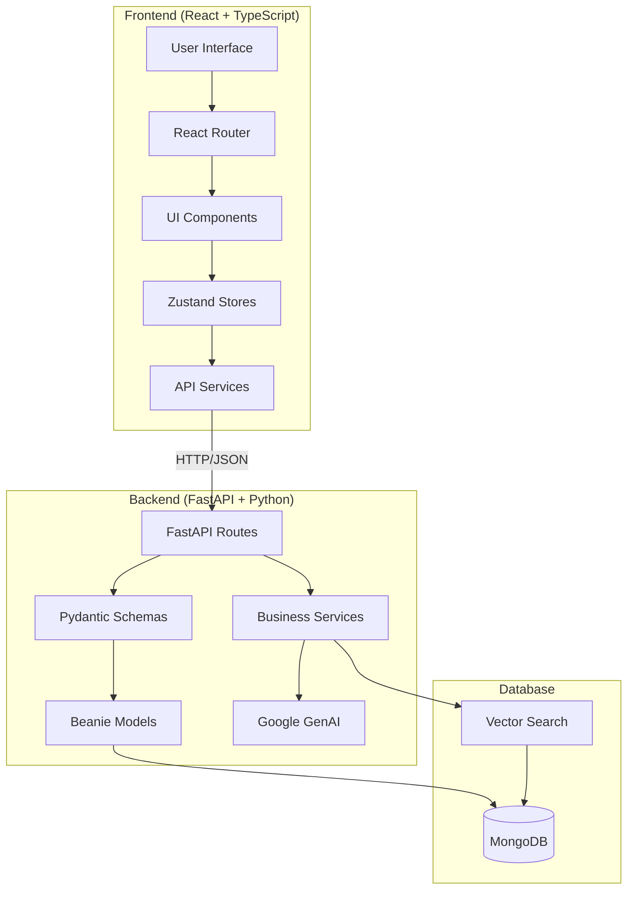

## 🎯 Frontend Architecture

### 📁 Cấu trúc thư mục Frontend

```
learning-app-fe/src/
├── 🎨 components/
│   ├── ui/                 # Base UI Components
│   │   ├── Button.tsx      # → Variants: primary, secondary, ghost
│   │   ├── Card.tsx        # → Layout components
│   │   ├── Input.tsx       # → Form inputs với validation
│   │   ├── Modal.tsx       # → Dialog components
│   │   ├── ThemeToggle.tsx # → Dark/Light mode switch
│   │   └── ...animations   # → Framer Motion components
│   └── layout/
│       ├── DashboardLayout.tsx  # → Main app layout
│       └── ProtectedRoute.tsx   # → Auth guard
│
├── 📄 pages/              # Route Components
│   ├── auth/              # → Login, Register
│   ├── courses/           # → Course management
│   ├── chat/              # → AI Chat interface
│   ├── quiz/              # → Quiz system
│   └── admin/             # → Admin panel
│
├── 🔄 stores/             # Zustand State Management
│   ├── authStore.ts       # → User authentication
│   ├── courseStore.ts     # → Course data
│   ├── chatStore.ts       # → Chat sessions
│   └── ...
│
├── 🌐 services/           # API Integration Layer
│   ├── api.ts             # → Base API client
│   ├── authService.ts     # → Auth endpoints
│   ├── courseService.ts   # → Course CRUD
│   └── ...
│
├── 🎭 contexts/           # React Contexts
│   └── ThemeContext.tsx   # → Theme management
│
├── 🌍 i18n/               # Internationalization
│   ├── index.ts           # → i18n configuration
│   └── locales/           # → Translation files
│
└── 📝 types/              # TypeScript Definitions
    └── index.ts           # → Shared interfaces
```

### 🔄 Data Flow Frontend

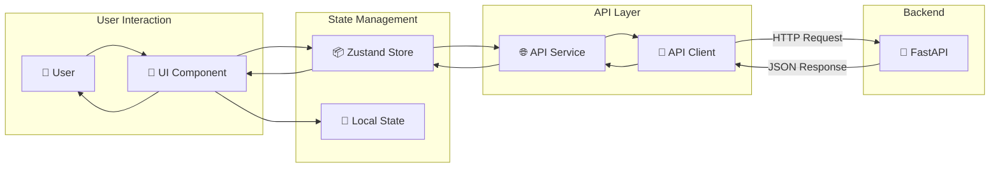

### 🧩 Component Relationships

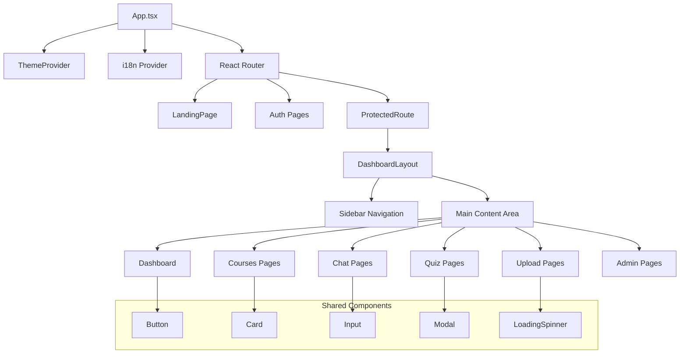

## 🚀 Backend Architecture

### 📁 Cấu trúc thư mục Backend

```
BEDB/app/
├── 🎯 main.py             # FastAPI Application Entry
├── ⚙️ config.py           # Configuration Management
├── 🗄️ database.py         # MongoDB Connection
├── 🔐 auth.py             # JWT Authentication
│
├── 📊 models/             # Beanie ODM Models
│   ├── user.py            # → User, Profile models
│   ├── course.py          # → Course, Chapter models
│   ├── quiz.py            # → Quiz, Question models
│   ├── chat.py            # → ChatSession, Message
│   ├── upload.py          # → File upload models
│   └── dashboard.py       # → Progress tracking
│
├── 🔄 schemas/            # Pydantic Schemas
│   ├── auth.py            # → Request/Response schemas
│   ├── course.py          # → Course data validation
│   ├── quiz.py            # → Quiz schemas
│   └── ...
│
├── 🛣️ routers/            # API Route Handlers
│   ├── auth.py            # → /api/v1/auth/*
│   ├── courses.py         # → /api/v1/courses/*
│   ├── quiz.py            # → /api/v1/quiz/*
│   ├── chat.py            # → /api/v1/chat/*
│   ├── uploads.py         # → /api/v1/uploads/*
│   ├── dashboard.py       # → /api/v1/dashboard/*
│   ├── admin.py           # → /api/v1/admin/*
│   ├── search.py          # → /api/v1/search/*
│   └── leaderboard.py     # → /api/v1/leaderboard
│
└── 🔧 services/           # Business Logic
    ├── genai_service.py   # → Google GenAI integration
    ├── file_service.py    # → File processing
    └── vector_service.py  # → Vector search
```

### 🔄 Backend Request Flow

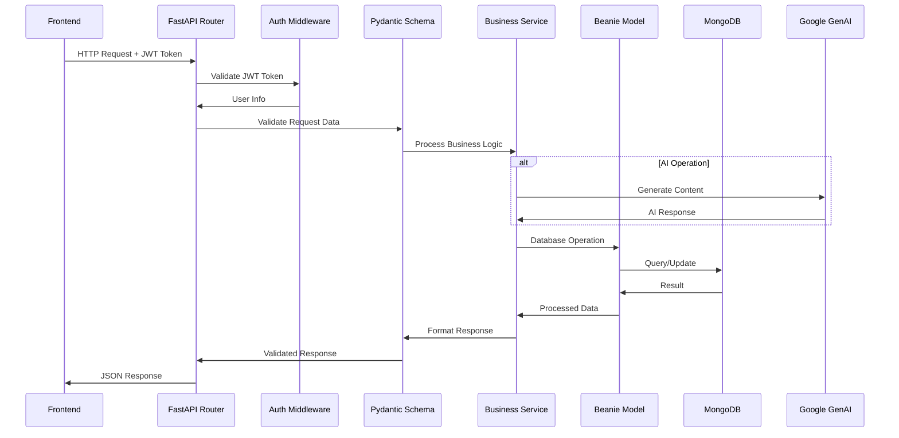

## 🔗 API Endpoints Mapping

### 🔐 Authentication Flow

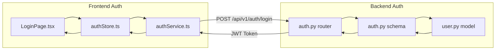

### 📚 Course Management Flow

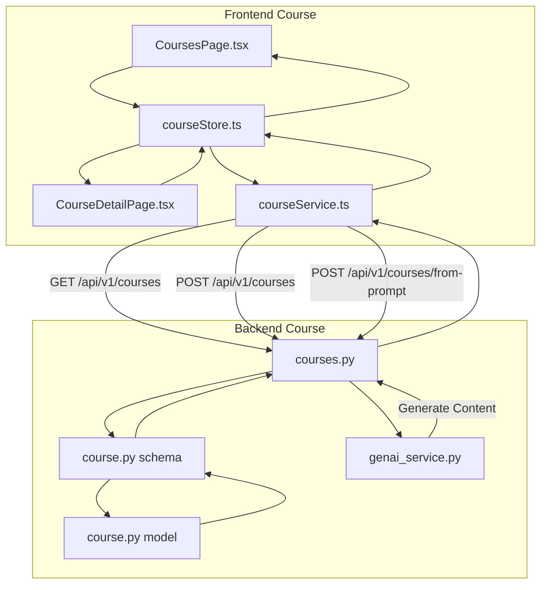

### 💬 Chat System Flow

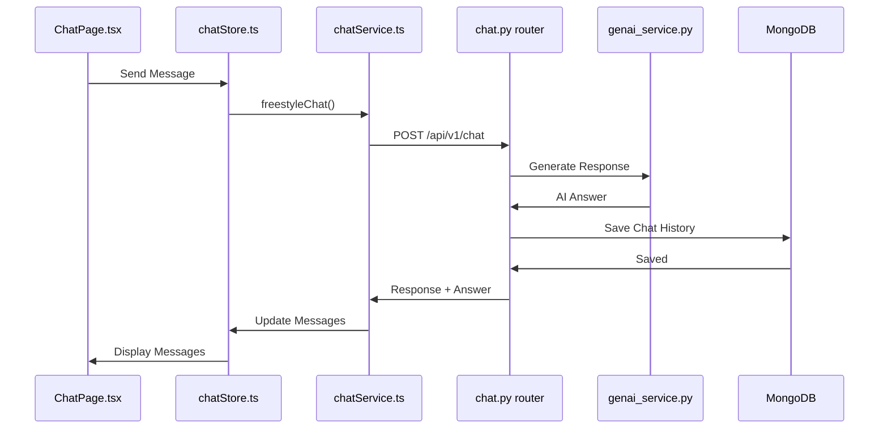

### 🧠 Quiz System Flow

```mermaid
graph TB
    subgraph "Frontend Quiz"
        QUIZ_LIST[QuizPage.tsx]
        QUIZ_DETAIL[QuizDetailPage.tsx]
        STORE[quizStore.ts]
        SERVICE[quizService.ts]
    end
    
    subgraph "Backend Quiz"
        ROUTER[quiz.py]
        SCHEMA[quiz.py schema]
        MODEL[quiz.py model]
        AI[genai_service.py]
    end
    
    QUIZ_LIST --> STORE
    QUIZ_DETAIL --> STORE
    STORE --> SERVICE
    
    SERVICE -->|POST /api/v1/quiz/generate| ROUTER
    SERVICE -->|POST /api/v1/quiz/{id}/submit| ROUTER
    SERVICE -->|GET /api/v1/quiz/history| ROUTER
    
    ROUTER --> AI
    AI -->|Generate Questions| ROUTER
    ROUTER --> SCHEMA
    SCHEMA --> MODEL
    MODEL --> SCHEMA
    SCHEMA --> ROUTER
    ROUTER --> SERVICE
    SERVICE --> STORE
```

## 🔄 State Management Flow

### 📦 Zustand Stores Architecture

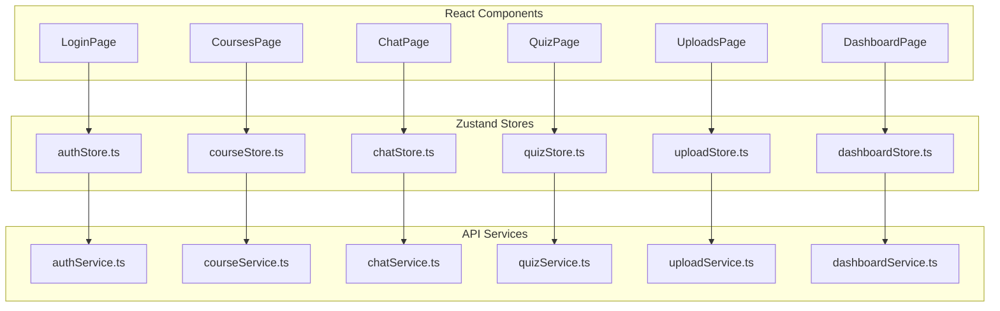

### 🔄 Store Update Pattern

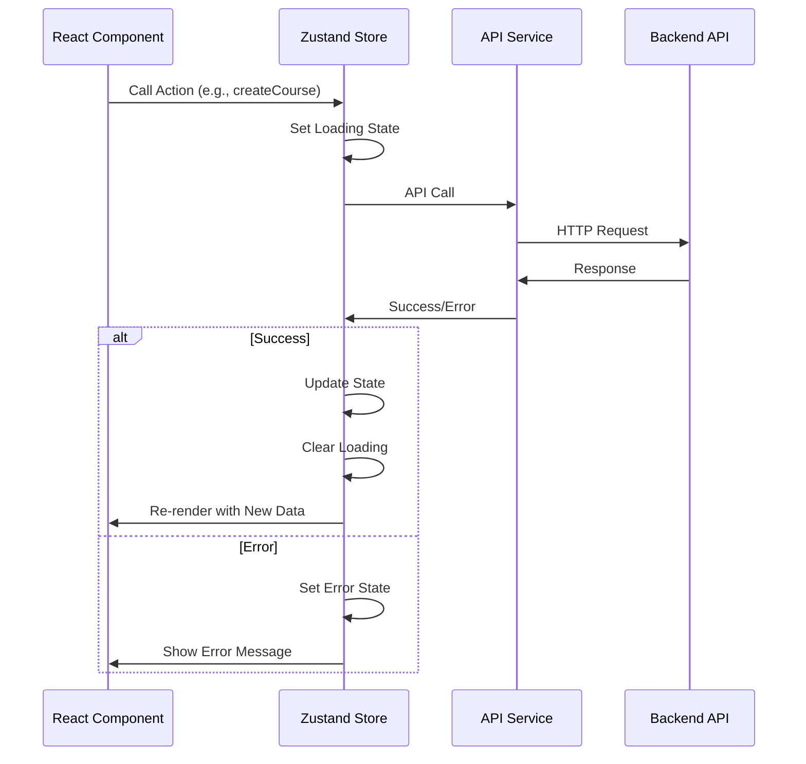

## 🎨 UI Component Architecture

### 🧩 Component Hierarchy

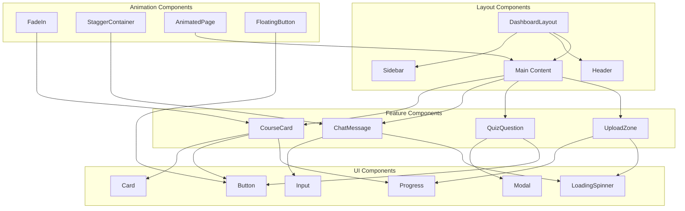

### 🎭 Theme & Animation System

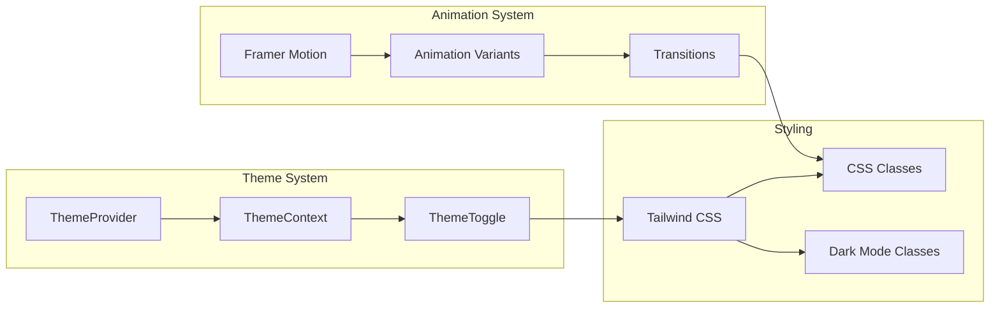

## 🔐 Authentication & Security

### 🛡️ Security Flow

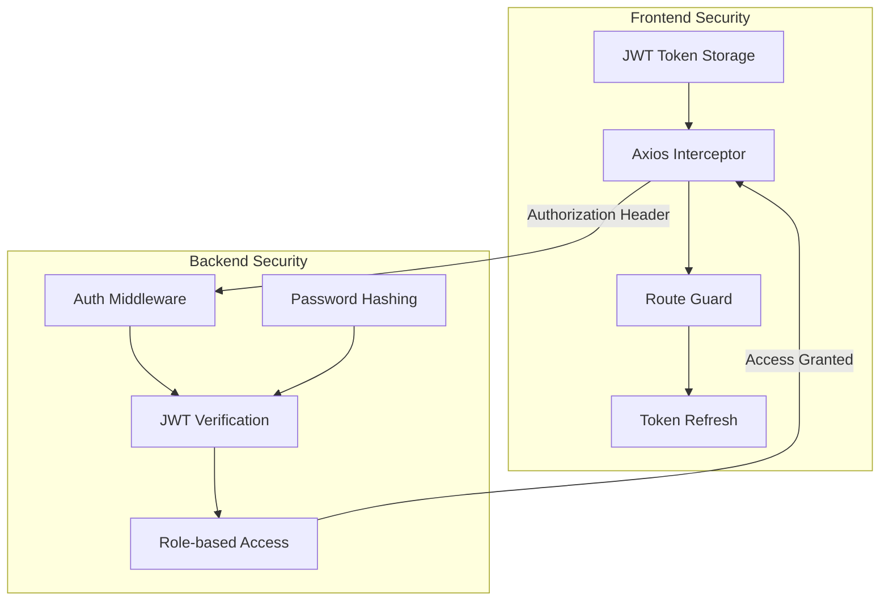

### 🔄 Token Refresh Flow

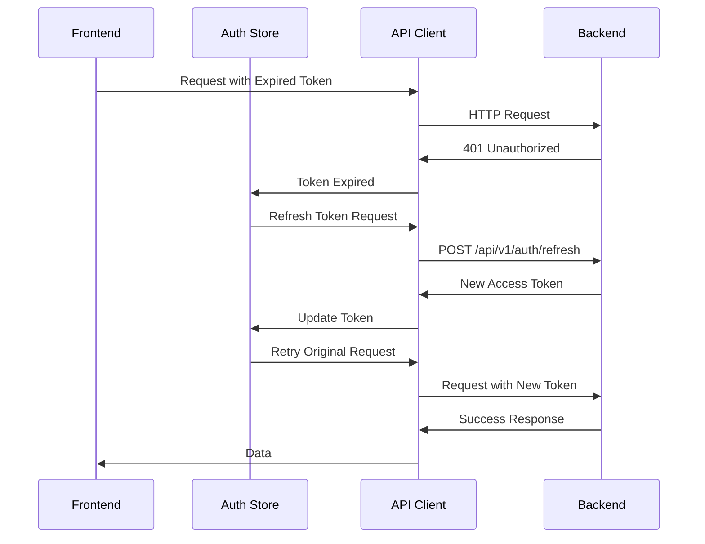

## 📊 Database Schema Relationships

### 🗄️ MongoDB Collections

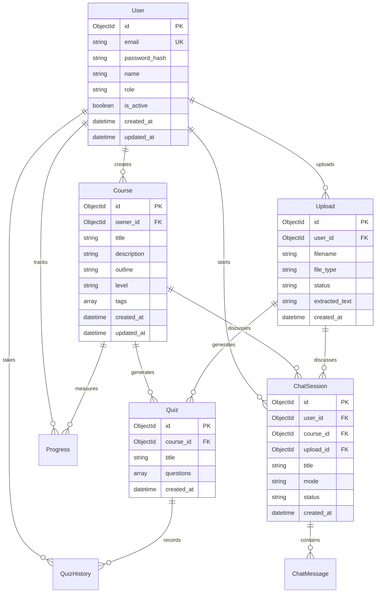

## 🚀 Deployment Architecture

### 🌐 Production Setup

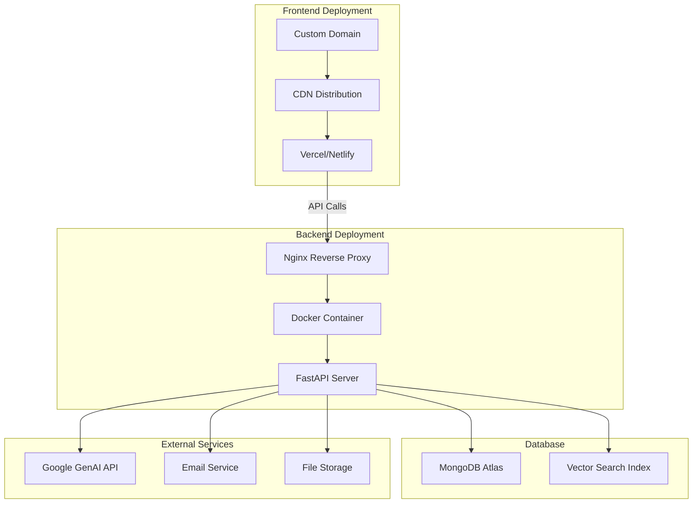

### 🔄 CI/CD Pipeline

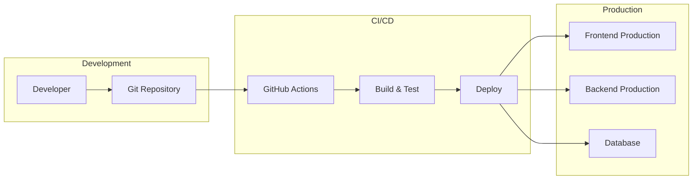

## 📈 Performance & Monitoring

### 🔍 Monitoring Stack

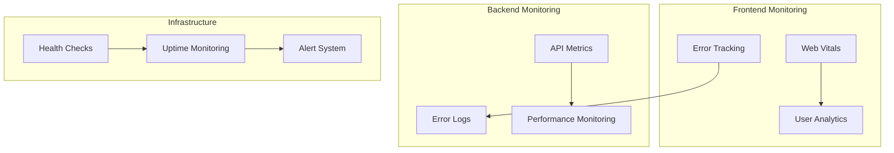

---

## 🎯 Kết luận

Hệ thống AI Learning Platform được thiết kế với kiến trúc:

✅ **Frontend**: Modern React + TypeScript với Zustand state management  
✅ **Backend**: FastAPI + MongoDB với AI integration  
✅ **Security**: JWT authentication với role-based access control  
✅ **Performance**: Optimized với lazy loading và caching  
✅ **Scalability**: Microservices-ready architecture  
✅ **Monitoring**: Comprehensive logging và error tracking  

**🚀 Sẵn sàng cho production deployment!**
